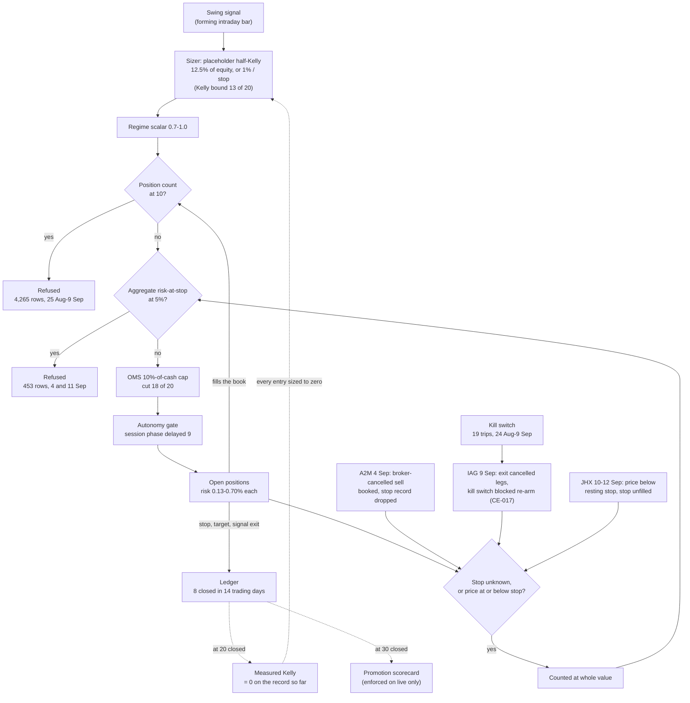

# QAT Design Recovery & Design Intent Audit, R16: Control Interaction Assessment

**Brief §13 ("Identify control interactions"). DRAFT for Checkpoint B.**
**Prepared:** 14 September 2026. Read-only: nothing in the system was changed.
**Records:** up to 12 September. Sources and tools are those of R9
(`s07-s13-risk-and-interactions/tools/`), plus `evidence_chain.py`.

The brief asks for chains in which one control makes another active, and for
"control traps": a safety mechanism that causes another to act, which then
prevents the evidence needed to judge the first. Each interaction below is
marked **measured** (reproduced from the records), **derived** (follows from
the code and the order of logged events, but not reproduced to the number),
or **code only** (possible in the code, not observed).

---

## 16.1 The main trap: one position counted at its whole value blocks every entry

**The two controls**
* **The full-value rule.** The governor measures each position's risk as
  `quantity × (price − stop)`. If it knows no stop for the position, **or the
  price is at or below the stop**, it counts the whole price instead
  (`governor.py:262-268`: "Unknown protection is treated as no protection").
  The price is IBKR's portfolio mark.
* **The aggregate cap.** New entries are refused while the total is at or
  above 5% of equity (`governor.py:310-316`).

A book of nine or ten positions carries about 3–5% at risk (R9 §9.2). A single
position counted at full value adds its entire notional, about 4–6% of equity
here. That alone takes the book past the cap.

**It happened three times, by three routes.**

| When | Position | How it came to count at full value | Aggregate logged | Evidence |
|---|---|---|---|---|
| 4 Sep 10:20–13:08 | A2M.AX, 9,636 | IBKR cancelled a 9,636-share market sell at 10:20:32–33 (Error 10349, then Error 383, its precautionary size limit of 500). The app booked the sale at transmission at 10:20:37 (`oms.py:1134-1137`). Booking the position flat dropped A2M's stop from the app's records (`oms.py:1141-1144`), while the broker still held the shares and, per the 08:45 adoption, a resting stop. Reconciliation then found the app and the broker disagreeing and tripped the kill switch at 10:25:12 ("Broker reconciliation mismatch") | 9.58–9.80%; the first refusal at 9.68% came at 10:20:37 | **derived** from the code and the order of the log lines, corroborated by the 10:25:12 mismatch. Not reproduced to the number (no marks for 4 Sep) |
| 9 Sep 11:27–13:09 | IAG.AX, 6,699 | The exit cancelled its protective legs, then the kill switch refused the exit and blocked the re-arm (CE-017). "POSITION UNPROTECTED" at 11:22:47 | 8.03–8.19% | **measured** event (the log names it); a genuine absence of protection |
| 10 Sep 12:04 – 12 Sep | JHX.AX, 1,097 | The mark fell to or below its resting stop and the stop did not fill (R9 §9.4; held until after the audit) | 7.25–7.65% | **measured**: reproduced exactly, below |

**The 12 September reading reproduced** (IBKR closing prices of 11 Sep; the
stops recorded in `open_position_entries.json`; equity 989,604.29). The
governor took its stops from the broker's resting legs at the 12 Sep launch.
The exact match confirms those equal the recorded stops for the eight
positions measured to their stop.

| Position | Close | Stop | Risk counted |
|---|---|---|---|
| ANZ 640 | 37.27 | 35.25 | 1,292.80 |
| ASX 1,314 | 54.78 | 51.18 | 4,730.40 |
| BOQ 13,586 | 6.52 | 6.07 | 6,113.70 |
| COH 363 | 134.14 | 126.09 | 2,922.15 |
| **JHX 1,097** | **39.01** | **39.39** | **42,793.97 (whole value: price below stop)** |
| SUN 3,192 | 19.61 | 17.20 | 7,692.72 |
| TAH 64,229 | 0.915 | 0.80 | 7,386.34 |
| TWE 10,412 | 5.18 | 5.14 | 416.48 |
| WOW 1,098 | 38.50 | 37.87 | 691.74 |
| **Total** | | | **74,040.30 = 7.48% of equity** |

The app logged **7.48%** at 11:01–11:16 on 12 Sep. **Without JHX's whole
value, the book stood at 31,246.33, 3.16%.**

**Consequences**
* **11 September: all 449 risk decisions (4 candidate symbols) were refused by
  the aggregate cap** at 7.35–7.62%. Each traces to JHX's full-value count.
  Without it the book had 1.84 points of headroom at the 11 Sep close, and
  the candidates would have gone on to the later rails.
* The app did not say which position caused it. Nothing alerts on a position
  priced at or below its resting stop. The launch line reported "9 of 9 carry
  a stop resting at the broker". The de-lever warning gives only the total.
  The 11 Sep daily report classed all 449 as "capacity (the book was full) —
  says nothing about the trade", when the book held 9 of 10 positions and
  3.16% of real risk.
* The rule behaved as designed for IAG, which really had no stop at the
  broker. For A2M, the broker still held the shares and the stop; the
  full-value count came from the app's own booking. For JHX, a stop was
  resting and the price was below it: the rule counted it at full value as
  written, and why the stop did not fill is NOT DETERMINED.

**The plan's early indication 3 ("winners consume the budget") is refuted for
this period.** At the 11 Sep close the book's value was 493,473.05 against a
cost of 498,215.56 (IBKR statement). Measured at the mark against fixed
stops, a book below cost reads *less* risk than at entry, not more. The cap's
binding readings came from the full-value rule, not from gains.

## 16.2 The brief's example chain, traced in QAT

The brief's chain: restriction → reduced entries → insufficient closed trades →
Kelly remains at default → promotion evidence does not accumulate →
autonomous strategy remains constrained.

| Link | In QAT (records to 12 Sep) | Status |
|---|---|---|
| Restriction → reduced entries | The position count held the book at its cap from 25 Aug to 9 Sep (4,265 refusal rows); the aggregate cap did the same on 11 Sep (16.1). With the book full, a new entry waits for a close | **measured** |
| → few closed trades | **8 positions closed in 14 trading days** (25 Aug–11 Sep), 0.57 a day: 2 targets, 2 stops, 3 signal exits, and 1 remnant of the 24 Aug duplicate unwind (TNE, 60 shares). No time stop fired. ⚠️ *Correction, 15 Sep (R13 §13.2, §13.6): the TNE row is not a remnant of the unwind. It is the 3 Sep stop-out of the 3,051-share swing entry, truncated to 60 shares by the missed-exit replay and labelled "target". So the eight are 2 targets, 3 stops and 3 signal exits* | **measured** |
| → Kelly remains at default | The sizer uses placeholders (W 0.55, R 1.5: 12.5% of equity) until **20** closed positions. At 0.57 a day, 12 more take about 21 trading days | **measured** rate; the day count is arithmetic, not a forecast |
| **→ and then a lock (not in the brief's chain)** | Applying the estimator's own arithmetic (`edge.py:102-132`) to the 8 closed positions gives 2 wins (25%), average win 9,681.10, average loss 3,809.54, ratio 2.54. Half-Kelly is positive only above a 28.2% win rate, so **measured Kelly is zero**. At the switch, every entry would be refused "Sizing produced zero shares" (`engine.py:205-208`). No entries means no new closed trades, so the estimate could not move again. Without the TNE remnant: 2 of 7 (28.6%) against a break-even of 31.9%, **still zero**. ⚠️ *Correction, 15 Sep (R13 §13.4): TNE is a real swing trade, so the "without" arm removes a real loss. With TNE at its broker loss (−7,076.61, not −139.17) the average loss is 4,965.78, the ratio 1.95, and the break-even 33.9% against 25%: **still zero**, by a wider margin* | **derived**, conditional: the switch happens at 20 trades, and the record then may differ |
| → promotion evidence does not accumulate | 30 closed positions are needed; about 38 trading days at the observed rate. The 11 Sep scorecard reads "promoted-below-bar", 8 of 30, 25% win rate against 40% | **measured** |
| → autonomy constrained | **Not on paper.** Promotion evidence is enforced on live accounts only (`enforce_promotion_evidence` false; R7 #2). Autonomous paper trading continues whatever the scorecard says | **code** |

**What this shows.** The placeholder (12.5% of equity in notional) is far more
generous than the strategy's own record would allow. So the switch at 20
trades is not a step from a cautious default to a measured figure: on the
record so far it is a step from 12.5% to zero. This is a trap in the brief's
sense. A sizing control, once it has evidence, would stop the trading that
produces more evidence. That depends on the record at the time, and the
sample is small.

## 16.3 Other interactions found

| # | Interaction | Evidence | Status |
|---|---|---|---|
| a | **Kill switch ↔ protective re-arm (CE-017).** The autonomous exit cancels the legs before the kill-switch check. The kill switch then blocks the re-arm that the cancel-first ordering relies on, and the position counts at full value against the cap (16.1, IAG) | 9 Sep log; CE-017 | **measured** |
| b | **Booking at transmission ↔ the stop record.** A sell the broker cancels is still booked. If it books the position flat, the app drops the position's stop, and 16.1 follows | 4 Sep (A2M) | **derived** |
| c | **Two entries in the same second ↔ the position count.** Two entries 173 ms apart each saw nine positions, so the book reached eleven. The count refuses at `>=`, so returning to ten was still at the cap: 1,036 refusals on 27 Aug | `oms.py:808-818`; R9 §9.2 counts 1,036 on 27 Aug | **measured**; fixed 27 Aug (`72191a9`, item 58) |
| d | **Per-order cash cap ↔ risk per trade ↔ which cap binds.** As cash falls, the 10% cap shrinks each entry (WOW to 24% of its budget, COH to 38%). Entries average about 0.45% of equity at risk, so ten positions reach about 4.5%, under the 5% aggregate cap. **The position count binds first in normal operation**; the aggregate cap has bound only through 16.1 | R9 §9.2 | **measured** sizes; the 4.5% is arithmetic |
| e | **Forming-bar signals ↔ minimum hold ↔ exits.** IAG's entry signal (EMA20 > EMA50) was proposed at 12:39 on 25 Aug and, after the Midday Lull gate, filled at 14:04. At 15:41 the same day swing's trend-break exit fired for it (EMA20 < EMA50), both on the forming intraday bar (R8 #18). The minimum hold held the exit back on 7 trading days (25 Aug–2 Sep, 10 log lines). IAG left on 9 Sep at −0.41R, through the CE-017 episode | log, "Signal exit on IAG.AX held back"; ledger `opened_at` 04:04:53Z; `risk_per_trade.py` | **measured** |
| f | **Session gate ↔ price-drift check.** The gate parks an order until its phase opens (9 entries delayed, R9). The drift check exists to guard a parked order's price, and was skipped on 298 evaluations for want of a broker quote until the 4 Sep fallback (`15ffd38`) | R9 §9.2 | **measured** |
| g | **A pending protective order ↔ signals.** Any order awaiting sign-off on a symbol, protective stops and exits included, suppresses that symbol's buy and sell signals (investigator 2, stage A, step 1) | code | **code only** |
| h | **Two audit files ↔ which rail binds.** The code stops at the first refusal, so a rail later in the order is never evaluated. The risk file names one rail per refusal, and the journal records only changes of verdict. Neither can show two rails binding at once; the 9 Sep case was found only by setting the log against the risk file | R9 §9.3 Q3 | **measured** |

## 16.4 The diagram

The interactions that decided what QAT traded from 24 Aug to 12 Sep. Dashed
lines are derived or conditional (16.2).

## 16.5 Not determined

* Why JHX's resting stop did not fill (held until after the audit).
* A2M's 4 Sep reading to the number (no marks for that day).
* How often two or more rails would have refused the same candidate. The
  code does not evaluate past the first refusal.
* The staleness rail's effect on which symbols were evaluated (not logged
  as events).
