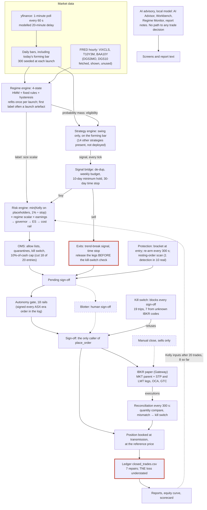

# QAT Design Recovery & Design Intent Audit, R17: Current-State Architecture

> **Final report section, issued 15 September 2026** for the operator's review (Checkpoint B). Findings made after a section was drafted are recorded as dated correction notes in place; nothing has been silently rewritten.

**Brief §15, first diagram ("QAT as it is"). Final, for the operator's review at Checkpoint B.**
**Prepared:** 15 September 2026, from the drafted sections R5 and R9–R16. It
represents the deployed build (M175) as it runs, not as it could be: "Do not
design an ideal future architecture. Represent reality."

**How to read it**
* **Solid lines** are paths the live record shows running (R10 §10.3).
* **Dashed lines** exist in code and have never run live, or run but decide
  nothing.
* **Red** marks a known defect: CE-017, the TNE ledger shortfall.
* Code the app never imports (R15 §15.1) is not drawn.

## 17.1 Each box, with its evidence

| Box | What the diagram claims | Evidence |
|---|---|---|
| Market data | yfinance polled every 60 s with a modelled 20-minute delay; daily bars include today's forming bar; 300 bars seeded at launch | R5 §5.1; investigator 1 A |
| FRED | three series feed the regime; `DGS3MO` and `DGS10` are fetched and shown only | R12 §12.1; R15 C11 |
| Regime engine | HMM + fusion rules + hysteresis; one refit per launch; the launch artefact | R12 §12.1–§12.2 |
| Strategy engine | swing only, evaluated every tick on the forming bar; 14 strategies undeployed | R5 §5.3 #6; R7 #4 |
| Signal bridge | de-dup, weekly budget, minimum hold, time stop | R5 §5.1 |
| Risk engine | sizing is the smaller of Kelly on placeholders and the 1% budget, times the regime and earnings scalars | R9 §9.1–§9.2 |
| OMS | the cash cap cut 18 of 20 entries after approval | R9 §9.2 |
| Autonomy gate / Blotter | the gate signed every ASX-era order in the log; the Blotter has never signed one live | R10 §10.3 |
| Sign-off → IBKR | the only caller of `place_order`; bracket structure | R10 §10.1 |
| Booked at transmission | quantity booked whatever status IBKR returns | R5 §5.3 #2; R14 §14.3 |
| Reconciliation | 300-s poll; 6 trips, all from the app's own record | R14 incident 3 |
| Ledger | seven repairs; TNE's loss understated by 6,937.44 | R13 |
| Kill switch | 19 trips; 7 from the halt-on-unknown-code rule | R9; R14 |
| Exits | legs released before the kill-switch check (CE-017) | R10 §10.2 |
| Protection | brackets, re-arm, the resting-order scan's hit rate | R10 §10.2–§10.3 |
| Manual close | never run live | R10 §10.3 |
| AI advisory | display only; no path to any trade decision | R11 §11.2 |
| Kelly feedback | switches to measured inputs at 20 closed positions; 8 so far | R16 §16.2 |
