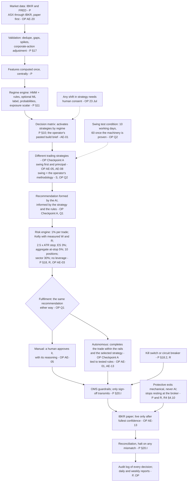

# QAT Design Recovery & Design Intent Audit, R18: Original-Intent Architecture

**Brief §15, second diagram ("QAT as originally intended"). DRAFT for
Checkpoint B.**
**Prepared:** 15 September 2026. The brief: "Only include components
supported by historical evidence." Every box below carries its source. Where
the evidence is silent, the diagram says UNKNOWN rather than filling the gap.

**The governing baseline** is the operator's Checkpoint A statement (R4
§4.00, §4.001) and the answers to Q1–Q3 (R8 §8.5):
* purpose, autonomy and the AI's part come from the operator;
* philosophy and strategies come from the paper (P);
* where the paper is silent, the operator's recorded direction and the
  reference app (R) fill in, with attribution.

The paper's "a human approves every order" rule is **superseded**. It was
Claude's addition, not the operator's (R4 §4.0).

**Source codes:**

| Code | Source |
|---|---|
| **OP** | the operator's own words (Checkpoint A, Q1–Q3, or an AE entry in `stage4/authority-evidence.md`) |
| **P** | the paper; the path is R4 §4.11 |
| **S** | the swing methodology, the operator's specification (Q2) |
| **R** | the reference app's settings, the operator's "Moderate" profile |

## 18.1 What the evidence does not settle (UNKNOWN)

These stay off the diagram, or are drawn without detail:

* **How large the AI's part is.** "Formed by the AI … informed around
  strategy and rules" (Q1) settles that the AI forms the recommendation, not
  how: originating it, confirming it, or adjusting it (R4 §4.001). The
  reference app gave the AI a veto on entries by default (R4 §4.4).
* **Whether swing was meant to trade alone** until other strategies were
  ready (R4 §4.13 #4). The operator named swing first and principal. The
  paper's matrix implies several running together.
* **The "learning" intent**: "learn from its decision making and adjust its
  strategy on the go" (C2 [125]). It was reframed as fixed rules, and no
  acceptance of that is recorded (R4 §4.13 #6).
* **The regime inputs for an ASX book.** The paper names inputs by concept
  (P §11.2). The operator asked on 26 Aug whether the US drivers were still
  relevant and deferred re-sourcing (R7 #11). No intended series list exists.
* **The live-trading path.** Intended as a later step, after testing (OP
  AE-13; P governance gates). No design detail was agreed.

## 18.2 Each box, with its evidence

| Box | Evidence |
|---|---|
| Market data | P §17, §20.D (R4 §4.11); ASX through IBKR: AE-20, AE-21 (R7 #8) |
| Validation | P §17, §20.D (R7 #10) |
| Features, central | the paper's path (R4 §4.11) |
| Regime engine | P §11, §20.E (R7 #12) |
| Decision matrix | P §10; the build brief the operator pasted on 24 Jul: "the orchestrator activates/deactivates strategies based on the current RegimeEvent and the decision matrix" (AE-01; R7 #5) |
| Strategies | Checkpoint A ("different trading strategies"); AE-05 ("across all 15 Strategies, with Swing being the first"); AE-08 ("Swing method will be principal strategy"); Q2 (the methodology is the swing specification) |
| AI recommendation | Checkpoint A ("recommended trades using AI"); §4.001; Q1 |
| Risk engine | P §18 and Table 18.1; R "Moderate" (R4 §4.6); no leverage as "a hard coded rule" (AE-03) |
| Fulfilment | Checkpoint A; Q1 ("no different whether in Autonomous mode or Manual mode") |
| Manual path | AE-05 item 3: "recommendations, supported by it's reasoning for human approval" |
| Autonomous path | Checkpoint A (§4.001); AE-01 ("tied to tested rules"); AE-13 ("complete autonomy will not be implemented until I have the fullest confidence the mechanism works") |
| OMS, reconciliation | P §20.I (R4 §4.7) |
| Protection | common to R and P (R4 §4.10) |
| Kill switch | P §18.2; R's drawdown breaker (R4 §4.6) |
| Audit and reports | P; C2 [163], [177] (R4 §4.1) |
| Strategy consent | C2 [286], 23 Jul: "any shift in strategy must always require human consent before applying" (R4 §4.0) |
| Holding condition | Q2: "10 working days … 60 days, once the machinery was proven" |
