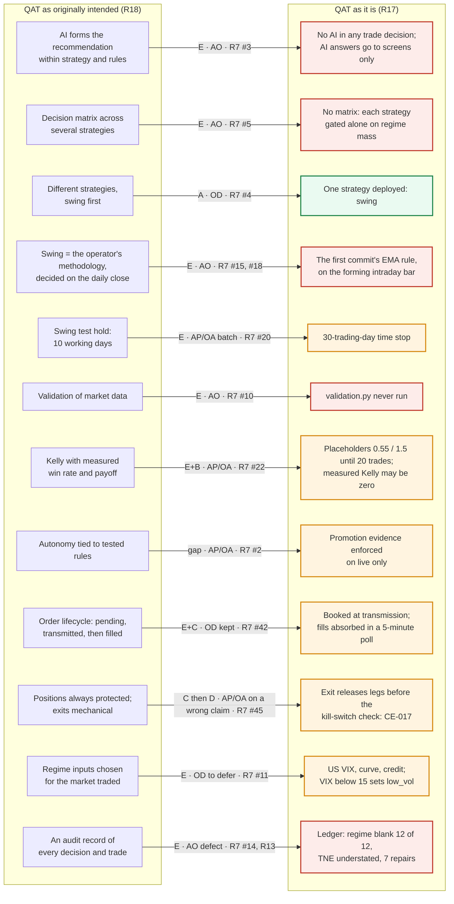

# QAT Design Recovery & Design Intent Audit, R19: Design-Drift Architecture

**Brief §15, third diagram ("QAT design drift"). DRAFT for Checkpoint B.**
**Prepared:** 15 September 2026. The brief: "Show the significant
differences between the two" (R18 against R17).

**How to read it**
* Each arrow runs from the intended component (left, R18) to what exists
  (right, R17).
* The label gives R7's class, then who decided (R7's Authority column):
  - **E**: behaviour change; **D**: agent-generated complexity; **C**:
    defensive fix; **A**: original design;
  - **OD**: operator-directed; **AP/OA**: agent-proposed, operator-approved;
    **AO**: agent-only.
* **Red** is drift the operator never directed. **Amber** is a change the
  operator directed or approved. **Green** is consistent with the operator's
  own sequencing.

The significant differences are those R7 rates **H** or that sit on the path
from signal to order. The full list of 59 items is R7.

## 19.1 The differences, with their evidence

| # | Intended (R18) | Current (R17) | Class · authority | Risk (R7) | Evidence |
|---|---|---|---|---|---|
| 1 | The AI forms the recommendation, within the strategy and the rules | No AI output reaches any trade decision | E · AO (CE-021) | H | R7 #3; R11 §11.5 |
| 2 | A decision matrix activates strategies by regime | Each strategy is gated alone on regime mass; no allocator | E · AO (CE-027) | M, H with a second strategy | R7 #5 |
| 3 | Several strategies, swing first | One strategy deployed | A · OD | L | R7 #4 (the operator's sequencing, not drift) |
| 4 | Swing is the operator's methodology, decided on the daily close | The first commit's rule, on the forming intraday bar | E · AO (CE-026) | H | R7 #15, #18; R8 §8.5 |
| 5 | Test hold of 10 working days | 30-trading-day time stop | E · AP/OA, batch | M | R7 #20; R8 §8.5 Q2 |
| 6 | Market data validated | `validation.py` never runs | E · AO (CE-027) | M | R7 #10; R15 C1 |
| 7 | Kelly from measured win rate and payoff | Placeholders until 20 closed positions; on the record so far, measured half-Kelly would be zero | E+B · AP/OA | M | R7 #22; R16 §16.2 |
| 8 | Autonomy tied to tested rules | The scorecard is enforced on live only | gap · AP/OA (operator informed, AE-06) | M | R7 #2 |
| 9 | Pending, transmitted, then filled | Booked at transmission; the common root of many incidents | E+C · OD (kept 3 Sep, AE-28) | H | R7 #42; R14 §14.3 |
| 10 | Positions always protected; exits mechanical | An exit releases its legs before the kill-switch check | C, then D · AP/OA on a wrong claim (AE-29) | H | R7 #45; CE-017 |
| 11 | Regime inputs fit for the market traded (the paper names them by concept) | US series; the US VIX sets low_vol below 15; a launch artefact | E · OD to defer | H | R7 #11; R12 §12.3 |
| 12 | An audit record of every decision and trade | Regime blank on 12 of 12 ledger rows; TNE understated; seven repairs | E · AO (defect) | M | R7 #14; R13 |

## 19.2 What the drift diagram shows

1. **Most of the red drift sits at the front of the path**: data (6),
   strategy (2, 4) and recommendation (1). It is agent-only and dates from the
   first two builds (R7 §7.7). The other red item is the evidence record at
   the end (12), a defect.
2. **Most of the amber changes sit at the back**: sizing (7), fulfilment (8),
   orders (9) and protection (10). The operator approved or directed them,
   one of them (10) on a claim of Claude's that was wrong. Two amber items sit
   earlier: the time stop (5), and the regime inputs, whose re-sourcing the
   operator deferred (11).
3. **The one difference that is not drift** is the single strategy (3). It is
   the operator's own sequencing: swing first.
