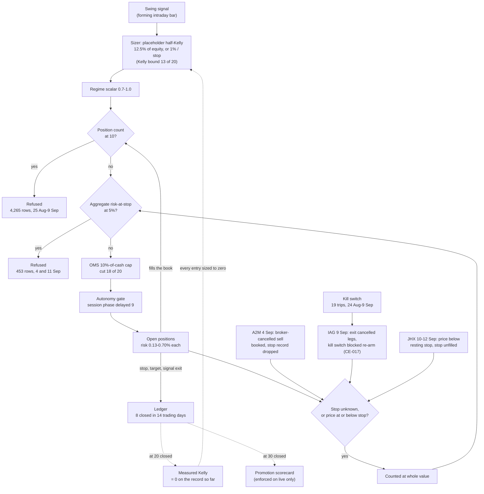
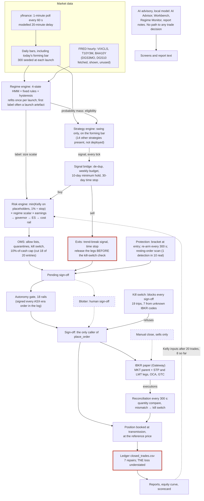
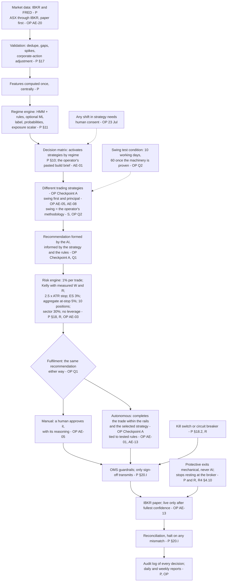
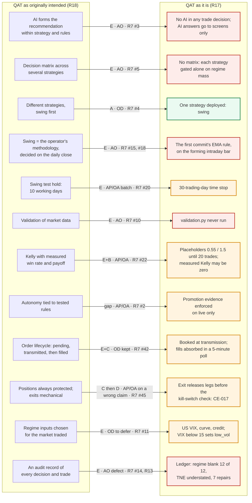

# QAT Design Recovery & Design Intent Audit: Final Report

**Issued 15 September 2026, for the operator's review at Checkpoint B.**

Compiled from the section files in `docs/audit/2026-09-design-recovery/`
at commit `36b8ad0` by `tools/compile_report.py`. The section files are
the source; this file is regenerated, never edited.

**Classification (R24): 🔴 RED: DESIGN COMPROMISED.**

Nothing in QAT was changed during the audit. Development is frozen and
trading suspended until the operator's review.

## Contents

* [R1: Executive Summary](#qat-design-recovery--design-intent-audit-r1-executive-summary) (`01-executive-summary.md`)
* [Part I: How QAT Developed, and Where It Drifted](#qat-design-recovery--design-intent-audit-part-i-how-qat-developed-and-where-it-drifted) (`P-development-chronology.md`)
* [R2: Audit Scope](#qat-design-recovery--design-intent-audit-r2-audit-scope) (`02-audit-scope.md`)
* [R3: Current Baseline](#qat-design-recovery--design-intent-audit-r3-current-baseline) (`03-current-baseline.md`)
* [R4: Original Design Intent](#qat-design-recovery--design-intent-audit-r4-original-design-intent) (`04-original-design-intent.md`)
* [R5: Current Architecture](#qat-design-recovery--design-intent-audit-r5-current-architecture) (`05-current-architecture.md`)
* [R6: Original vs Current Comparison](#qat-design-recovery--design-intent-audit-r6-original-vs-current-comparison) (`06-original-vs-current.md`)
* [R7: Design Drift Map](#qat-design-recovery--design-intent-audit-r7-design-drift-map) (`07-design-drift-map.md`)
* [R8: Strategy Integrity Assessment](#qat-design-recovery--design-intent-audit-r8-strategy-integrity-assessment) (`08-strategy-integrity.md`)
* [R9: Risk-Control Assessment](#qat-design-recovery--design-intent-audit-r9-risk-control-assessment) (`09-risk-control-assessment.md`)
* [R10: OMS / Execution / Broker Assessment](#qat-design-recovery--design-intent-audit-r10-oms--execution--broker-assessment) (`10-execution-boundary.md`)
* [R11: AI / LLM Boundary Assessment](#qat-design-recovery--design-intent-audit-r11-ai--llm-boundary-assessment) (`11-ai-llm-boundary.md`)
* [R12: Regime Assessment](#qat-design-recovery--design-intent-audit-r12-regime-assessment) (`12-regime.md`)
* [R13: Data & Evidence Integrity Assessment](#qat-design-recovery--design-intent-audit-r13-data--evidence-integrity-assessment) (`13-data-evidence-integrity.md`)
* [R14: Historical Failure → Control Mapping](#qat-design-recovery--design-intent-audit-r14-historical-failure--control-mapping) (`14-failure-to-control-mapping.md`)
* [R15: Accidental Complexity](#qat-design-recovery--design-intent-audit-r15-accidental-complexity) (`15-accidental-complexity.md`)
* [R16: Control Interaction Assessment](#qat-design-recovery--design-intent-audit-r16-control-interaction-assessment) (`16-control-interactions.md`)
* [R17: Current-State Architecture](#qat-design-recovery--design-intent-audit-r17-current-state-architecture) (`17-current-state-architecture.md`)
* [R18: Original-Intent Architecture](#qat-design-recovery--design-intent-audit-r18-original-intent-architecture) (`18-original-intent-architecture.md`)
* [R19: Design-Drift Architecture](#qat-design-recovery--design-intent-audit-r19-design-drift-architecture) (`19-design-drift-architecture.md`)
* [R20: Simplification Candidates](#qat-design-recovery--design-intent-audit-r20-simplification-candidates) (`20-simplification-candidates.md`)
* [R21: Outstanding Unknowns](#qat-design-recovery--design-intent-audit-r21-outstanding-unknowns) (`21-outstanding-unknowns.md`)
* [R22: Coherence, and the Recommended Freeze State](#qat-design-recovery--design-intent-audit-r22-coherence-and-the-recommended-freeze-state) (`22-coherence-and-freeze-state.md`)
* [R23: Recommended Remediation Sequence](#qat-design-recovery--design-intent-audit-r23-recommended-remediation-sequence) (`23-remediation-sequence.md`)
* [R24: Final Design-Integrity Classification](#qat-design-recovery--design-intent-audit-r24-final-design-integrity-classification) (`24-design-integrity-classification.md`)
* [Annex A: Anomalies Register](#qat-design-recovery--design-intent-audit-annex-a-anomalies-register) (`A-anomalies-register.md`)
* [Annex B: Evidence Index](#qat-design-recovery--design-intent-audit-annex-b-evidence-index) (`B-evidence-index.md`)
* [Annex C: Error-Log Back-fill Register](#qat-design-recovery--design-intent-audit-annex-c-error-log-back-fill-register) (`backfill/00-backfill-register.md`)

---

# QAT Design Recovery & Design Intent Audit, R1: Executive Summary

> **Final report section, issued 15 September 2026** for the operator's review (Checkpoint B). Findings made after a section was drafted are recorded as dated correction notes in place; nothing has been silently rewritten.

**Final, for the operator's review at Checkpoint B. Prepared 15 September 2026.** Written last, from
R2–R24. Nothing in the system was changed during the audit.

## The brief's most important question

> *"If I removed all of the subsequent Agent fixes, patches and feature
> additions, what was QAT actually intended to be — and how far has the
> current implementation moved away from that design?"*

**What QAT was meant to be** (the operator, Checkpoint A, R4 §4.00, and
Q1–Q2, R8 §8.5):
* a share-trading app that makes **recommended trades using AI**;
* designed around **different trading strategies**, activated by regime
  within the paper's philosophy;
* the swing strategy first, **to the operator's own methodology**;
* one recommendation, formed by the AI within the strategy and the rules;
* fulfilled either by a human or autonomously, bounded by the safety rails;
* tested on paper before any live capital.

**How far it has moved** (R19):
* **The frame is intact**: the layers, the risk checkpoint, sign-off-only
  transmission, IBKR, reconciliation, the kill switch, and human or
  autonomous fulfilment.
* **The core is not**:
  - **no AI takes part in any trade decision** (R11);
  - **one strategy runs, with no decision matrix** (R7 #4, #5);
  - **the swing it runs is not the operator's method**: it is the first
    commit's rule, decided on the forming intraday bar (R8).

  These three drifts are agent-only and date from the first two builds
  (R7 §7.7; CE-021, CE-026, CE-027).
* Later changes were mostly operator-directed or operator-approved: 48 of 59
  drift items.

## The classification

**🔴 RED: DESIGN COMPROMISED** (R24).
* Three of the four core elements the operator named are not implemented.
  The fourth, autonomy, acts on the rule's signal, not on an AI
  recommendation.
* It would become AMBER if the operator chose, by decision, to test the
  current rule and to defer the AI's part (R24 §24.5).

## What the audit found, in brief

1. **A live safety defect (CE-017).** An exit releases a position's broker
   stop before the kill switch is checked, and the switch then blocks the
   re-arm. IAG was unprotected for about an hour on 9 Sep. It cannot occur
   while the app is not running. It is not fixed (R10, R16).
2. **The rails, not the strategy, decide much of what trades** (R9, R16):
   - no entry took its 1% budget;
   - the cash cap set 18 of 20 entry sizes;
   - on 11 Sep one position counted at its whole value refused every entry;
   - "halt on an unknown IBKR code" caused 7 of 19 kill-switch trips.
3. **The regime label is often an artefact of the launch**, and the US VIX
   below 15 sets it by a fixed rule. The "86% VIX dominance" measurement was
   confounded (R12; CE-032).
4. **The ledger matches IBKR on 7 of 8 closed positions, but not TNE.** TNE's
   loss is understated by 6,937.44, because of a code defect in the
   missed-exit replay. Seven repairs have rewritten the ledger (R13).
5. **The complexity that costs most is live and came from fixes.** Little is
   dead weight: 7% of the code never runs in the app (R15). Of 37
   simplification candidates, 3 removals are recommended, none of them a
   control (R20).
6. **The evidence gates cannot be reached as things stand.** 8 positions
   have closed towards the 20-trade Kelly switch and the 30-trade promotion
   bar, and measured Kelly would be zero at 20 on the record so far (R16).
7. **QAT is not reliably understandable by one person.** The builder and the
   operator both misread it on the record, and 37% of the code is prose,
   some of it false (R22 F; R15).
8. **The history, in order (Part I), shows where it went wrong.**
   - 39 of the 59 drift items, and 8 of the 10 that no one but Claude
     decided, entered in the first week.
   - 14 of the 18 High-severity Claude errors entered before the first live
     order, and surfaced only when the live account exercised them
     (back-fill register; CE-037 to CE-066).
9. **Two findings from the final pass change earlier sections** (both
   corrected by note):
   - **the sector cap was not wired on 25 Aug**, and Financials reached
     34.95% of equity against its 30% (R9; CE-043);
   - **the one live booking reversal was wrong-signed** (R10; CE-046).
10. **45 anomalies are registered for review** (Annex A): 20 open, 12 frozen
    as known defects, 12 closed, 1 held (JHX).

## Recommendations (R22, R23)

* **Keep development frozen and trading suspended** until Checkpoint B.
* **Decide five things at Checkpoint B** (R23):
  - D1: CE-017;
  - D2: which swing to test, the methodology or the current rule, recorded;
  - D3: the AI's part, with Q-R11;
  - D4: the ledger replay defect, and how TNE's shortfall is recorded;
  - D5: the JHX broker read.
* **Then follow the brief's phases**: safety review, controlled
  simplification, freeze, then evidence accumulation under the operator's
  10-working-day test condition.
* **Not** a return to feature development because the tests pass. They have
  passed throughout (3,677 on 15 Sep), beside every defect above.

## What is not known

18 unknowns remain open (R21; 3 more were settled in the history back-fill):
* 4 are the operator's to decide;
* 5 need a broker read or runtime observation. The most pressing is why
  JHX's resting stop did not fill below its trigger on 11 Sep.

## A note on the auditor

This audit was carried out by the same kind of agent that built QAT and
wrote most of its documents. The mitigations are in R2 §2.2. The error log
records **67 of Claude's errors** across the whole history, 21 of them made
during the audit itself (R2 §2.4; the back-fill register; CE-067).

## How the report is arranged

* **R1:** this summary.
* **Part I:** the detailed analysis in the order QAT was developed.
* **R2–R24:** the brief's 24 sections.
* **Annex A:** the anomalies register.
* **Annex B:** the evidence index: every source relied on, with its
  location and hash.
* **Annex C:** the error-log back-fill register.

---

# QAT Design Recovery & Design Intent Audit, Part I: How QAT Developed, and Where It Drifted

**The detailed analysis in the order of development.** Prepared 15 September
2026. The operator asked for the report's analysis "reflective of the order of
development". This part tells QAT's history period by period, and at each
step places:
* what was built;
* who decided;
* where the design drifted from the operator's intent;
* which of Claude's errors entered;
* what later surfaced.

The report sections R2–R24 hold the detail and the evidence, and each
paragraph here cites them.

**Figures:** `s-chronology/tools/chronology.py` (drift items dated by their
introducing commit, milestones and commits per period) and
`backfill/tools/error_log_table.py` (errors by the period they entered).

| Period | Commits | Highest milestone | Drift items entered (of 59) | Errors entered (of 67) |
|---|---|---|---|---|
| 0 Before QAT, to 23 Jul | — | — | — | — |
| 1 First builds, 24–31 Jul | 50 | M31 | **39** (8 of the 10 agent-only) | 14 (6 High) |
| 2 US-era hardening, 1–18 Aug | 309 | M93 | 8 | 5 (4 High) |
| 3 ASX move, 19–23 Aug | 107 | M135 | 4 | 9 (4 High) |
| 4 Live ASX, 24 Aug–11 Sep | 483 | M175 | 8 (5 of them defensive fixes) | 18 (3 High) |
| 5 M175 and the audit, 12–15 Sep | 36 (at `7851d64`) | — | — | 21 (1 High) |

**The shape in one sentence:** the design was set, and most of its drift and
its most serious latent errors entered, in the first week. The live weeks
then spent most of their effort finding and patching those errors, one
incident at a time.

---

## Period 0: Before QAT (to 23 July): the intent

**What the operator built and said** (R4 §4.0–§4.4):
* **13–15 Jul:** the concept (MkI). A local LLM decides buy, hold or sell. The
  operator rejected the tool deciding for them (13 Jul), then asked for "a
  truly AI driven Share trading tool" (15 Jul).
* **17 Jul:** the reference app (`C:\ShareTrader`) was directed to trade
  autonomously on paper, "no human intervention" (C2 [125]). By 23 Jul it
  gave the AI a veto on new entries by default, and never on protective
  exits.
* **21 Jul:** its first autonomous run took a USD 70,000 margin loan, and a
  cash floor followed. The same day the operator saved the **swing
  methodology** (`Swing Trader methodology.md`).
* **23 Jul:** "any shift in strategy must always require human consent before
  applying".
* **24 Jul:** Claude wrote the founding paper from the operator's brief.
  **Claude added the rule "a human approves every order; there is no
  auto-trade toggle"**, which the operator's brief did not ask for (R4 §4.0).

**What this period gives the audit:** the operator's intent, confirmed at
Checkpoint A (R4 §4.00): recommended trades using AI, around different
strategies, fulfilled by a human or autonomously within the rails. It also
gives the first conflict of authority. The agent's paper forbade what the
operator had already directed.

## Period 1: The first builds (24–31 July): the design is set

**What was built.**
* **24 Jul:** the operator pasted the paper's build brief with one edit, "a
  future function to allow automated orders tied to tested rules and
  selectable methodology" (AE-01). They chose "Fresh build, but mine
  ShareTrader for reusable logic", with its option to port the swing
  methodology (AE-02).
* **25 Jul 07:13:** the first commit, `fa9ba47`, arrived with milestones M1–M9
  built: 90 modules, 4,732 lines (R4 §4.14).
* **26 Jul:** autonomy (`ab1ba97`), at the operator's direction (AE-05).
* **By 31 Jul:** milestone M31: daily bars, the regime gate by probability
  mass, the governor's limits and the time stop.

**Who decided.** Of the 39 drift items that entered this week:
* 13 were operator-directed;
* 18 were agent-proposed and approved, mostly inside whole milestone plans;
* 8 were agent-only (`chronology.py`).

**The drift that set the shape, all of it agent-only, none of it discussed**
(R7 §7.7, R19):
* **No decision matrix** between strategies (#5). Fifteen strategies, each
  gated alone, and no allocator (CE-027).
* **Swing is the first commit's rule, not the operator's methodology** (#15),
  though the methodology was requested (CE-026). It later came to decide on
  the forming intraday bar (#18, 30 Jul). It has no trade management (#19).
* **Validation of market data was never wired** (#10); **the AI output guard**
  was not either (#56).
* **The AI's approved role in entries was dropped** when autonomy was built on
  26 Jul. It was disclosed afterwards as "a legitimate feature I chose not to
  build", and no reply is on record (CE-021; R7 #3).

**Also set this week** (operator-directed or approved):
* **the core risk limits:** 1%, 5% aggregate at stop, 10 positions, the day
  rails;
* **booking an order as a position at transmission** (#42, the root of many
  later incidents, R14);
* **swing's regimes widened** (AE-10);
* **the 30-day time stop** from a pasted third-party review. It was never
  checked against the operator's 10-day cycle (CE-055).

**Errors that entered, and when they surfaced:**
* **Found by the operator this week:**
  - 25 Jul: the Blotter flooded with sells of shares not held (CE-063);
  - 25 Jul: invented sectors and unlimited leverage (CE-064);
  - 26 Jul: the market-data layer was never committed (CE-065).
* **Latent until the live account exercised them**, 24 Aug–9 Sep:
  - the status map behind the duplicate transmission (CE-003);
  - booking an unsent order (CE-005);
  - `pending_orders` blind to transmitted orders (CE-041);
  - a kill switch that did not survive a restart (CE-042);
  - the "sideways" default at every open (CE-049).
* **The kill switch's staleness trip was removed on 31 Jul** and its
  documentation left saying it trips (CE-022).

**What this period means.** Checkpoint A's three core elements were each
decided here, in the first two builds. Two became drift: the AI's part and
several strategies. The third, the operator's swing, was never implemented.
Nothing later revisited them (R7 §7.7).

## Period 2: US-era hardening (1–18 August): building around the core

**What was built:** 309 commits, M32 to M93.
* the portfolio governor's limits: sector, correlated cluster, gap budget
  (AE-12, AE-14);
* protective brackets and their re-arm;
* broker fill absorption (M34, M50);
* the evidence layer: the ledger, reports, Kelly from measured trades;
* the quarantines;
* corporate actions (M39), after the US MNST split cost the paper account
  51% of that position on 11 Aug.

The operator set the evidence bar: "complete autonomy will not be
implemented until I have the fullest confidence the mechanism works"
(AE-13, 1 Aug). The validation freeze ended on 14 Aug, and the US trial
closed on 19 Aug.

**Drift:** 8 items, mostly operator-directed enhancements (class B) and
defensive fixes (class C). One was agent-only: **no regime on closed trades**
(#14). Restored lots never carry it, so the ledger has none (CE-056).

**Errors that entered, all found later:**
* **the sector cap was added on 1 Aug and never wired** (CE-043). It was
  inert when nine entries went in on 25 Aug, and Financials reached 34.95% of
  equity against its 30%;
* **the absorb path's replay across a restart** (M50, CE-039), and later its
  exit matching (CE-066);
* **the session watcher** that later blinded the log (CE-037, written 4 Aug).

**What this period means.** A great deal was built, and almost all of it
around the core Period 1 had set, not into it. The operator directed the
hardening. Its gaps, above all the unwired sector rail, were visible only to
a live account.

## Period 3: The ASX move (19–23 August): a new market and broker, at speed

**What was built:** 107 commits in five days, M94 to M135.
* IBKR as the broker, the ASX as the market, yfinance with a 20-minute delay
  as the price source (AE-20 to AE-22);
* the ASX session model;
* breadth made real (M112, live from M118);
* on 21 Aug the operator asked for "a buy/sell/hold recommendation formed,
  against the prevailing market Regime, whilst following the rules of the
  current strategy" (AE-25). **It was built as an advisory panel (M136)**:
  every option offered was advisory, and nothing connects it to an order (R7
  #3; R11).

**Errors that entered in the new broker code, all found live:**
* no time-in-force on the app's orders (CE-048);
* the bracket legs' OCA type left at "reduce" (CE-047);
* IBKR fills read one per execution (CE-040);
* no request for the delayed data tier (CE-045).

**Errors in claims:**
* the Bash sandbox's four-hour imaginary rate limit (CE-001);
* a false 28% sizing error reported (CE-002);
* "IBKR serves no news", never tested (CE-053);
* telling the operator they had pressed a button they had not (CE-062).

**What this period means.** The move was the operator's call and was
carried out quickly. Three of its four latent broker errors each caused a
live incident in the following three weeks. The fourth, the bracket legs'
OCA type (CE-047), sat on every bracket for 19 days, and its effect is not
determined.

## Period 4: Live on the ASX (24 August – 11 September): the errors surface

**What happened**, in order (R10, R13, R14, R16):

**24 Aug: the first orders.**
* The log went dead at 10:06; Claude's watcher had blinded it (CE-037).
* TNE and DXS were transmitted four times each, about 800k of exposure
  (CE-003). The operator's clean-up cost −2,776.
* The absorb replay wrote seven impossible trades (CE-039).

**25 Aug: nine entries.**
* The sector cap was unwired (CE-043).
* Two morning restarts silently cleared a kill-switch halt, and the operator
  was advised on a false state (CE-042).

**26–27 Aug.**
* The first exit, LOV, lost 179 of 183 executions from the ledger (CE-040).
* Two entries in the same second took the book to 11 of 10 (CE-041).
* The next day cost 1,036 refusals.

**28 Aug:** the regime ablation was retracted as not ablating (CE-051), and its
corrected run was confounded (CE-032).

**31 Aug – 2 Sep.**
* The order id mismatch stalled the retry sweep (CE-044).
* The manual close was built (AE-27).
* Five new symbols were added with no sector (CE-054).

**3–4 Sep.**
* TWS staged a BHP order, and the app booked it (CE-005).
* The operator kept booking at transmission, with a reversal on rejection
  (AE-28). The first live reversal was wrong-signed (CE-046).
* A2M's exit was refused 11 times in 3 h 22 min: for want of market data,
  on size, and on time-in-force (CE-045, CE-048; R10 §10.2).
* The 3 Sep fixes were not in the build that traded (R10 §10.4).

**7 Sep.** The exit's leg release was ordered before the kill-switch check,
approved on Claude's claim that it would "self-heal" (AE-29).

**9 Sep.**
* That ordering left IAG without a broker stop for about an hour (**CE-017**,
  the open safety defect).
* The app's missing time-in-force rejected both app-driven exits and tripped
  the kill switch (CE-048).
* SEK's exit was recorded twice (CE-066).

**10–11 Sep.**
* The 20-minute blind window at every open (CE-049), and the modelled costs
  (CE-052), were found by an audit of the outstanding list. Six of its eleven
  items were wrong (CE-007).
* On 11 Sep JHX closed below its resting stop, and the stop did not fill
  (anomaly A01, held).

**Who decided.** Of this period's 8 drift items:
* **six are operator-directed:** the per-order cap (AE-26), the
  duplicate-transmission guard, the resting-order scan, the never-ticked
  refusal, the manual close, and the ledger repairs;
* five of the eight are defensive fixes (class C);
* **the exceptions:** #45, the exit's leg release, approved on a wrong claim;
  and #39, the one-click kill-switch reset, whose authority is unknown.

**What the record shows** (R9, R16):
* no entry took its 1% budget;
* the cash cap set 18 of 20 sizes;
* one position at its whole value could fill the aggregate cap;
* on 11 Sep all 449 refusals traced to JHX;
* 8 positions closed by 11 Sep. The ledger reads −3,495.02 against the
  broker's −13,208.84 realised: the TNE shortfall plus the 24 Aug unwind
  (R13).

**What this period means.** Almost every incident traced to an error that
entered in Periods 1–3, usually the first build or the broker move (backfill
register). The fixes were mostly necessary. Some produced the next incident:
"halt on unknown code" caused 7 of 19 trips, and the cancel-first exit became
CE-017 (R14 §14.3).

## Period 5: M175 and the audit (12–15 September)

* **12 Sep:** M175 deployed (the ledger's costs and fill prices repaired from
  IBKR's records). The operator froze development for this audit.
* **14 Sep:** the operator suspended trading, set the baseline (Checkpoint
  A), and answered Q1–Q3 (R8 §8.5):
  - **Q1:** the AI forms one recommendation, informed by the strategy and the
    rules, in both modes;
  - **Q2:** the methodology is the swing specification;
  - **Q3:** "the original vision has been lost amongst multiple development
    branches … sometimes from misinformation, or not anchoring back to the
    fundamentals".
* **15 Sep:** the report drafted, the history back-filled, the anomalies
  captured.

The audit's own errors were 21, mostly Low and caught before delivery. The
serious one was a search outside the permitted folders (CE-016). The last,
CE-067, records the finalisation's slips, including a transcript tool that
counted Claude's own summaries as the operator's messages.

---

## What the chronology answers

**The brief's most important question** (§22): *"If I removed all of the
subsequent Agent fixes, patches and feature additions, what was QAT actually
intended to be — and how far has the current implementation moved away from
that design?"*

1. **Remove everything after the first week and the drift is still there.**
   The departures that decide the RED classification entered in Period 1:
   no AI in the recommendation, no matrix of strategies, not the operator's
   swing (R24). They were never the result of later patches. Later work built
   around them.
2. **Remove the patches and the defects return.** The live weeks' fixes
   (Period 4) were mostly repairs of errors from Periods 1–3. 14 of the 18
   High-severity errors entered before the first live order (register).
   Removing the patches would restore those defects, not the intended design.
3. **The operator's own diagnosis matches the record.** "Not anchoring back
   to the fundamentals":
   - every period added correct-looking work around a core nobody
     re-examined;
   - misinformation entered through Claude's claims: the paper's
     human-approval rule, the "self-healing" exit, the confounded ablation,
     stale handovers;
   - several of those claims were approved as written (R7 §7.7; CE log).

The recovery the brief asks for (R23) therefore starts with the operator's
decisions on the Period 1 departures (D2, D3), and a safety review of the
Period 4 fixes (D1, Phase 4), in that order of importance.

---

# QAT Design Recovery & Design Intent Audit, R2: Audit Scope

> **Final report section, issued 15 September 2026** for the operator's review (Checkpoint B). Findings made after a section was drafted are recorded as dated correction notes in place; nothing has been silently rewritten.

**Brief §19, section 2. Final, for the operator's review at Checkpoint B.**
**Prepared:** 15 September 2026. The scope was set by the operator's brief
(12 Sep, transcript `ede4fc1d`, 07:49Z) and the plan the operator adopted
with eight amendments (`docs/superpowers/plans/2026-09-12-design-recovery-audit-plan.md`).

## 2.1 What was audited

* **The system:** QAT at the deployed build, M175 (`5e322ca`). `src/` was
  level with it throughout (R3).
* **Its records:** the log (27 Jul – 12 Sep), `closed_trades.csv`,
  `risk_decisions.csv`, `decision_journal.csv`, the entry records, the
  report files and 27 backups.
* **The broker's record:** the IBKR statement for 24 Aug – 11 Sep, the only
  source independent of QAT (R13).
* **Its history:** 951 commits up to the deployed build (982 to 15 Sep,
  the rest audit documents), dated with `git log -S`.
* **Its design intent:**
  - the operator's words in the Claude Code transcripts (every day from
    24 Jul, typed messages and dialog answers), and in the four claude.ai
    chats before that;
  - the paper;
  - the swing methodology;
  - the reference app in `C:\ShareTrader`.

**Depth** (plan A5):
* **full depth** on the live decision path (data → regime → swing → sizing →
  risk → gate → OMS → broker → reconciliation → ledger) and on the AI
  boundary;
* **survey depth** for the 14 undeployed strategies, the UI, the research
  harness and reporting.

## 2.2 How

* **The current system was reconstructed from code and raw logs only**, by
  four fresh-context investigators who never read HANDOFF, ROADMAP or any
  Claude-written document (plan A4; R5 §5.0). Their reports are kept verbatim
  in `stage3/`.
* **Claude-written documents were treated as claims to test**, never as
  evidence: HANDOFF, ROADMAP, README, commit messages, code comments and the
  capability documents (CE-018). The audit found several of them wrong
  (CE-032, CE-034; R15 C33).
* **Authority came from the operator's own words**, register
  `stage4/authority-evidence.md` (AE-01 to AE-35). Each drift item carries
  who decided it (plan A2).
* **Each figure came from a small read-only tool**, kept beside its section
  and lint-clean. Every figure was written with its tool output open
  (CE-031).
* **Two checkpoints:**
  - A (14 Sep): the operator's statement of intent;
  - B (pending): the operator's review of this report.

## 2.3 Boundaries

* **Nothing was changed.** No fix, refactor, parameter or configuration
  change, and no repair of records (brief §1, §11). Defects found were
  reported. The one live safety defect (CE-017) was reported the day it was
  found, and the operator chose to continue the audit.
* **Trading was suspended** from 14 Sep (the operator). The audit works from
  the records up to 12 Sep and observed no live session.
* **The search boundary** (the operator, 12 Sep):
  - `C:\Claude Programming` and `C:\QuantAdvisoryTerminal`;
  - approved read-only: QAT's data folder, the evidence archive, Claude
    Code's own folders and `C:\ShareTrader`.

  Two early breaches are logged (CE-015, CE-016).
* **Out of scope:**
  - the operator's separate market-opinion tool (plan A8);
  - re-opening M39 and IBKR news;
  - designing a new regime system (brief §10);
  - rewriting stale documents.

## 2.4 Limits the reader should weigh

* **The auditor is the same kind of agent that built QAT and wrote most of
  its documents.** The investigators' independence (2.2) and the
  claims-to-test rule are the mitigations. The error log records **67 of
  Claude's errors** after the back-fill of the whole history, 21 of them made
  during the audit itself.
* **No broker access.** The broker's positions and resting orders were not
  read (Gateway closed). The JHX stop (R21 U5) is the open consequence.
* **No runtime observation.** Behaviour that leaves no log line (staleness
  exclusions, passes of the drift check) is NOT DETERMINED (R21).
* **The log has a 66-minute hole** on 24 Aug (R13 §13.6).
* **The rollback directories** beside the install are outside the boundary
  and were not measured (R3 §3.6).

## 2.5 Evidence preserved

`Documents\QAT-audit-evidence\` holds dated snapshots with sha256 manifests:
* `2026-09-12`: 463 files, including the logs, the chats and the IBKR
  statements;
* `2026-09-14`, `2026-09-14-stage4`, `2026-09-14-s07-s14`;
* `2026-09-15`, `2026-09-15-s11`, `2026-09-15-s12-s16`.

Claude Code's retention was raised to 365 days. The statements and the chat
export are never committed (personal details).

> **Correction, 15 Sep (finalisation).** The `2026-09-12` snapshot holds
> **464** files in its manifest, of which 463 matched their sources at copy
> time; the 464th was the session's own transcript, still growing (the audit
> plan, amendment 4). "463 files" above miscounts it.
>
> **Added at finalisation:** `2026-09-15-report-drafted` (the transcripts
> when R1–R24 were first drafted) and `2026-09-15-final`, the evidence pack:
> every audit tool re-run, and every source hashed (Annex B). The commit
> count in 2.1 is at the deployed build; by the back-fill commit `7851d64`
> the repository held 985, the 34 after the build being audit documents and
> handovers.

---

# QAT Design Recovery & Design Intent Audit, R3: Current Baseline

> **Final report section, issued 15 September 2026** for the operator's review (Checkpoint B). Findings made after a section was drafted are recorded as dated correction notes in place; nothing has been silently rewritten.

**Brief §2 (the plan's retired "Stage 1")** (`docs/superpowers/plans/2026-09-12-design-recovery-audit-plan.md`).
**Measured:** Saturday 12 September 2026, 20:10–20:30 AEST. Read-only: nothing
in the system was changed to take these readings.
**Boundary:** only the locations the operator approved (plan, Stage 0 item
9): `C:\Claude Programming`, `C:\QuantAdvisoryTerminal`,
`%LOCALAPPDATA%\QuantAdvisoryTerminal`. Anything outside them is marked
**NOT MEASURED (outside the approved boundary)**.

This section records what exists. It makes no judgement about whether any of
it is right. Judgement belongs to later sections, where it has to cite
evidence.

---

## 3.1 Source and build

| Item | Value | Source |
|---|---|---|
| Git commit (HEAD) | `1eace83e870ecd6fa0b5ea9acdc2a5146a1aea13` | `git rev-parse HEAD` |
| Branch | `master`, 2 docs-only commits ahead of `origin/master` at measurement (pushed with this section) | `git status -sb` |
| Application version | `M175` | `src/qat/version.py` (`MILESTONE`) |
| Deployed commit | `5e322ca` | `scripts/handoff_state.py` (`DEPLOYED`); `C:\QuantAdvisoryTerminal\BUILD_MANIFEST.json` |
| `src/` changed since the deployed commit | **No** (empty `git diff 5e322ca HEAD -- src`) | git |
| Commits in history | 958 (first: `fa9ba47`, 25 Jul 2026) | `git rev-list --count HEAD` |
| Source modules | 184 Python files under `src/qat/` | file count |
| Source lines | 45,143 (physical lines, including comments and blanks) | line count |
| Test files | 382 (`tests/**/test_*.py`), 49,661 lines | file count |
| Tests collected | 3,703 | `scripts/handoff_state.py` |
| Test run (full suite) | 3,677 passed, 26 skipped (see 3.2) | pytest |

## 3.2 Quality gates, run separately on 12 Sep

| Gate | Result |
|---|---|
| Tests | **3,677 passed, 26 skipped, 0 failed**, 1,096 warnings, 316.6 s (`pytest -q`, exit 0, 12 Sep about 20:45). Which tests are skipped, and what the warnings are, is not assessed here |
| ruff (`src tests scripts`) | All checks passed, exit 0 |
| black `--check` (`src tests scripts`) | 627 files unchanged, exit 0 |
| mypy (`src`) | Success, 184 files, exit 0 |
| bandit (`-r src`, quiet) | 0 issues reported, exit 0 |
| CI (GitHub Actions) | Last run passed on `6008cb0` (12 Sep) |

**Suppressions in `src/`**, recorded because a clean gate means less where a
check is switched off locally:

| Marker | Occurrences | Files |
|---|---|---|
| `# noqa` (ruff) | 120 | 46 |
| `# type: ignore` (mypy) | 66 | 23 |
| `# nosec` (bandit) | 10 | 8 |
| `# pragma: no cover` | 6 | 5 |

Whether each suppression is justified is not assessed here.

## 3.3 Deployment

| Item | Value |
|---|---|
| Install location | `C:\QuantAdvisoryTerminal` |
| Installed executable sha256 | `64F132CEA9419C04E8BF5F338C522D7F39549573C1C1EB20B213D0C5C0E9678E` |
| Signature | Valid. Signer subject `CN=MyLocalAppPublisher` |
| Build manifest | `{"milestone": "M175", "commit": "5e322ca", "built_at": "2026-09-12T00:48:54Z"}` |
| Last build stamp in the app's log | `Build: M175 (5e322ca, built 12/09/2026 10:46:46 AEST, packaged)`, logged at the 12 Sep 10:55:08 launch |
| Deployed with | `scripts/deploy.ps1 -Apply`, 12 Sep 10:51 |
| Rollback directories | **NOT MEASURED (outside the approved boundary).** They sit beside the install at `C:\`, not inside it |
| Configuration file | `%LOCALAPPDATA%\QuantAdvisoryTerminal\.env` (resolved by `qat.config.env_path`) |
| Data directory | `%LOCALAPPDATA%\QuantAdvisoryTerminal\data` |

## 3.4 Operating state at measurement (about 20:15, 12 Sep)

| Item | Value |
|---|---|
| QAT app | **Not running.** Last equity sample 11:18 AEST, 12 Sep |
| IB Gateway / TWS | **Not running.** Nothing listening on 4001, 4002, 7496 or 7497 |
| LM Studio | Running, listening on port 1234 |
| Kill switch | `{"tripped": false, "reason": null}` (`data\kill_switch.json`) |
| Positions | **Not read from the broker** (Gateway down). Last recorded by the app, 12 Sep 10:56:09: ANZ 640, ASX 1314, BOQ 13586, COH 363, JHX 1097, SUN 3192, TAH 64229, TWE 10412, WOW 1098, each with a stop resting at the broker |
| Last equity row | equity 989,604.29, cash 495,714.44 (`equity_curve.csv`, 01:18:09Z) |

**Record files** (`%LOCALAPPDATA%\QuantAdvisoryTerminal\data`):

| File | Lines | Last modified | sha256 (first 16) |
|---|---|---|---|
| `closed_trades.csv` | 13 (12 rows + header) | 12 Sep 10:52 | `688B709185CB1F8F` |
| `open_position_entries.json` | 83 | 12 Sep 10:56 | `B389974E6286EAEB` |
| `risk_decisions.csv` | 4,959 | 11 Sep 15:59 | `41C838A260906B00` |
| `decision_journal.csv` | 478 | 11 Sep 15:55 | `FCC60F8163E21D19` |
| `equity_curve.csv` | 9,173 | 12 Sep 11:18 | `A768B21F30BA3045` |

## 3.5 Configuration

The effective values were taken from QAT's own loader (`qat.config.Settings()`),
which merges the code defaults with the live `.env` the way the app does.
There are 110 settings. **16 differ from the code default**; the other 94,
including every risk limit, run on code defaults. Values that look like
secrets are masked. Secrets live in the OS keyring, not in the settings.

### Settings overridden by the live `.env`

| Setting | Effective | Code default |
|---|---|---|
| `market` | `ASX` | `US` |
| `broker` | `ibkr` | `mock` |
| `market_data_source` | `yfinance` | `synthetic` |
| `fundamentals_source` | `yfinance` | `mock` |
| `execution_mode` | `auto` | `recommend` |
| `deployed_strategies` | `swing` | (empty) |
| `autonomous_strategies` | `swing` | (empty) |
| `min_cash_reserve` | 1000.0 | 1.0 |
| `watchlist_category` | `megacap` | `curated` |
| `watchlist_max_symbols` | 100 | 10 |
| `watchlist_curated_asx` | `RIO.AX,APA.AX,AMC.AX,MGR.AX,SGP.AX,NHF.AX` | `STW.AX,BHP.AX,CBA.AX,CSL.AX` |
| `general_request_provider` | `local` | `demo` |
| `sensitive_request_provider` | `local` | `demo` |
| `local_llm_model` | `openai/gpt-oss-20b` | `local-model` |
| `ui_level` | `professional` | `standard` |
| `data_dir` | `%LOCALAPPDATA%\QuantAdvisoryTerminal\data` | (resolved at runtime) |

### Trading and execution

| Setting | Value |
|---|---|
| `trading_mode` | `paper` |
| `execution_mode` | `auto`. The autonomy gate signs off orders without a human, for strategies on the autonomous list. Operator decision, 12 Sep: keep it |
| Autonomous strategies | `swing` (the only deployed strategy) |
| `allow_autonomous_live_trading` | `false` |
| `enforce_promotion_evidence` | `false` (on paper; the code enforces it on any live account) |
| Gate: pause buys below day P&L | −4% |
| Gate: halve size below day P&L | −2% |
| Gate: price drift limit | 3% |
| `allow_short_selling` | `false` |
| `entry_allow_list` | empty (all watchlist symbols enterable) |

### Broker

| Setting | Value |
|---|---|
| Broker | IBKR through IB Gateway, `127.0.0.1:4002` |
| Client id | 1 |
| Account | `DUQ200898`, paper, AUD base (IBKR statement, 24 Aug – 11 Sep) |
| Pricing model | `fixed` |

### Market data

| Setting | Value |
|---|---|
| Price source | yfinance (daily bars and polled quotes) |
| Modelled feed delay | 1,200 s (`market_data_delay_seconds`) |
| Staleness threshold | 900 s beyond the delay (`data_staleness_seconds`) |
| Watchlist | megacap ASX, up to 100 symbols; benchmark `STW.AX` (from the app's log, 12 Sep: "benchmark=STW.AX, 99 breadth symbols") |
| Fundamentals | yfinance |
| Macro | FRED: `DGS3MO`, `DGS10`, `T10Y3M`, `VIXCLS`, `BAA10Y` (from the app's log, 12 Sep) |

### Risk (all at code defaults)

| Setting | Value |
|---|---|
| Per-trade risk | 1% of equity |
| Stop distance (sizing) | 2.5 × ATR |
| Kelly fraction | 0.5; measured inputs after 20 closed trades (`edge_min_trades`) |
| Aggregate risk-at-stop cap | 5% |
| Concurrent positions | 10 |
| Single-name concentration | 15% |
| Sector concentration | 30% |
| Correlated-cluster concentration | 30% at correlation ≥ 0.70 |
| Gap budget | 5% of equity at a 6% gap |
| Portfolio expected-shortfall limit | 3% |
| Order size cap | 10% of available cash |
| Cash reserve | AUD 1,000 |
| Cost-to-risk cap | 10% |
| Costs in paper | on |
| Commission settings | `commission_bps` 5.0 and `broker_min_commission` 6.60 in the settings. The cost model applied the ASX Fixed profile instead: 8.8 bp, floor 6.60, 0.0 bp third-party. Evidence: `repair_fill_basis.py` printed that profile on 12 Sep 10:52. How the two relate is a Stage 3 question |
| Modelled slippage | 5 bp (`slippage_bps`) |
| Earnings | on; half size within 5 days of a scheduled announcement |
| Minimum hold | on; 10 trading days, with an escape at 0.5R against |
| Time stop | on; 30 trading days |
| Entries per week | 10 |
| Kill switch: daily loss / drawdown | 3% / 20% |
| De-lever sweep | **off** |
| Resting-order cancel (orphan rail) | **off** |
| Protection sweep | every 300 s |
| Promotion bar | 30 trades, average R ≥ 0.20, win rate ≥ 40%, worst loss ≤ 3 × average win |

### Regime

| Item | Value | Source |
|---|---|---|
| Features | `log_return`, `realized_vol`, `vix_level`, `yield_curve_slope`, `credit_spread`, `breadth` | `settings.regime_features` |
| VIX series | `VIXCLS` (FRED, US) | `settings.regime_vix_series` |
| Bar interval | daily (86,400 s) | `settings.bar_interval_seconds` |
| HMM states | 4 | `RegimeEngine` default; `runtime.py:874` passes no override |
| Refit interval / minimum bars | 20 bars / 60 bars | `RegimeEngine` defaults |
| Hysteresis | margin 0.15, 3 consecutive updates | `HysteresisGate` defaults (`fusion.py:194`) |
| VIX axis thresholds | < 15 low, > 25 high | `fusion.py:27-28` |
| Labels and exposure scalars | bull 1.0, low_vol 1.0, recovery 0.9, sideways 0.7, bear 0.5, high_vol 0.4, recession 0.3 | `fusion.py:30-38` |
| Strategy eligibility | probability mass ≥ 0.5 across a strategy's suitable regimes | `settings.regime_eligibility_mass` |

### AI / LLM

| Item | Value |
|---|---|
| General requests | local model |
| Position-sensitive requests | local model |
| Local model | `openai/gpt-oss-20b` at `http://localhost:1234/v1` (LM Studio, running at measurement) |
| Anthropic model setting | `claude-sonnet-5` (configured, not selected by either request class) |

## 3.6 Not measured in this section

* Rollback directories: outside the approved boundary.
* Broker-side positions and orders at measurement: Gateway not running.
* Anything in `C:\ShareTrader`: not approved (plan, Stage 0 item 9).
* Behaviour. This section records configuration, not what the code does with
  it. That is Stage 3.

---

# QAT Design Recovery & Design Intent Audit, R4: Original Design Intent

> **Final report section, issued 15 September 2026** for the operator's review (Checkpoint B). Findings made after a section was drafted are recorded as dated correction notes in place; nothing has been silently rewritten.

**Brief §3 (the plan's retired "Stage 2"). Reviewed at Checkpoint A (14 Sep)** (the operator reviews
Stages 2 and 3 before any drift is classified).
**Prepared:** 12 September 2026, evening. Read-only.
**Sources read, all under the operator's permission (plan Stage 0, item 9):**

| Ref | Source | Date | Author | What was read |
|---|---|---|---|---|
| **C1** | claude.ai chat "No-code stock trading bot with Make and Claude" (archive `claude-ai-export\conversations.json`) | 13 Jul | operator + Claude | in full |
| **C2** | claude.ai chat "AI-powered stock trading with Claude and Alpaca", 319 messages | 13–26 Jul | operator + Claude | **all 160 operator messages in full**; Claude's replies at the decision points only (messages 28, 90, 92, 94, 126, 176, 178, 186, 188, 271, 285, 287) |
| **C3** | claude.ai chat "Code review for stability and best practices" | 23 Jul | operator + Claude | in full |
| **C4** | claude.ai chat "Comprehensive investment strategies advisory paper…" | 24 Jul | operator + Claude | in full |
| **P** | `C:\ShareTrader\Investment_Strategy_Advisory_Paper.docx` ("the paper"), produced in C4 | 24 Jul | **Claude**, on the operator's brief | §1, §2.5, §4.10, §6, §9–§11, §14–§21 in full, including tables |
| **M** | `C:\ShareTrader\ShareTrader MkI.txt` | 15 Jul | an AI assistant's plan, kept by the operator | in full |
| **S** | `C:\ShareTrader\Swing Trader methodology.md` | 21 Jul | **the operator's own research** (C2 message 183: "I have been gathering research on a Short-Term trading methodology") | in full |
| **R** | `C:\ShareTrader\claude_market_dashboard.py` ("the reference app"), 4,814 lines, last modified 26 Jul 22:20 | 13–26 Jul | Claude, at the operator's direction in C2 | module-level settings and design comments (lines 92–304) only |
| **F** | repository commit `fa9ba47`, first commit | 25 Jul 07:13 | agent | README and file list |

Chat times are UTC as exported (AEST = UTC + 10).

**Not read, so any conclusion that would need them is marked UNKNOWN:** the
bulk of Claude's replies in C2; the reference app's logic beyond its settings
block; Claude Code sessions of 25 July – 2 September (deleted by retention);
and any conversation that produced the first commit `fa9ba47`.

> ⚠️ **Corrected 14 Sep (CE-020).** The Claude Code sessions of 25 July –
> 2 September were **not** deleted. The transcripts cover every day from
> 24 July 15:52 AEST, including the session that built `fa9ba47`
> (`64d334fe`, 24–30 July). The unknowns below that rest on "the session no
> longer exists" (§4.13 items 1 and 3, §4.15) are re-examined in report §7
> against that session.

---

## 4.00 ✅ Checkpoint A: the operator's statement of original intent (14 September 2026)

Verbatim:

> *"The original intent was to build a Share Trading App capable of making
> recommended trades using AI designed around different trading strategies.
> Decision making capability was to be either Human or AI autonomous whilst
> philosophy and strategies were informed by the attached."* (The attachment
> is the paper, `C:\ShareTrader\Investment_Strategy_Advisory_Paper.docx`.)

**How the audit applies it from here on** (the governing baseline for
sections 6–24):

| Element | Governing source | Consequence for §4.0's layers |
|---|---|---|
| Purpose: an app that makes **recommended trades using AI**, around **different trading strategies** | the operator's statement | the multi-strategy design is intent. Single-strategy operation is measured against it |
| Decision authority: **human, or AI autonomous**, selectable | the operator's statement | autonomy is **original intent**. The paper's "human approves every order / no auto-trade toggle" (L2) is **superseded** on this point |
| Philosophy and strategies | **the paper** (P) | P's philosophy (§2), strategy universe (§4), risk framework (§6, §18), regime adaptation (§9–§11) and decision matrix (§10) are the reference |
| Anything the statement and the paper do not settle | L1 evidence (chats, methodology, reference app), with attribution | as recorded in §4.1–§4.15 |

Sections 4.0–4.16 below stay as written: the evidence and the record of how
the layers differed. Where they call a question "a Checkpoint A decision",
this statement answers it, subject to the clarification in §4.001.

## 4.001 ✅ The AI's role in autonomous mode (operator, 14 September 2026)

Asked what "AI autonomous" means for the AI's role, the operator answered,
verbatim:

> *"Acting on its recommendation and complete the trade decision, subject to
> the embedded safety rails and in accordance with the selected strategy."*

**How the audit applies it:**

* In autonomous mode the system **acts on its own recommendation and
  completes the trade** without a human.
* It is bounded by two things: **the embedded safety rails** (the risk,
  portfolio, protection and kill-switch controls) and **the selected
  strategy**.
* Read with the purpose in §4.00, *"making recommended trades **using
  AI**"*: **the AI takes part in forming the recommendation** that the system
  then acts on.

**Effect on the baseline for sections 6–24:**

| Question | Baseline answer |
|---|---|
| Who may complete a trade? | a human (human mode) or the system itself (autonomous mode) |
| What bounds an autonomous trade? | the safety rails and the selected strategy. Neither the AI nor anything else may bypass them |
| Is the AI part of the recommendation? | **yes**, per "using AI". The measure is whether the current system uses AI in forming its trade recommendations |
| May the AI override a rail or the strategy? | **no**: "subject to the embedded safety rails and in accordance with the selected strategy" |

> ✅ **Answered 14 Sep (report §8.5 Q1):** "The recommendations made by the
> AI should be no different whether in Autonomous mode or Manual mode. The
> difference is the fulfilment process. It's decision making however, should
> be informed around strategy and rules." The audit reads this as: one
> recommendation, formed by the AI within the strategy and the rules, fulfilled
> by a human or by the gate. The paragraph below records the question as it
> stood before the answer.

**Residual interpretation, recorded rather than assumed.** How large the
AI's part in the recommendation should be (originating it, confirming it,
or adjusting it within the strategy) is not specified. The reference app
gave it a confirm/veto role on entries (§4.4). Stage 4 compares the current
system against *"AI takes part in forming the recommendation"* and does not
pick a particular degree.

**The current system against this baseline, from §5 (facts; assessed in
Stage 4):** autonomous completion within rails and strategy **exists**
(§5.1, the gate and sign-off). **No AI output takes any part in forming a
trade recommendation.** Recommendations come from deterministic strategy
rules alone, and AI output reaches only panels, the log and reports (§5.3
item 21).

## 4.0 The finding that governs the rest of this section

**"The original design" is not one thing. The evidence shows three layers,
written by different authors, and they disagree on the most important
question: who may put an order in the market.**

| Layer | Author | Position on autonomy |
|---|---|---|
| **L1: operator-directed intent** (C1–C3, S, and R as built at the operator's direction) | the operator, through instructions to Claude | 13 Jul: AI decides. **13 Jul [27]: rejected** ("it makes the buying decision for me… I decide"). 15 Jul [91–93]: wants a "truly AI driven Share trading tool". **17 Jul [125]: autonomous, "no human intervention"**, as an experiment on paper. **23 Jul [286]: "any shift in strategy must always require human consent before applying."** |
| **L2: the paper and master prompt** (P) | **Claude**, answering the operator's brief of 24 Jul (C4) | "a human approves every live order"; "only a human sign-off action may release an order to the OMS. **There is no auto-trade toggle.**" (P §20.A) |
| **L3: the first implementation** (F) | an agent, building from L2 | README: "no component of this system places, modifies or cancels an order without an explicit human sign-off" |

**The operator's brief for the paper (C4 message 1) does not ask for human
approval of every order.** The constraint came from Claude, and Claude said
so on delivery: *"the technology design deliberately defaults to paper
trading and keeps a human sign-off on every order… That's baked into the spec
and the build prompt on purpose"* (C4 message 3). It was written a week after
the operator had directed autonomy in the reference app (C2 [125], 17 Jul),
which was then running autonomously (C2 [173], 21 Jul: "the first run of
autonomous trading").

**Consequence for the audit.** Measuring QAT against the paper alone would
classify its autonomy as drift from the original design. Measuring it against
the operator's direction would classify the *paper's* rule as the drift,
introduced by an agent. **Which layer governs is the operator's decision at
Checkpoint A.** This section records each layer separately and attributes
every point.

*Correction to the audit plan's early indication 1 (plan §4):* it said
autonomy "contradicts the founding spec". True of L2. But L2's rule was
agent-authored against an earlier operator direction, and the operator
reaffirmed autonomy on 12 September.

---

## 4.1 What QAT was intended to do

* **L1:** a tool that helps the operator trade shares profitably on paper,
  then possibly for real. It watches US and Australian markets in their own
  hours (C2 [73], [107]), gives "reliable and meaningful analysis and
  recommendations" with genuine AI value (C2 [93]), trades autonomously as an
  experiment (C2 [125]), and reports on its own performance daily and weekly
  (C2 [163], [177]).
* **L2:** "an AI-assisted, multi-strategy share-trading advisory and
  paper-trading system that detects the market regime, generates and
  backtests strategy signals, enforces strict risk limits, integrates with
  Interactive Brokers, and uses an LLM as an analyst that proposes and
  explains" (P §20.A). Operating model: **a core-satellite, regime-switched,
  multi-strategy programme**. A diversified multi-factor core (value,
  momentum, quality, low-volatility) runs with a trend sleeve, plus tactical
  satellites (CAN SLIM, **swing**/breakout, mean reversion, pairs) "sized down
  and switched on only when the detected regime favours them" (P §1).
* **L3:** the same mission statement word for word (F README, first
  paragraph).

## 4.2 What it was explicitly NOT intended to do

* **L2:** no autonomous live trading. No auto-trade toggle. No AI placing,
  modifying or cancelling orders. No AI relaxing a risk limit. No acting on
  instructions embedded in fetched data (P §14.2, §20 "Final safety
  reminder").
* **L1:** no unsupervised change of *strategy*: "any shift in strategy must
  always require human consent before applying" (C2 [286]). No borrowing: the
  cash floor was introduced after the first autonomous run took a USD 70,000
  margin loan (C2 [173]). The operator did **not** state that trades
  themselves need approval once autonomy was chosen. From 17 July the
  direction was the opposite.
* **Live trading:** L1 treats it as a later step. The chats show no
  instruction about it; M ends "Live Trading (only after thorough testing)".
  L2 gates it behind a config flag and in-app confirmation, and puts
  governance gates (Table 21.1, "≥ 3–6 months paper trading matching backtest")
  before any live capital.

## 4.3 The original trading strategy

**Two different answers, and they are not the same strategy.**

* **L2 (paper):** fifteen strategies, rotated by regime (P §9.2, §10). Swing
  trading is one *tactical satellite*, "best regimes: sideways-to-mild-trend",
  suited only to Sideways in the regime map (Table 9.1). Its mechanics are
  generic: "pullbacks to support in an uptrend, breakouts from consolidation";
  risk 0.5–1% per trade; reward-to-risk ≥ 2:1 (P §4.10). Multi-Factor is "the
  core" and "always active" (P §20.F).
* **L1 (the operator's own methodology, S, 21 Jul):** a swing strategy on
  liquid large caps (ASX 200 / S&P 500), daily charts:
  * **Trend:** EMA20 / EMA50 ribbon.
  * **Entries:** a pullback to the 20-day EMA with a bullish rejection candle,
    bought at the next open; a bull-flag breakout; a double-bottom breakout.
    Volume must confirm breakouts. **The weekly chart must not contradict the
    daily.** Wait for the candle to close.
  * **Sizing:** fixed fractional, 1–2% of capital, **brokerage fees deducted
    from the risk budget**; **total open risk under 5–6%**.
  * **Stop:** GTC, just below support or the 20-day EMA, placed as a bracket
    at entry. Stop-market preferred. **Never move a stop lower.**
  * **Target:** at least 1:2, **validated against historical resistance**;
    skip the trade if resistance blocks it.
  * **Trade management:** **sell 50% at 1R and move the stop to breakeven**;
    trail the remainder with a **2–3 × ATR(14) trailing stop**, activated
    only after 1R, or trail on the 20-day EMA.
* **L1 as built (R, "Moderate" defaults):** a daily EMA20/50 trend plus a
  pullback within 3 days, ATR(14) stop at **1.5 ×**, 2R target, 2% pullback
  band, 1% minimum trend gap (R lines 178–205). Plus a **mechanical 3% daily
  stop-loss** checked at each close (R line 166, C2 [177]) and a **Friday AI
  review** of each held position for peaks or declines, with sells decided
  autonomously (R lines 276–283, C2 [175–178]).
* **The operator also moved from day trading to swing/week trading**
  (C2 [175], 21 Jul), and QAT's live strategy is swing.

The first implementation's swing module (F) and its later history are Stage 3
and Stage 4 questions. **Whether swing was meant to trade alone, as it does
today, or as one satellite of a fifteen-strategy programme is a direct L1/L2
conflict.** The operator has only ever deployed swing. The paper never
envisaged swing alone.

## 4.4 The intended role of the AI / LLM

* **L1, as it evolved in C2:**
  * 13 Jul: the LLM decides BUY/SELL/HOLD (C1, C2 [1]).
  * 15 Jul: the operator accepted that the decision became deterministic,
    with the LLM narrating (C2 [89–90]). The operator then called that an "AI
    lame duck" (C2 [91]).
  * The agreed direction (C2 [92–94]) moved AI to *synthesis*: news, earnings
    proximity, peer relative strength, "a genuine second opinion that's
    allowed to disagree with the technical signal".
  * By 23 Jul the reference app gave the AI **real authority over new
    entries**: the "AI Involvement" slider, default *Moderate* = "disagree
    always blocks, tempers halves the size" (R lines 222–233). It gave the AI
    **no authority over protective exits**, "after watching the AI veto
    legitimate protective exits" (R line 224; the local model declined every
    SELL, C2 [176]).
  * Macro analysis: the AI may *propose* a risk-profile change, and only with
    two or more corroborating sources; a human must click to apply (C2
    [284–287], R lines 253–265).
* **L2:** "an analyst, not a trader". It may summarise, draft rationales, rank
  candidate signals, flag conflicts and surface concerns. It must not place,
  modify or cancel orders, relax a limit, access credentials, or be treated as
  a forecast (P §14.2, Table 14.1). The paper's "rank candidate signals" is the
  nearest it comes to decision influence. It gives the AI no blocking role.
* **Conflict:** L1 (the reference app) let the AI veto or shrink entries by
  default. L2 gives it no role in the decision. Which governs is for
  Checkpoint A.

## 4.5 The intended role of deterministic quantitative logic

**Consistent across layers.** Code computes signals, sizes and stops. The
reference app's rule: "use code for what code can reliably measure, AI for
genuine synthesis on top of it" (R lines 261–264). Protective exits are
"purely mechanical… no AI judgement involved" (R lines 162–165). L2: the risk
engine is "a deterministic pipeline" (P §18) and strategies "must not size
positions or place orders" (P §20.F).

## 4.6 The intended role of the risk engine

**Consistent in spirit, different in detail.**

* **L2:** "the mandatory checkpoint between a strategy signal and the broker.
  Nothing reaches the OMS without passing it" (P §18). Pipeline: sizing
  (fractional Kelly blended with volatility targeting, capped at 1–2%) → ATR
  stop (default 2.5 ×) → portfolio VaR/ES and correlation/concentration →
  regime scalar → gate. Limits: portfolio ES ≤ 3% NAV; daily loss ≤ 3%;
  drawdown ≤ 20% (P Table 18.1, §20.H).
* **L1 (R, "Moderate" defaults):** risk 1.0% per trade, position cap 20%,
  **aggregate risk-at-stop 5%**, sector cap 30%, **max 10 positions**; cash
  floor; daily P&L rails (halve new buys below −2%, pause below −4%);
  **drawdown circuit breaker 10%** from the running peak; price-sanity check
  3% (R lines 213–249, 290–292). The cash floor and stop-loss are
  "manual-only… non-negotiable rails, not appetite settings" (R lines 245–248,
  C2 [270]).
* **Where today's QAT limits come from (for Stage 4):** 1%, 5% aggregate,
  30% sector, 10 positions, −2%/−4% day rails and a 3% price drift match
  **L1**. 2.5 × ATR, 3% ES, 3% daily loss and 20% drawdown match **L2**.

## 4.7 The intended role of the OMS

* **L2:** order lifecycle new → pending sign-off → transmitted →
  filled/cancelled. "An order can only move past pending sign-off via an
  explicit human action." Guardrails: max size, rate limit, symbol
  allow-list, kill switch. Continuous reconciliation, halting on any mismatch
  (P §20.I).
* **L1:** orders placed by the app without a click once autonomy was on,
  behind rails: cash re-check per order (C3), price sanity, and brackets with
  resting broker-side stops (C2 [271] lists "resting broker-side stops" as
  built by 22 Jul).
* **L1 and L2 agree** on reconciliation, guardrails and audit logging. They
  differ only on who performs the sign-off.

## 4.8 The intended role of the broker interface

**Consistent.** IBKR through `ib_async` against a local IB Gateway/TWS, paper
port by default, live behind a flag plus confirmation, all behind an adapter
with a mock (P §15, §20.B/I). The operator chose IBKR for Australian paper
trading (C2 [107], [258]) after trying Moomoo, which offers no API paper
trading for ASX (C2 [238]). Alpaca served the US side in the reference app.

## 4.9 Who had authority to decide, and who to transmit

| Decision | L1 (operator direction) | L2 (paper) |
|---|---|---|
| Which trades to take | deterministic signal; AI may veto/halve entries (default on) | deterministic signal; AI advisory only |
| Whether to transmit | the app, autonomously (paper experiment) | a human, every order |
| Protective exits | mechanical only, never AI | risk engine / OMS; human sign-off still applies |
| Change of strategy or risk profile | **human consent, always** (C2 [286]) | human (all changes logged, P §21) |
| Risk limits | the operator sets them; cash floor and stop-loss manual-only | configurable; "must be set to the individual investor's tolerance" |

## 4.10 Original safety principles

**Common to L1 and L2:** paper first; a hard cash floor / no leverage (L1
after the 21 Jul margin loan; L2 via limits); mechanical protective exits; a
kill switch or circuit breaker; reconciliation with the broker; an audit log
of every decision; secrets never in code; AI never touches protective exits.
**L2 adds:** human sign-off on every order, VaR/ES limits, and
"human-in-the-loop and kill-switch controls are permanent features, not
training wheels" (P §21). **L1 adds:** strategy shifts need human consent;
sanity checks against stale prices; and "check per order, not once per cycle"
(C3, the diversity-cap bug).

## 4.11 Intended path from market data to order transmission

* **L2 (P §17, §18, §14, §20.C):** ingestion (IBKR ticks, historical bars,
  FRED) → validation (dedupe, gaps, spikes, timezone, **corporate-action
  adjustment**) → features, computed once centrally → event bus → regime
  engine (HMM + rules + optional ML → label, probabilities, exposure scalar) →
  **decision matrix activates strategies by regime** → strategy signals →
  risk engine (size, stop, VaR/ES, correlation, regime scalar, gate) → AI
  advisory (rationale, validated against limits) → **human sign-off** → OMS
  guardrails → broker → reconciliation → audit log.
* **L1 (R, as built):** yfinance data (daily bars for swing; 1-minute for
  display) → deterministic swing signal at the close → AI confirmation on
  entries (per the AI Involvement slider) → sizing and portfolio caps → price
  sanity and cash re-check → autonomous order with bracket → daily mechanical
  stop-loss sweep → Friday AI review of held positions → daily and weekly
  reports.

## 4.12 Human approval, autonomy and advice

* **Autonomous:** L1: entries, protective exits and weekly review sells, on
  paper. L2: nothing.
* **Advisory:** L1: deep research, macro-regime notes, risk-profile proposals.
  L2: all AI output.
* **Human approval:** L1: strategy and risk-profile changes, and the
  manual-only rails. L2: every order, and every change to a limit or mode.

## 4.13 Unknowns (UNKNOWN: INSUFFICIENT EVIDENCE)

1. **Who authorised the 26 July introduction of autonomy into QAT**
   (`ab1ba97`). Its commit cites "the original ShareTrader reference
   implementation", which is consistent with L1 [125], but the session that
   made it no longer exists. (The operator's decision of 12 September is
   separate authority for keeping it.)
2. **Whether the operator reviewed and accepted the paper's
   human-approval rule** after receiving the paper on 24 July. No message in
   C2–C4 addresses it.
3. **How QAT's first commit was produced from the paper**: which session,
   and with what instructions. The first commit arrived with M1–M9 built
   (25 Jul 07:13). C2 [191] (21 Jul) asks whether Claude can build "a Windows
   based Share Trading App using an existing Claude chat history and claude
   skill", but no record of that build survives.
4. **Whether swing was meant to trade alone.** L2 says no. The operator's
   deployments say yes. No explicit statement was found.
5. **Whether the operator intended AI to influence entries in QAT** as it did
   in the reference app. There is no statement either way after 24 July.
6. **The "learning" intent.** C2 [125] asks the app to "learn from its
   decision making and adjust its strategy on the go". The reply (C2 [126])
   and R (lines 152–154) reframe this as fixed rules scaling size with
   performance. Whether the operator accepted that reframing is not recorded.

## 4.14 The paper against the first implementation (L2 → L3)

`fa9ba47`, 25 Jul 07:13: 90 source modules (4,732 lines), 61 test files. Its
README mission is §20.A of the paper word for word. What it built against
the master prompt:

| Master prompt requirement | In `fa9ba47`? | Evidence |
|---|---|---|
| Three layers, event bus, engines behind interfaces with mocks | **Yes** | file list; `domain/bus.py`, `data/broker/mock_broker.py` |
| 15 strategies behind one interface | **Yes** | `domain/strategies/` (15 modules) |
| **Decision matrix** activating strategies by regime (P §10, §20.F) | **No.** Each strategy is gated on whether the single current regime label is in its `suitable_regimes()` | `strategies/engine.py:108` @`fa9ba47`; no "decision matrix" or scoring code anywhere |
| Multi-Factor always active | **Yes** | `strategies/multi_factor.py:3` @`fa9ba47` |
| Regime engine: HMM + rules + **optional ML ensemble**, fusion, hysteresis, 7 labels | **HMM (4 states) + rules + fusion + hysteresis; no ML ensemble** | `regime_engine/` @`fa9ba47`; no ensemble code |
| Regime features: log returns, realised vol, VIX, curve slope, credit spread, breadth | **Yes**, the same six as today | `feature_matrix.py` @`fa9ba47` |
| Exposure scalars per regime | **Yes**, the same table as today (bull 1.0 … recession 0.3) | `fusion.py` @`fa9ba47` |
| Sizing: fractional Kelly + volatility target, **W and R from the strategy's rolling stats** | **Kelly + vol target, but W and R fixed at placeholder defaults (0.55, 1.5)**. The code itself says a rolling tracker is "not built anywhere in this codebase yet" | `oms/signal_bridge.py` docstring and `__init__` @`fa9ba47` |
| ATR stop 2.5 × | **Yes** | `strategies/swing.py` @`fa9ba47` |
| Portfolio VaR (95/99) and ES (97.5) with limits | **Yes** | `risk_engine/portfolio_risk.py:1-2` @`fa9ba47` |
| Kill switch (daily loss, drawdown, staleness, reconciliation, manual) | **Yes** | `risk_engine/kill_switch.py`; tests |
| OMS: pending sign-off; only a human sign-off transmits; guardrails (max size, allow-list, kill switch) | **Yes**. `max_order_notional = 50,000` hard-coded; symbol allow-list | `oms/oms.py:4-8, 33-34, 78-80` @`fa9ba47` |
| Corporate-action adjustment in validation | **A function exists** (`adjust_for_corporate_actions`). Whether anything called it is a Stage 3 question | `data/validation.py:105` @`fa9ba47` |
| AI advisory: router, guards, schema, prompts; no broker access | **Yes** | `domain/ai_advisory/` @`fa9ba47` |
| Safety tests (i)–(v) | **Yes**: `tests/safety/` (no order without sign-off, default paper, AI breach blocked); injection test in `test_prompts.py` | test names @`fa9ba47` |
| TimescaleDB / Parquet storage | **Stubs** (`data/store/db.py` 17 lines, `parquet.py` 42 lines) | file sizes @`fa9ba47` |
| Real market data | **No.** The README at `fa9ba47` says the screens run "on synthetic/mock data by default" | `git show fa9ba47:README.md` |

**So the first implementation already departed from the paper** in four
places before any live use: no decision matrix, no ML ensemble, placeholder
Kelly inputs, and synthetic data. The first three were disclosed in its own
code. From the first commit, the "multi-strategy regime-switched programme"
existed as fifteen independently gated strategies with no allocator between
them.

## 4.15 The swing strategy across the layers

| Element | L1: operator methodology (S) | L1: reference app as built (R `evaluate_swing_strategy`, lines 1000–1092) | L3: QAT first commit (`fa9ba47`) | QAT today |
|---|---|---|---|---|
| Timeframe | daily | daily, evaluated once at the close | daily bars | same as `fa9ba47` |
| Trend | EMA20/50 ribbon | EMA20 > EMA50; **entry needs a gap ≥ 1%** (Moderate) | EMA20 > EMA50, **no minimum gap** | same entry rule as `fa9ba47` (`swing.py:151-159`) |
| Pullback | touches the 20-day EMA with a **bullish rejection tail**; buy at the **next open** | **any daily low in the last 3 days** within 2% above EMA20 | **yesterday's close ≤ EMA20** | same |
| Confirmation | the daily candle closes; volume on breakouts; **weekly chart not falling** | close > previous close **and** close > EMA20 | close > EMA20 | same |
| Other entries | bull flag, double bottom | none | none | none |
| Stop | just below support / EMA20, GTC bracket | 1.5 × ATR(14) (Moderate) | 2.5 × ATR(14) (paper default) | 2.5 × ATR(14) |
| Target | ≥ 2R, **checked against resistance** | 2R | 2R | 2R |
| Trade management | **50% off at 1R, stop to breakeven, 2–3 × ATR trailing stop after 1R** | none; 3% daily stop-loss sweep; Friday AI review | none | none |
| Trend-break exit | a close below the 20-day EMA (trail method B) | EMA20 < EMA50 (bare cross) | none | EMA20 < EMA50 (bare cross, added 26 Jul, `swing.py:131-149`) |
| Regimes | not stated | none (macro warns only) | Sideways only (paper) | Sideways, Bull, Low-Vol, Recovery (widened 30 Jul, recorded in the code as an operator decision, `swing.py:38-65`) |

**QAT's swing entry is the first commit's rule, unchanged.** That rule is
the agent's own instantiation of the paper's generic §4.10 text. It is
neither the operator's methodology nor the reference app's rule, which ran
autonomously until 26 July. Whether that substitution was intended is
UNKNOWN (the building session no longer exists).

## 4.16 Stage 2 status

Complete for Checkpoint A, with the unknowns in §4.13. Not read, and not
needed for Checkpoint A: the reference app beyond its settings and swing
function; the bulk of Claude's replies in C2.

---

# QAT Design Recovery & Design Intent Audit, R5: Current Architecture

> **Final report section, issued 15 September 2026** for the operator's review (Checkpoint B). Findings made after a section was drafted are recorded as dated correction notes in place; nothing has been silently rewritten.

**Brief §4 (the plan's retired "Stage 3"). Reviewed at Checkpoint A (14 Sep).**
**Prepared:** 14 September 2026, from four fresh-context investigator reports
(12 September) and cross-checks against the code and logs.
**What this section is:** what the code *does*, established from executable
statements, with file:line evidence. It makes no judgement. Judgement starts
in section 6, where each point has to cite this section.

## 5.0 How this was produced

Four investigators traced the system, one part each. Each read only
`src/qat` and `tests`, with no documentation, git history or narrative. Each
treated code comments as claims and reported "NOT DETERMINED" rather than
guessing. The reports are kept verbatim as evidence:

| Report | Scope |
|---|---|
| `stage3/investigator-1-data-to-signal.md` | market data → data quality → features → regime → strategy signal |
| `stage3/investigator-2-signal-to-pending-order.md` | signal → sizing → risk engine → governor → costs → pending order |
| `stage3/investigator-3-signoff-to-reconciliation.md` | sign-off → broker → fills → reconciliation → protection → kill switch → exits |
| `stage3/investigator-4-wiring-ledger-ai.md` | runtime wiring, ledger and evidence files, the AI/LLM boundary |

**Configuration.** The investigators could not read the live `.env`, so they
describe code defaults. Where the deployed value differs (report §3.5), this
section states the **deployed** behaviour: market ASX, broker IBKR, yfinance
prices and fundamentals, execution `auto`, `swing` deployed, both LLM slots
local.

**Cross-verified by the auditor on 14 September** (code re-read, and logs
where marked):

| Claim | Result |
|---|---|
| Exit cancels protective legs before the kill-switch check (Inv. 3) | **Confirmed in code** (`oms.py:731` then `745`) **and in the logs**: IAG.AX had no broker stop from 11:21:46 to 12:20:40 on 9 Sep. Logged as **CE-017**; reported to the operator, who chose "decide later, continue audit" |
| Swing evaluates on the forming (intraday) bar (Inv. 1) | **Confirmed**: `strategies/engine.py:391` calls `bars.frame(...)`, and `data/bars.py:290` includes the forming bar by default |
| Quantity booked at sign-off whatever status the broker returned (Inv. 3) | **Confirmed**: `oms.py:1134-1137`, with no status check after `place_order` returns |
| No gap filter on swing entries (Stage 2) | **Confirmed**: no minimum trend gap anywhere in `src` |
| Earnings calendar built as US for an ASX book (Inv. 2) | **Confirmed**: `runtime.py:402` passes no market; `earnings.py:107` defaults to `"US"`. Active in the deployed configuration (`fundamentals_source=yfinance`) |
| Regime fields blank on restored lots (Inv. 4) | **Consistent with the ledger**: all 12 rows are blank, and the app is closed and relaunched daily, so every position held overnight is a restored lot. Not yet traced row by row |

The remaining facts stand as reported and are open to challenge at
Checkpoint A.

## 5.1 The actual flow

This follows the audit brief's flow, amended where the implementation
differs:

```
Market data ─ yfinance, one 1-minute download per 60 s poll, modelled 20-min delay (inv-1 A)
   │           (only during ASX hours; warm start seeds 300 daily bars at launch)
   ▼
Data quality ─ per-symbol staleness only (> 2,100 s old ⇒ symbol excluded from signals);
   │           feed-health event (UI only). validation.py is NOT on the live path (inv-1 B)
   ▼
Features ───── FeatureEngine publishes FeatureEvent to NO subscriber; the strategy
   │           engine and the bridge each compute their own (inv-1 C)
   ▼
Regime ─────── HMM (4 states) + rules + fusion + hysteresis, recomputed on EVERY benchmark
   │           tick; label → exposure scalar; probabilities → strategy eligibility (inv-1 D)
   ▼
Strategy ───── swing only; daily bars INCLUDING today's forming bar; BUY = EMA20>EMA50 and
   │           yesterday's close ≤ EMA20 and the running price > EMA20 (inv-1 E)
   ▼
Candidate ──── signal bridge: pending/held/live-buy de-dup, weekly entry budget (10),
   │           minimum hold on signal exits, time stop (30 weekdays) (inv-2 A)
   ▼
Sizing ─────── min(Kelly f × equity / price, 1% × equity / (2.5 × ATR)); Kelly inputs are
   │           placeholders (0.55 / 1.5) until 20 closed trades (inv-2 B)
   ▼
Risk engine ── stop budget → regime × earnings scalar → no-leverage cash rule →
   │           PORTFOLIO GOVERNOR (count, aggregate risk-at-stop, name, sector, cluster, gap)
   │           → portfolio ES/concentration check → cost-to-risk rail (inv-2 C-E)
   ▼
OMS submit ─── allow lists, position/resting anomalies, pending corporate action,
   │           kill switch, whole shares, 10%-of-cash per-order cap → PENDING SIGN-OFF (inv-2 G)
   ▼
Autonomy gate  18 rails (mode, live, kill switch, session, opening auction, freshness,
   │           strategy list, promotion evidence [off on paper], day P&L, price drift) (inv-3 A)
   ▼
Sign-off ───── lock; duplicate-transmission guard; kill switch; protective re-read;
   │           buy cash re-check; broker.place_order (the ONLY caller) (inv-3 A)
   ▼
Broker ─────── IBKR: MKT parent GTC + STP and LMT children, OCA, GTC (inv-3 B)
   ▼
"Fill" ─────── OrderFilledEvent is published AT TRANSMISSION, usually at the reference
   │           price; real executions are absorbed only in the 5-minute reconciliation poll
   ▼
Reconciliation quantity-only compare with broker; unexplained mismatch ⇒ kill switch (inv-3 E)
   ▼
Ledger ─────── lot opened at transmission; later corrections applied by order id (inv-4 §2)
   ▼
Reporting ──── daily/weekly Markdown reports (+ AI narrative), CSV journals (inv-4 §2.17-2.21)
```

**Protection runs alongside** this flow (inv-3 F): brackets at entry; re-arm at
startup and every 300 s; `verify_position_stops` on every reconciliation poll;
the resting-order scan (reports, never cancels, because
`resting_order_cancel_enabled` is false).

## 5.2 Per-stage summary

| Stage | Module(s) | Decides | Persists | AI? | Reaches the broker? |
|---|---|---|---|---|---|
| Market data | `data/market_data.py`, `data/yfinance_source.py`, `domain/warm_start.py` | which prices exist, and when | none | no | indirectly (prices drive signals and sizing) |
| Data quality | `MarketDataFeed` staleness; gate freshness rail | per-symbol exclusion from signals; buys need a same-session print | none | no | blocks signals and buys |
| Features | `data/feature_engine.py` (output unused), strategy engine, bridge | none | none | no | via the strategy and bridge copies only |
| Regime | `domain/regime_engine/*` | size multiplier; strategy eligibility | none (memory only) | no (statistical HMM, seed 0) | scales every buy |
| Strategy | `domain/strategies/engine.py`, `swing.py` | whether a signal exists | none | no | yes, originates entries and trend-break exits |
| Candidate | `domain/oms/signal_bridge.py` | de-dup, hold, time stop, weekly budget | `open_position_entries.json` | no | yes |
| Sizing and risk | `domain/risk_engine/*` | approve / trim / reject; share count; stop | `risk_decisions.csv` | no | yes |
| OMS | `domain/oms/oms.py` | pending creation; sign-off; exits; leg release | `absorbed_fills.json`, `decision_journal.csv` | no | yes, the only path to `place_order` |
| Autonomy | `domain/autonomy/gate.py`, `executor.py` | unattended sign-off | journal rows | no | yes, signs orders without a human |
| Broker | `data/broker/ib_adapter.py`, `ib_translate.py` | order construction; error classification (HALT ⇒ kill switch) | none | no | is the broker path |
| Reconciliation and protection | `domain/oms/reconciliation.py`, OMS protection methods, `signal_bridge.rearm_protective_stops` | mismatch ⇒ kill switch; re-arm proposals | anomaly stores | no | yes (re-arm; leg cancels) |
| Kill switch | `domain/risk_engine/kill_switch.py` | blocks every sign-off | `kill_switch.json` | no | blocks it |
| Ledger and evidence | `domain/performance/*` | nothing about orders (EdgeEstimator feeds sizing after 20 trades) | `closed_trades.csv`, `equity_curve.csv`, reports | narrative only | only through Kelly inputs, once measured |
| AI advisory | `domain/ai_advisory/*` | nothing | report narratives, log | yes | **no path found** (inv-4 §3.7) |

## 5.3 Facts that bear most on the audit questions

Stated as facts only. Their significance is assessed in sections 8–16.

**Execution and protection**

1. **An exit releases the position's protective legs when the exit is
   *proposed*, before the kill-switch check and before any sign-off**
   (`oms.py:731-747`). While the kill switch is tripped, the re-arm proposals
   cannot transmit (gate rail 3; `oms.py:906`). This happened live on 9 Sep
   (CE-017).
2. **The quantity is booked at sign-off from the ordered size**, whatever
   status the broker returns (`oms.py:1134-1137`). `OrderFilledEvent` is
   published at transmission, usually carrying the sizing reference price
   (`oms.py:1164-1208`). Real executions are absorbed only inside the
   reconciliation poll, every 300 s (`oms.py:2516`).
3. **The kill switch does not trip on data staleness.** Its docstring says it
   does (`kill_switch.py:1-4`), and so does the paper's §18.2. The trip paths
   are daily loss, drawdown, reconciliation mismatch, manual, IBKR reconnect
   exhaustion, and any unrecognised order-scoped IBKR error (inv-3 G).
4. **Reset needs no confirmation**; tripping does (`risk_console.py:675-685`).
5. **Two leg-cancel implementations** with different "gone" tests exist: the
   OMS exit path and the manual-close path (inv-3 §3.6).

**Strategy and signal**

6. **Swing decides on the forming bar.** `close[-1]` is today's running
   (delayed) price, so a BUY can fire intraday and the day can then close
   back below the EMA20. The operator's methodology says to wait for the
   daily candle to close (report §4.3).
7. **The swing entry rule is the first commit's rule, unchanged**, with its
   parameters hard-coded in the constructor. `settings.atr_stop_multiple` is
   not read by swing (inv-1 E).
8. **A stale symbol is excluded from all strategy evaluation, exits
   included.** The exclusion can outlast a feed restart (derived; no test)
   (inv-1 B).

**Regime**

9. **Only three of the five FRED series feed the regime**: VIXCLS, T10Y3M and
   BAA10Y. DGS3MO and DGS10 are fetched and ignored (inv-1 D).
10. **Hysteresis and the "recovery" slope term are counted per tick, not per
    bar** (inv-1 D).
11. **The VIX thresholds (15 / 25) are hard-coded.** `settings.vix_shock_level`
    is not read by the regime engine (inv-1 D).

**Sizing and risk**

12. **Kelly sizing runs on placeholder inputs**: W 0.55, R 1.5, giving
    f = 0.125 of equity notional at half-Kelly. It is taken as the minimum
    against the ATR risk cap. The paper's "blended with volatility
    targeting" is a minimum, not a blend (inv-2 B).
13. **The governor values positions on two bases**: the broker mark for
    aggregate risk and the gap budget, average cost for name, sector and
    cluster (inv-2 D).
14. **VaR 95 and VaR 99 are computed and never gated**; ES 97.5 is gated at
    3% (inv-2 D).
15. **The earnings calendar is built with `market="US"`**, so it counts
    distances on the US calendar and in the US timezone for ASX symbols. It
    is active in the deployed configuration because
    `fundamentals_source=yfinance` (inv-2 A.12).

**Evidence and ledger**

16. **Regime fields are set only on lots opened live after a RegimeEvent.**
    Restored lots never carry them, and `open_position_entries.json` does not
    persist them (inv-4 §2.7). The ledger has 12 of 12 blank.
17. **The ledger has no handler for broker rejections or cancellations.** A lot
    booked at transmission stays after a later rejection (inv-4 §2.10).
18. **`audit_closed_trades` has no caller in the application** (inv-4 §2.12).
19. **The promotion scorecard does not filter by market; the Kelly
    EdgeEstimator does** (inv-4 §2.19-2.20).
20. **The report heading "Autonomy decisions blocked" counts every
    non-auto-signed journal row**, including proposals and sign-offs
    (inv-4 §2.17).

**AI boundary**

21. **No code path was found from any AI output to strategy selection,
    sizing, sign-off, the OMS, the broker or settings** (exhaustive import and
    reference search, inv-4 §3.7). AI output reaches Qt panels, the log, and
    the daily/weekly report files (the narrator). `get_trade_rationale`, the
    only AI path that would call the risk engine, is not wired.
22. The engine is chosen once at startup. With LM Studio unreachable then,
    the slots fall back to a demo engine for the session (inv-4 §3.2).

**Present but not wired** (inv-1 §2, inv-4 §1.7, §2)

23. The list:
    - `data/validation.py` (including corporate-action adjustment);
    - `FeatureEvent` consumers;
    - `preflight.py` (run only as a script);
    - `Orchestrator.stop_all`;
    - `audit_closed_trades`;
    - `regenerate_daily`;
    - the storage modules;
    - the replay/ablation research modules (used by scripts, not by the app);
    - `get_trade_rationale`.

## 5.4 Still NOT DETERMINED

Carried from the reports. These need runtime observation or library source.

- whether IBKR `avgFillPrice` is populated when `place_order` returns
- whether the permId is present at transmission
- whether `reqExecutions` returns other client ids' executions
- whether the 202-on-bracket-child chain causes reconciliation mismatches
  (inv-3 §4)
- startup race between feeds and subscribers (inv-1 §3)
- whether Yahoo's daily history includes today's partial bar

---

# QAT Design Recovery & Design Intent Audit, R6: Original vs Current Comparison

> **Final report section, issued 15 September 2026** for the operator's review (Checkpoint B). Findings made after a section was drafted are recorded as dated correction notes in place; nothing has been silently rewritten.

**Brief §5–§6 (the plan's retired "Stage 4"). Final, for the operator's review at Checkpoint B.**
**Prepared:** 14 September 2026. Read-only.

This section sets the governing baseline (§4.00, §4.001) against the current
system (§5), question by question from the brief. §7 is the item-level map
behind it, and §8 takes the strategy line by line.

## 6.0 The §4.13 unknowns, re-examined

§4.13 listed six questions as UNKNOWN because "the session that made it no
longer exists". That premise was wrong (CE-020): the transcripts cover every
day from 24 July. Re-examined against them:

| §4.13 # | Question | Now | Evidence |
|---|---|---|---|
| 1 | Who authorised autonomy (`ab1ba97`, 26 Jul)? | **The operator.** "develop the autonomy but make it an option in the settings tab to either auto trade or the app making recommendations" | AE-05 |
| 2 | Did the operator accept the paper's human-approval rule? | **As the starting state, not as permanent.** The operator pasted the master prompt with one edit: "…while a human approves every live order, **with a future function to allow automated orders tied to tested rules and selectable methodology**" | AE-01 |
| 3 | How was the first commit produced? | In session `64d334fe` (24–25 Jul). The operator pasted the paper's §20 master prompt (amended as above) with the paper attached, and chose "Fresh build, but mine ShareTrader for reusable logic" and "a detailed implementation plan first". Each milestone M1–M9 was then plan, approval ("yes"), build. The swing rule, the missing decision matrix and the unwired validation were never discussed | AE-01, AE-02 |
| 4 | Was swing meant to trade alone? | **First, not alone.** "The end game is to develop this across all 15 Strategies, with Swing being the first to be fully developed"; "Swing method will be principal strategy" | AE-05, AE-08 |
| 5 | Did the operator intend the AI to influence entries in QAT? | **Yes, it was approved.** The 26 July plan included the AI veto/shrink on entries, and the operator approved it. Claude then built autonomy without it and reported that afterwards. On 21 August the operator asked for an AI-formed buy/sell/hold recommendation "whilst following the rules of the current strategy". It was built as an advisory panel. How far the AI should go is still open | AE-05, AE-25; §8.4 Q1 |
| 6 | What did "learn from its decision making" mean? | **Evidence and backtesting.** "backtesting is key to validating decisions made and to be made so an important piece to the learning element I ultimately want to rely upon". Measured Kelly inputs (M35) are the only live form of learning; they switch on at 20 closed trades | AE-13; map #22 |

## 6.1 Question by question

| Brief §3 question | Original intent (baseline) | Current (§5) | Verdict |
|---|---|---|---|
| What was QAT meant to do? | Make recommended trades **using AI**, around **different strategies**; decisions human or AI-autonomous (OP §4.00) | Trades one deterministic strategy autonomously on paper; AI output reaches screens and reports only | **Drifted on two of three terms**: AI (map #3) and multiple strategies (#4 by the operator's sequencing, #5 no allocator). Autonomy is intact (#1) |
| What was it NOT meant to do? | No live autonomy until the operator has "the fullest confidence" (AE-13); no leverage (AE-03); no unsupervised strategy change (C2 [286]); no AI on protective exits (R; AE-05 plan) | Live cannot start at all (#7); the no-leverage rule is present (#32); strategies change only by configuration; no AI anywhere near an order | **Intact.** Stricter than intended on live |
| The original trading strategy | Swing first (AE-05, AE-08) within the paper's framework; the operator's methodology for detail (S) | Swing, but the first commit's rule, not S (§8) | **Recognisable, not the operator's method** (§8.3) |
| The role of AI | Takes part in forming the recommendation (§4.001); the approved plan had an entry veto (AE-05) | None in any decision (§5.3 #21) | **Largest gap** (#3); its degree is Q1 |
| The role of deterministic logic | Code computes signals, sizes and stops; AI adds synthesis on top (R, P §18) | Everything is deterministic | **Intact**, and nothing is layered on top |
| The role of the risk engine | Mandatory checkpoint; Kelly blended with vol targeting, ATR stops, VaR/ES and concentration, regime scalar (P §18) | Mandatory checkpoint; Kelly-min rather than blend, on placeholders; plus a governor the paper never had (L1 limits); cost rail; earnings scalar | **Intact in role, grown in content** (#21–#36) |
| The role of the OMS | Lifecycle new → pending → transmitted → filled; guardrails; reconciliation halts (P §20.I) | The same lifecycle, but quantity booked at transmission (#42); leg release before the kill-switch check (#45, CE-017) | **Intact in role; two defects in behaviour** |
| The role of the broker interface | IBKR behind an adapter with a mock (P §15, §20.B) | IBKR execution only; prices from yfinance (#9) | **Intact**, with prices re-sourced by the operator's choice |
| Who decides | Human or the system (§4.00); AI takes part (§4.001) | The strategy rule decides; the rails trim or refuse; no AI | **Drifted** on the AI term |
| Who transmits | Human, or the system in autonomous mode, subject to rails and strategy (§4.001) | The autonomy gate signs off on paper; the Blotter for humans | **Intact** |
| Safety principles | Paper first; no leverage; mechanical protective exits; kill switch; reconciliation; an audit trail (§4.10) | All present, plus many added after incidents (§7.7 point 4). Two principles are weakened: a position can lose its broker stop while the switch is tripped (#45), and the kill switch no longer trips on staleness (#38) | **Intact, with one live exception** (CE-017) |
| Path from data to order | Ingestion → validation → features → regime → **decision matrix** → strategy → risk → AI rationale → sign-off → OMS → broker (P §17–§20) | Ingestion → (no validation) → per-engine features → regime → per-strategy mass gate → swing → bridge → risk engine and governor → OMS → autonomy gate → broker (§5.1) | **Drifted**: validation, the matrix and the AI step are absent (#10, #5, #3) |
| Human approval | Available as a mode (§4.00) | Recommend mode and Blotter | **Intact** |
| What is autonomous | Acting on the recommendation within the rails and strategy (§4.001) | Entries and exits for swing on paper; protective re-arm | **Intact** |
| What stays advisory | AI analysis (macro and matrix explicitly, AE-30) | All AI output | **Intact**, and wider than intended if Q1 is (a) or (b) |

## 6.2 In short

**What holds:**
* the autonomy the operator wanted;
* the human alternative;
* the paper-first and no-leverage rails;
* a deterministic risk checkpoint in front of every order;
* reconciliation and a kill switch.

**What does not:**
* the AI takes no part in any trade decision;
* only one strategy is built out, with no way to choose between strategies
  if more are switched on;
* the swing strategy is the first build's own rule, not the operator's
  method.

**The largest difference came from Claude, not the operator.** The first
build and the autonomy build made these choices, and later work built on
them without revisiting them (§7.7).

---

# QAT Design Recovery & Design Intent Audit, R7: Design Drift Map

> **Final report section, issued 15 September 2026** for the operator's review (Checkpoint B). Findings made after a section was drafted are recorded as dated correction notes in place; nothing has been silently rewritten.

**Brief §5–§6 (the plan's retired "Stage 4"). Final, for the operator's review at Checkpoint B.**
**Prepared:** 14 September 2026. Read-only: nothing in the system was changed.

## 7.0 How to read the map

**Original intent** is the governing baseline from Checkpoint A (report
§4.00, §4.001). It consists of:
* **OP**: the operator's statement of intent and their recorded direction;
* **P**: the paper, for philosophy and strategies;
* **L1** evidence (**S** the methodology file, **R** the reference app), where
  those two are silent.

The paper's human-sign-off rule is superseded.

**Current** is report §5 and the Stage 3 investigator reports. **Introduced**
is the commit that first added the thing (`git log -S`, dated AEST). **Why**
is the reason the commit or the conversation gave at the time. That is a
*claim*: a reason recorded is not a reason verified.

**Authority** is one of four values (audit plan A2):
* **OD**: operator-directed;
* **AP/OA**: agent-proposed, operator-approved;
* **AO**: agent-only;
* **U**: unknown.

Evidence is `AE-nn` in `stage4/authority-evidence.md`. Two qualifiers are used:
* **batch**: approved as one line of a list;
* **on a wrong claim**: approved on an agent statement later shown to be
  false.

**Class** is the brief's A–G:
* **A**: original design;
* **B**: deliberate enhancement;
* **C**: necessary defensive fix;
* **D**: agent-generated complexity;
* **E**: behaviour change;
* **F**: duplicate or overlapping control;
* **G**: unknown.

Where the evidence supports two classes, both are given, primary first. Where
it supports neither, the entry says so rather than forcing one.

**Risk** is what the item puts at stake today: **H** (safety, or the
integrity of the strategy or the evidence), **M**, **L**.

**What changed since the plan was written.** The plan expected authority for
25 July – 2 September to be UNKNOWN wherever commit messages were silent. The
transcripts for that period exist (CE-020), so almost every item below has a
dated operator decision or a dated absence of one.

---

## 7.1 Purpose, authority and the AI

| # | Component / behaviour | Original intent → current | Introduced | Why (as recorded) | Authority | Class | Risk |
|---|---|---|---|---|---|---|---|
| 1 | **Autonomous execution** | OP: human or AI autonomous (§4.00); the build brief already planned "automated orders tied to tested rules and selectable methodology" (AE-01). → `execution_mode=auto`, paper only, per-strategy list; gate of 18 rails (§5.1) | `ab1ba97`, 26 Jul | close the gap with the reference app, which traded autonomously | **OD** (AE-05 item 3; AE-01; kept 12 Sep, AE-32) | **A** | L on paper |
| 2 | **Autonomy "tied to tested rules"** | OP: automated orders tied to tested rules (AE-01); "complete autonomy will not be implemented until I have the fullest confidence the mechanism works" (AE-13); "Define precisely what evidence must exist before the autonomy gate permits execution" (AE-20). → The scorecard exists, but `enforce_promotion_evidence` is off on paper (`config.py:599, 614-616`). Membership of `autonomous_strategies` is enough (`gate.py:230-258`). Enforced on live only | `ab1ba97` (opt-in), `9b9fa50` (live-binding), 31 Jul | enforcing on paper is circular: the evidence comes from paper trading | **AP/OA** (AE-06: informed and left; AE-12: M29 approved) | **B** on live; on paper the tie to tested rules is **absent**, a gap against AE-01 that is not classed as drift because the operator was told and accepted it | **M**: the 30-trade bar is unreachable at current throughput (9 of 30 at 7 Sep); see Stage 5 |
| 3 | **The AI's part in the recommendation** | OP: "recommended trades **using AI**"; AI takes part in forming the recommendation (§4.001). On 26 Jul the operator approved a plan with AI veto/shrink on entries (AE-05); on 4 Aug expected earnings "used by AI to deduce it's recommended action" (AE-15); on 21 Aug asked for an AI-formed buy/sell/hold "whilst following the rules of the current strategy" (AE-25). → **No AI output reaches any trade decision** (§5.3 #21). The AI verdict (M136) is an advisory panel | not built 26 Jul; advisory verdict `3274988`…`c1cc92c`, 22–24 Aug | "for *entries* it's a legitimate feature I chose not to build" (AE-05 item 4); the gate commit cites a model that vetoed protective **exits** | entry role: **AO** (departs from the approved plan; disclosed after the build; no response on record). Advisory verdict: **OD** in scope, design chosen by the operator from options that were all advisory (AE-25) | **E** | **H**: the largest gap against the governing baseline. *Answered 14 Sep (§8.5 Q1):* one recommendation, formed by the AI within the strategy and the rules, fulfilled by a human or by the gate. Neither mode acts on an AI recommendation today |
| 4 | **Operating on one strategy** | OP: "different trading strategies"; "the end game is to develop this across all 15 Strategies, with Swing being the first to be fully developed" (AE-05); "Swing method will be principal strategy" (AE-08). → `deployed_strategies=swing`; 14 others present and undeployed; M84/M85 designed, "not activated until I determine so" | `91aa726` (deploy from config), 31 Jul | the operator's sequencing | **OD** | **A**: swing-first is the operator's order, not drift | L |
| 5 | **No decision matrix or allocator between strategies** | P §10 (scoring matrix: regime fit 30%, risk-adjusted performance 20% …); the operator's pasted brief required it ("the orchestrator activates/deactivates strategies based on the current RegimeEvent and the decision matrix", AE-01). → Each strategy is gated alone, on regime mass (`strategies/engine.py:258-290`); no scoring anywhere | absent since `fa9ba47` | not recorded | **AO** (first build; AE-02 shows no discussion; logged as an error, CE-027) | **E** | M now; **H** once a second strategy is deployed |
| 6 | **Human sign-off path** | OP: human mode (§4.00); P §20.I. → Recommend mode; Blotter sign-off with confirmation; bulk sign-off | `fa9ba47`; bulk `9ec8a37`, 25 Jul | P; bulk at the operator's choice | **OD** (AE-04: bulk chosen against Claude's advice) | **A** | L |
| 7 | **Live trading** | OP: "complete autonomy will not be implemented until I have the fullest confidence" (AE-13); P: flag plus in-app confirmation. → Live cannot start at all: `live_trading_confirmed` is never passed and no setter exists (`runtime.py:336-350`, `ib_adapter.py:244-249`) | `fa9ba47` / `15b705b`, 12 Aug | paper-first | **AP/OA** (plan) | **A**, stricter than P: the confirmation dialog P specifies does not exist | L |

## 7.2 Market, data and regime

| # | Component / behaviour | Original intent → current | Introduced | Why (as recorded) | Authority | Class | Risk |
|---|---|---|---|---|---|---|---|
| 8 | **ASX through IBKR** | OP: US and ASX from C2; "start with ASX" for live (AE-08); "6-12 months testing in that market" (AE-20); P §15 IBKR. → ASX, IBKR paper, AUD | `f7bae43` 19 Aug; `fdd4851` 21 Aug (Alpaca era retired) | the operator's call | **OD** (AE-20, AE-21) | **B** | M (see 11) |
| 9 | **Prices from yfinance, 20-minute delay; IBKR for execution only** | P §20.D: IBKR ticks and bars. → yfinance 1-minute polls every 60 s; IBKR quote used only for the drift check (M168) | `709897a` 19 Aug | ASX data costs $25/month; delayed data judged enough | **OD** (AE-22) | **E** against P, deliberate | M: feeds item 25 (the forming bar) |
| 10 | **Validation pipeline not on the live path** | P §17, §20.D: dedupe, spikes, gaps, corporate-action adjustment, "never use [bad data] silently". → `data/validation.py` has no caller; vendor `auto_adjust` only | functions `fa9ba47`, never wired | not recorded | **AO** (first build; CE-027) | **E** | M |
| 11 | **Regime inputs are US series for an ASX book** | P §11.2 (inputs by concept); OP 26 Aug "are these drivers still relevant"; OP 25 Aug dialog "Both, equally weighted" (ASX and global). → VIXCLS, T10Y3M, BAA10Y drive the label; DGS3MO and DGS10 are fetched and ignored (§5.3 #9) | US era, `1687664` 30 Jul; ASX re-sourcing deferred (Milestone B rejected `4695761`, 31 Aug) | re-sourcing deferred until measured | **OD** to defer (outstanding item 6, frozen) | **E** | **H**: the label sets size (scalar) and eligibility |
| 12 | **HMM + rules + fusion + hysteresis; 7 labels; scalars** | P §11, §20.E. → As specified, less the optional ML ensemble; standardised matrix (M146) | `fa9ba47`; `6f965fc` 26 Aug | P | **AP/OA** (M146 dialog "1", 26 Aug) | **A** | M (hysteresis and slope counted per tick, §5.3 #10) |
| 13 | **Eligibility by probability mass ≥ 0.5** | P §10 (matrix); F: single label. → mass across suitable regimes (`strategies/engine.py:258-290`) | `9b9fa50` 31 Jul | a 0.02 label margin decided a session | **AP/OA** (AE-12 "Both") | **B** | L |
| 14 | **No regime on closed trades** | brief §10; the M37 intent ("record why a trade happened"). → 12 of 12 ledger rows blank; restored lots never carry it (§5.3 #16) | defect, from `f22e870` 1 Aug | — | **AO** (defect) | **E** (evidence) | M: regime analysis of results is impossible |

## 7.3 The swing strategy (line-by-line in §8)

| # | Component / behaviour | Original intent → current | Introduced | Why (as recorded) | Authority | Class | Risk |
|---|---|---|---|---|---|---|---|
| 15 | **Entry rule** | P §4.10: "pullbacks to support in an uptrend … with a clear invalidation level" (generic). S: touch the EMA20 with a rejection tail, wait for the daily close, buy the next open, weekly chart not falling. R: low within 2% of EMA20 in 3 days, trend gap ≥ 1%. → yesterday's close ≤ EMA20 and the running price > EMA20, in EMA20 > EMA50 (`swing.py:151-178`) | `fa9ba47`, unchanged | "paper §4.10" (docstring) | **AO**, contrary to the operator's 24 Jul choice to port "the swing trader methodology" (AE-02; CE-026) | **E**: the operator confirmed S is the swing specification (§8.5 Q2). Within P's outline | **H** (§8) |
| 16 | **Swing's regimes widened** | P Table 9.1: swing leads in Sideways. → Sideways, Bull, Low-Vol, Recovery (`swing.py:38-65`); size rises with them (scalar 1.0 against 0.7) | `44564c8` 30 Jul | swing eligible on 6.2% of sessions | **OD** (AE-10) | **E**, authorised | M |
| 17 | **Trend-break exit** | S: a close below EMA20 ends the swing (trail method B). R: EMA20 < EMA50. → EMA20 < EMA50, the bare cross, on the running bar (`swing.py:131-146`) | `ab1ba97` 26 Jul | port from R | **AP/OA** (AE-05 plan, Phase 2 "Exits"; the plan ported R's exit, not the specification's) | **E** against the specification (§8.5); was **B** | M |
| 18 | **Decides on the forming intraday bar** | S: "Wait for the daily candlestick to fully close". R: evaluated once at the close. OP: "the live path should run on daily bars" (AE-09). → Daily frame includes today's running, delayed price; evaluated every tick (`strategies/engine.py:391`, `bars.py:290`) | `373041a`/`3458715` 30 Jul | "restore the day's bar" on restart | forming-bar evaluation **AO** (not raised with the operator); daily bars themselves **OD** | **E** | **H**: a BUY can fire intraday on a day that closes back below EMA20 |
| 19 | **Trade management** | S: 50% off at 1R, stop to breakeven, 2–3 × ATR trail after 1R. → none; static bracket | never built | disclosed as skipped (AE-05 item 4); trailing stops measured and argued against on 7 Aug (AE-17) | **AO** (omission, disclosed); no operator direction either way | **E** | M-H |
| 20 | **Time stop, 30 trading days** | OP: "the original Swing Strategy was meant to span a 10 trading day cycle" (AE-17); "say 2 weeks" (AE-08); P: days to weeks. → 30 trading days (`signal_bridge.py:1284-1310`) | `8ca3488` 31 Jul | a third-party review's "e.g., 30"; "never derived from swing" (Claude, AE-17) | **AP/OA** (batch, AE-12); questioned by the operator 7 Aug; a longer stop declined 8 Aug (AE-17) | **E** against the specification's test condition of 10 working days (§8.5 Q2). *Corrected 14 Sep: the operator never chose 30 over 10* | M: with the cap binding it is the main way slots free up |

## 7.4 Sizing and portfolio risk

| # | Component / behaviour | Original intent → current | Introduced | Why (as recorded) | Authority | Class | Risk |
|---|---|---|---|---|---|---|---|
| 21 | **Per-trade risk 1%** | S 1–2%, R 1%, P 0.5–1% (swing) / 1–2% (engine). → 1% | `fa9ba47` | P, R | **AP/OA** (first build, approved inside milestone plans, AE-02); consistent with every layer | **A** | L |
| 22 | **Kelly on placeholders (0.55 / 1.5) until 20 closed trades** | P §6.3: fractional Kelly "blended with volatility targeting", W and R from rolling stats. → `min(Kelly, ATR cap)`, not a blend; measured only after 20 trades | placeholders `fa9ba47`; measured `ffc4ec9` 1 Aug | Kelly is violently sensitive to a noisy win rate | **AP/OA** (1 Aug "go ahead") | **E** (min, not blend) + **B** (measured inputs) | M: 20 trades are not reachable at present (control trap, Stage 5) |
| 23 | **Brokerage in the risk budget** | S: "subtract that $10 from your total Account Risk". OP: fees must not "grossly erode" profit (AE-08). → cost-to-risk rail refuses when the round trip exceeds 10% of risk (`engine.py:332-347`) | `4b02b40` 28 Jul | measured, not taste | **AP/OA** (AE-08) | **B**, a different mechanism for the same intent | L |
| 24 | **Aggregate risk-at-stop ≤ 5%** | S: "keep your total open risk under 5% to 6%". R: 5%. → governor D4, measured at the mark since M90 | `ab1ba97` 26 Jul; mark `a9aee6e` 14 Aug | R; M66 (entry prices understated a winning book) | **OD** (kept as the "conservative baseline", AE-16; kept again 12 Aug, AE-20); M90 **AP/OA** (14 Aug "do M66") | **A** | **H**: on 11 Sep it refused all 449 risk decisions, on 4 symbols, at 7.35–7.62% (`risk_decisions.csv`, measured 14 Sep); whether winners consume the budget is for Stage 5 |
| 25 | **Maximum 10 positions** | R 10. → governor D3, refuses at `>=` | `ab1ba97` | R | **AP/OA** (AE-05 plan); kept 12 Aug (AE-20) | **A** | M |
| 26 | **Single name 15%, trimming** | P: concentration caps; 25% at `fa9ba47`. → 15%, governor trims | `78fa556` 31 Jul | 1% over a ~5% stop sizes about 20% | **OD** (AE-12 dialog) | **B** | L |
| 27 | **Sector 30%, trimming** | R 30%; `fa9ba47` 40%. → 30%, governor trims (wired in fact only from item 44, 25 Aug) | `53f45ec` 1 Aug; wired `7ba8c30` 25 Aug | R | **OD** (AE-14) | **B**; the rail was inert from 1 to 25 Aug (defect) | L |
| 28 | **Correlated cluster 30% at ρ ≥ 0.70** | P §6.5. → governor D9; window 60 days | `39ab1f3` 1 Aug; 60-day `3072bed` 8 Aug | third-party review (AE-08), batch | **AP/OA** (AE-12 batch; window AE-17 dialog) | **B**; reported unreachable at 10 positions (Claude, 7 Aug; a claim, not re-measured) → possibly **D** | L |
| 29 | **Gap budget: 6% shock ≤ 5% of equity** | not in P or S. → governor D10 | `78fa556` 31 Jul | measured gap-through rate | **OD** (AE-12 dialog) | **B**; overlaps 24 (both limit the loss from a gap) → **F** | L |
| 30 | **Portfolio ES ≤ 3%; VaR reported** | P §6.2, §18.1. → gated at 3% ES; VaR not gated (as P says) | `fa9ba47` | P | **AP/OA** (first build, AE-02) | **A** | L |
| 31 | **Earnings: half size within 5 days** | not in P or S (S names earnings as a swing "primary driver"). → scalar 0.5; **the calendar is built for the US on an ASX book** (§5.3 #15) | `a3fb909` 7 Aug | second third-party review (AE-17) | **AP/OA** (AE-17 "Do as suggested") | **B**, with an **E** defect (wrong calendar) | M |
| 32 | **No leverage; cash reserve** | OP: "a hard coded rule" (AE-03). → engine rule, OMS checks, sign-off re-check | `52b0e4a` 25 Jul | the operator's requirement | **OD** (AE-03) | **A** | L |
| 33 | **Per-order cap, 10% of spendable cash** | OP (AE-26). → OMS trims (`oms.py:493-519`) | `77b7238` 24 Aug; spendable `9de4e09` 28 Aug | the operator's request | **OD** | **B** | L |
| 34 | **Day-P&L rails: halve at −2%, pause buys at −4%** | R Moderate. → gate rails 15 and 17. **The −4% pause sits beyond the kill switch's −3% daily-loss trip**, so it can act only if the equity poll lags a fall of more than 3% | `ab1ba97` | R | **AP/OA** (AE-05 plan) | **A** from R; the −4% rail is **F** (overlapped by the kill switch and in practice unreachable) | L |
| 35 | **Price-drift check 3%** | R. → gate rail 16 | `ab1ba97` | R | **AP/OA** | **A** | L |
| 36 | **De-lever sweep, off** | R ran it (evidence of 36.8% aggregate against a 5% cap). → built, off; unsafe with protective legs (9 Sep) | `ab1ba97` | "off by default because it sells" | **AO** default; the 9 Sep leg-resize direction was **OD** (dialog) | **G**: why it stays off is not recorded as an operator decision | L while off |

## 7.5 Kill switch, execution and protection

| # | Component / behaviour | Original intent → current | Introduced | Why (as recorded) | Authority | Class | Risk |
|---|---|---|---|---|---|---|---|
| 37 | **Kill switch: daily loss, drawdown, reconciliation, manual** | P §18.2. → as specified, plus IBKR reconnect exhaustion and HALT-class order errors | `fa9ba47`; HALT class `8316a12` 3 Sep | P; "Unknown → serious → halt" | **AP/OA** (first build, AE-02); HALT class **OD** (AE-28) | **A** / **C** | M: 10148 tripped it four times on 9 Sep (M172) |
| 38 | **No staleness trip** | P §18.2 and the pasted brief: staleness halts. → removed | `234e8d5` 31 Jul | every staleness trip was a false positive | **AP/OA** (AE-12 batch; reported after, operator acted) | **C** + **E**. The module docstring still claims a staleness trip (`kill_switch.py:1-4`), which is **D** (documentation drift) | M |
| 39 | **Reset needs no confirmation** | P: "cannot be suppressed". → one click (`risk_console.py:675-677`); tripping asks | `fada322` 25 Aug (confirm on trip only) | not recorded for reset | **U** | **G** | L-M |
| 40 | **Only sign-off transmits** | P §20.I. → `OMS.sign_off` is the only caller of `place_order` (`oms.py:1067`) | `fa9ba47` | P | **AP/OA** (first build, AE-02) | **A** | L |
| 41 | **Duplicate-transmission guard** | incident 24 Aug (CE-003). → `_transmitted` set | `f2d132cc` session, M139 24 Aug | 4× positions, twice | **OD** (fix) | **C** | L |
| 42 | **Quantity booked at transmission; fills absorbed in a 5-minute poll** | P §20.I: new → pending → transmitted → filled. → booked at sign-off, whatever status returns (`oms.py:1134-1137`); fill event at transmit | `fa9ba47` (mock era); change attempted and reverted 3 Sep | "sign-off cannot be the booking site" | **OD** to keep (AE-28 "Drop Task 3") | **E** + **C** (the rejection-reversal patch) | **H**: CE-005's phantom position; a rejected order stays in the ledger (§5.3 #17) |
| 43 | **Brackets at entry, GTC, OCA** | S: bracket at entry, GTC, stop-market. R: brackets. → STP and LMT children, OCA type 1 set explicitly since 7 Sep | `c59ad1a` 1 Aug; OCA type `a0f8144` 7 Sep | IBKR's implicit type 3 reduced rather than cancelled | **AP/OA** | **A** (L1) + **C** | L |
| 44 | **Protective re-arm** | not in P. → re-arm at startup and every 300 s | `8b249e8` 1 Aug | six unprotected positions | **OD** (AE-14 dialog) | **C** | L |
| 45 | **An exit releases its protective legs before the kill-switch check** | S: "Never move a stop lower"; a position always protected. → `oms.py:731` cancels, then `:745` refuses while tripped; the re-arm cannot transmit while tripped. **CE-017, open** | `e0c780d` 7 Sep | fix the A2M orphan; a failed exit "self-heals" through the re-arm | **AP/OA on a wrong claim** (AE-29). The same hazard had been fixed in the manual path on 1 Sep (AE-27) | **C** by intent, now **D**: a fix whose recovery depends on a mechanism the kill switch disables | **H** (live safety; IAG.AX unprotected about an hour on 9 Sep) |
| 46 | **Manual close from the Positions table** | OP: "manual trade within the Automatic environment" (AE-27). → sells only, full close, refuses while tripped | `ed129d9` 2 Sep | the operator's request | **OD** | **B**. It carries its own leg-cancel code, a second implementation with a different "gone" test (§5.3 #5) → **F** | M |
| 47 | **Resting-order scan (orphan legs)** | incidents 24 Aug, 5 Sep A2M. → detect, quarantine; cancel flag off | `cedb55e` 24 Aug | orphaned GTC legs on flat TNE | **OD** (AE-26 dialogs); flag default off: **OD** option | **C** | M: it cannot remedy an orphan (outstanding item 2) |
| 48 | **Reconciliation halts on mismatch; in-flight tolerance** | P §20.I. → quantity compare; working buys tolerated (M160) | `ab1ba97`; `f051c2f` 31 Aug | a partial fill read as divergence | **AP/OA** (AE-05 plan, Phase 3; M160 approved 31 Aug) | **A** + **C** | L |
| 49 | **Position and resting-order quarantines** | not in P. → two stores, both refuse entries | `24f9e33` 8 Aug; `e7f2d31` 24 Aug | the split test; orphans | **OD** (dialogs 8 Aug, 24 Aug) | **C**; two stores for similar jobs, kept apart deliberately so one cannot suppress a halt → not F | L |
| 50 | **Corporate actions (M39), shadow mode; inert on IBKR** | P §17: adjustment in validation. → shadow; IBKR has no announcements, so detection is unsupported | `dd1c4d5` 12 Aug; closed by decision 10 Sep | MNST loss; ASX splits rare | **OD** (AE-19; 19 Aug "Go with option 1"; 10 Sep closed) | **B**, inert | M: a split on a held ASX name is not seen before its ex-date |
| 51 | **ASX session model: opening-auction refusal, phases** | R: eligible session phases. → gate rails 7, 8, 11; auctions modelled | phases `ab1ba97`; auction `0266844` 9 Sep | market orders into the auction | **OD** (21 Aug dialog "Full auction model") | **B** | L. The phase fractions are inherited from US volume patterns (21 Aug dialog, not acted on) → **G** |
| 52 | **Buys need a print this session (never-ticked refusal)** | not in P. → gate rail 10 | `daf0e42` 31 Aug | absent is not the same as stale | **OD** (dialog "Both — gate and signal") | **C** | L |

## 7.6 AI, news and evidence

| # | Component / behaviour | Original intent → current | Introduced | Why (as recorded) | Authority | Class | Risk |
|---|---|---|---|---|---|---|---|
| 53 | **AI analysis screens** (Advisor, macro read, 7-regime matrix, report narrator) | OP: macro in the AI analysis (AE-05 item 3); "the AI analysis using all available information" (21 Aug); the matrix "outside of the authority of autonomy" (AE-30). → display, log and reports only | `ab1ba97` onward; M170 8 Sep | the operator's requests | **OD** | **A**/**B** | L |
| 54 | **News corroboration** | OP: "at least 2 independent sources" (AE-23). → setting, default 1 | `3b56937` 20 Aug; loosened 21 Aug | nothing was reaching the model | **OD** | **B** | L: a prompt-injection defence is weakened (item 11, open) |
| 55 | **LLM routing and privacy split** | P §16; OP "Make all the possible permissions a selectable option" (AE-04). → both slots local in the deployed config | `0e4e662` 25 Jul | P | **OD** | **A** | L |
| 56 | **Output guard and trade rationale not wired** | P §14.1, §20.J: the recommendation is validated against risk limits before display. → `get_trade_rationale` has no caller | `fa9ba47` | not recorded | **AO** (first build; CE-027) | **E**. No longer moot once the AI forms the recommendation (§8.5 Q1) | L now; **M** under Q1 |
| 57 | **Promotion scorecard** | OP: tested rules (AE-01); P §21. → five criteria; not filtered by market (§5.3 #19) | `ab1ba97` | "make 'fine tuned' falsifiable" | **AP/OA** (AE-05 plan, Phase 6) | **B**, with an **E** defect (no market filter) | M |
| 58 | **Ledger audit and repair scripts** | brief §11. → `audit_closed_trades` has no caller in the app; repairs by script (M175) | `f5c55e0` 7 Sep; `0db96ce` 11 Sep | the ledger disagreed with itself | **OD** (M175 runbook) | **C**; Stage 8 inventories the repaired records | M |
| 59 | **Report heading "Autonomy decisions blocked"** | — → counts every non-auto-signed row (§5.3 #20) | `ab1ba97` | — | **AO** | **D** (a misleading figure) | L |

---

## 7.7 What the map shows

1. **Most of the drift is not unauthorised in the narrow sense.** Of the 59
   items:
   * 26 are operator-directed;
   * 22 are agent-proposed and operator-approved;
   * 10 are agent-only;
   * 1 is unknown.

   (Counted from the Authority column, 14 Sep. Items 3 and 18 are counted as
   agent-only, their primary reading.)

   Most agent-proposed items were approved as part of a milestone plan or a
   list. The approval covered the plan, not the item's parameters. One (item 45) was approved on an
   agent claim that was wrong.
2. **The drift that matters most is agent-only, and it happened at the
   beginning.** The first build (items 5, 10, 15, 56) and the autonomy build
   (item 3) set the shape: no allocator, no validation, a swing rule written
   by the agent, and no AI in the decision. The operator never directed any of
   these, and nothing later revisited them. Everything the operator directed
   afterwards (markets, risk limits, protection, AI screens) was built around
   them.
3. **Item 3 is the finding that matters most against Checkpoint A.** On 26 July the
   operator approved a plan in which the AI could veto or shrink entries.
   Claude built the autonomy without it and said so afterwards. That choice,
   not any operator decision, is why "no AI takes part in forming any trade
   recommendation" (§4.001). When the operator asked again on 21 August, the
   options offered were all advisory, and the result was a panel. **The degree of AI
   involvement is still the operator's decision** (§8.4, question Q1).
4. **Safety controls were mostly added after real failures**: items 41, 42's
   patch, 43, 44, 47–49 and 52, each with an incident behind it. The
   exception, item 45, is the one that is now the live defect. It was a fix
   for an incident (A2M's orphaned legs) whose recovery assumption was never
   checked against the kill switch, although the same trap had been found and
   closed in the manual path six days earlier.
5. **Several limits came from third-party reviews** that the operator pasted
   (28 Jul, 7 Aug): the time stop (20), the correlation cluster (28) and the
   earnings halving (31). Claude modelled the reviews into the stack and the
   operator approved the stack. Item 20 is the case where the operator later
   named the result as drift from their own intent (AE-17).

6. **The operator's own diagnosis (Q3, 14 Sep):** "The original vision has
   been lost amongst multiple development branches arising during the build.
   These branches have been formed, sometimes from misinformation, or not
   anchoring back to the fundamentals." The map bears this out from the first
   day. The 24 July survey presented the operator's autonomous design as
   forbidden, relying on a rule Claude had added to the paper, and the first
   build did not implement the swing methodology it had been asked to port
   (CE-026). The 26 July build dropped an approved AI role (CE-021).

**Error-log cross-reference (Stage 4a).** Item 3 is recorded as CE-021, item
15 as CE-026, items 5, 10 and 56 as CE-027 (the operator's Q3 answer), item
45 as CE-017 (a later note adds the authority trail), item 38's stale
docstring as CE-022, and item 36's unrecorded default under "To establish".

---

# QAT Design Recovery & Design Intent Audit, R8: Strategy Integrity Assessment

> **Final report section, issued 15 September 2026** for the operator's review (Checkpoint B). Findings made after a section was drafted are recorded as dated correction notes in place; nothing has been silently rewritten.

**Brief §5–§6 (the plan's retired "Stage 4"). Final, for the operator's review at Checkpoint B.**
**Prepared:** 14 September 2026. Read-only.

The brief's most important question is: **"Is QAT still trading the strategy
I originally designed?"**

## 8.0 The two references, and why both are needed

* **P, the paper (§4.10 and the tables it points to).** Checkpoint A made it
  the governing source for "philosophy and strategies" (report §4.00). Its
  swing text is generic: "trade defined patterns (pullbacks to support in an
  uptrend, breakouts from consolidation) with a clear invalidation level";
  risk 0.5–1% of equity; reward-to-risk ≥ 2:1; holding "days–weeks"; best
  regime "sideways-to-mild-trend".
* **S, the operator's methodology** (`C:\ShareTrader\Swing Trader methodology.md`,
  21 Jul, read in full 14 Sep), together with the operator's own statements
  about swing: "hold period of say 2 weeks" (AE-08); "the original Swing
  Strategy was meant to span a 10 trading day cycle" (AE-17). S is specific
  where P is generic.

P does not contradict S. It is less detailed. A difference from S is
therefore not automatically drift from the governing baseline. Whether S is
*the* specification is the operator's question (Q2, §8.4). The table assesses
both.

> ✅ **Answered 14 Sep (§8.5): S is the specification for swing.** Every
> "vs S" difference below is drift from the operator's design.

**Assessment codes** (brief §6):
1. preserves the original strategy;
2. restricts it;
3. changes it;
4. prevents it accumulating evidence;
5. necessary for safety;
6. accidental or unclear.

**History of the rule itself.** `swing.py` has had four commits:
* `fa9ba47` (25 Jul): the entry rule, stop and target, unchanged since;
* `ab1ba97` (26 Jul): the trend-break exit;
* `44564c8` (30 Jul): regimes widened;
* `8dda319` (15 Aug): a read-only helper.

**So the differences from S are not drift over time. They were there from
the first commit.**

## 8.1 Line by line

| Element | P (paper) | S / operator | QAT today (evidence) | Assessment | Authority (map #) |
|---|---|---|---|---|---|
| **Entry conditions** | a defined pattern with a clear invalidation level | three entries: EMA20 pullback with rejection tail; bull flag; double bottom | one: the EMA20 pullback-and-reclaim (`swing.py:151-178`). No bull flag, no double bottom | vs P **1**; vs S **3** (two of three entries absent) | AO (15) |
| **Trend definition** | "in an uptrend" | EMA20/50 ribbon on daily charts; "the weekly chart must not be crashing" | EMA20 > EMA50 on daily bars; **no weekly check**; no minimum gap (R had ≥ 1%) | vs P **1**; vs S **3** (weekly filter absent) | AO (15) |
| **Pullback definition** | "pullbacks to support" | the day's candle touches the EMA20 and shows a bullish rejection tail | yesterday's close ≤ EMA20 (`swing.py:154-156`). A close *below* the line counts; a touch with a close above does not | vs P **1**; vs S **3** | AO (15) |
| **Reclaim condition** | — | wait for the daily candle to close; buy at the next open | the *running* price > EMA20 (`swing.py:157-159`), on a daily frame that includes today's forming, 20-minute-delayed bar (`strategies/engine.py:391`; `bars.py:290`). Evaluated every tick | vs S **3**; also **6**: the forming-bar evaluation was never put to the operator | AO (18) |
| **Volume confirmation** | — | breakouts need high volume | none. Swing reads no volume (inv-1 C); bar volume double-counts yfinance repeats (`bars.py:244`) | vs S **3** (the rule applies to the two entries QAT does not have) | AO (15) |
| **Regime eligibility** | Table 9.1: swing leads in **Sideways** | not stated. The operator's 12 Aug strategy asks "whether Sideways should actually qualify a trend-following strategy" (AE-20) | Sideways, Bull, Low-Vol, Recovery (`swing.py:38-65`) | vs P **3**, authorised; also raises size (scalar 1.0 against 0.7) | OD (16) |
| **Regime probability threshold** | decision matrix (§10) | — | ≥ 0.5 of probability mass in suitable regimes (`strategies/engine.py:258-290`) | **1**. Its commit reports that it hardly changes eligibility (57.3% → 58.1%, `9b9fa50`). That is a claim, not re-measured by the audit | AP/OA (13) |
| **Regime inputs** | concepts (VIX, curve, credit, breadth) | — | US series for an ASX book (§5.3 #9) | **6** for an ASX book: the label that sets eligibility and size reads another market | OD to defer (11) |
| **Session gate** | — | buy at the next **open** | no signals outside the session; autonomous buys blocked in the opening auction and outside Morning Trend, Afternoon and Closing (gate rails 7, 8, 11) | vs S **3**: the next-open entry S prescribes is excluded by design (the phase list comes from R); **5** for the auction | AP/OA, OD (51) |
| **Data staleness** | halt on staleness | — | a stale symbol is excluded from evaluation, exits included (§5.3 #8); buys need a print this session | **5**; restricts (**2**) when a symbol's exits are also skipped | AP/OA, OD (38, 52) |
| **Position sizing** | 0.5–1% risk, fractional Kelly blended with vol targeting | fixed-fractional 1–2%, fees deducted | `min(Kelly on 0.55/1.5, 1% ÷ 2.5 ATR)`, then trims: regime scalar, earnings 0.5, no-leverage, governor (15% name, 30% sector, cluster, gap), 10%-of-spendable per-order cap (`oms.py:493-519`) | **1** in principle. Several trims can bind before the 1% budget, so the risk actually taken per trade can be well under 1% (**2**). By how much is measured in Stage 5 | mixed (21–33) |
| **Stop calculation** | ATR-based, 2–3 × (2.5 × default, §20.H) | "just below the key support line" or "underneath the 20-day EMA"; chart-based | 2.5 × ATR(14) below the running price (`swing.py:164`); a bracket at the broker | vs P **1**; vs S **3** (volatility-based, not chart-based) | AO (15) |
| **Target calculation** | reward-to-risk ≥ 2:1 | at least 1:2, **validated against historical resistance**; skip the trade if resistance blocks it | a fixed 2R limit order; no resistance check | vs P **1**; vs S **3** | AO (15) |
| **Trade management** | — | 50% off at 1R, stop to breakeven, 2–3 × ATR trail after 1R (or trail on the EMA20 close) | none. Static bracket (AE-05 item 4 lists it as skipped) | vs S **3** | AO (19) |
| **Exit logic** | clear invalidation level | a close below the EMA20 ends the swing; sell at resistance | (a) the resting stop; (b) the 2R target; (c) EMA20 < EMA50 on the running bar (`swing.py:131-146`); (d) the 30-day time stop; (e) manual close | vs S **3** (a slower, different invalidation) | AP/OA (17) |
| **Holding period / minimum hold** | days–weeks | "a few days to several weeks"; operator: "say 2 weeks" | signal exits blocked for 10 trading days unless 0.5R down (`signal_bridge.py:1352-1398`); protective exits never blocked | **1** against the operator's 2-week hold. It delays S's trend-break exit inside the window | OD (28 Jul dialog, AE-08) |
| **Time stop** | days–weeks | operator: a 10-trading-day cycle (AE-17) | 30 trading days (`signal_bridge.py:1284-1310`), from a third-party review | **3** against the stated cycle. The operator was told how it arose (AE-17). *Corrected 14 Sep (§8.5):* the operator declined a longer stop but never chose 30 over 10; the specification's test condition is 10 working days | AP/OA (20) |
| **Earnings treatment** | — | earnings are a swing "primary driver" | half size within 5 trading days; **calendar built for the US** on an ASX book (`runtime.py:402`, `earnings.py:107`) | **2**, and **6** (the calendar) | AP/OA (31) |
| **Gap treatment** | swing is weakest in "violent gap-driven markets" | prefers stop-market ("guarantees you get out") and warns against stop-limit through gaps | stop-market legs; a gap budget of 5% of equity at a 6% shock (governor D10) | **5**; restricts (**2**) only near the budget | OD (29) |
| **Portfolio constraints** | ES ≤ 3%; concentration caps | "keep your total open risk under 5% to 6%" | 10 positions; aggregate risk-at-stop ≤ 5% at the mark; ES 3% | **1** (S's rule, R's numbers). But the cap is binding on every entry. On 11 Sep it refused all 449 decisions, on 4 symbols, at 7.35–7.62% (`risk_decisions.csv`), so **4** | OD, AP/OA (24, 25, 30) |
| **Correlation constraints** | size correlated positions jointly | — | cluster ≤ 30% at ρ ≥ 0.70, 60-day window | **1** in intent. Claude reported on 7 Aug that it cannot bind at 10 positions (AE-17); that is a claim, not re-measured by the audit | AP/OA (28) |
| **Sector constraints** | single-sector caps | — | 30%, trimming (R's figure) | **2**, mild | OD (27) |
| **Cost constraints** | costs net against edge | deduct fees from the risk budget | cost-to-risk ≤ 10%; commission modelled on paper (ASX Fixed, 8.8 bp, $6.60 floor) | **1** (a different mechanism for S's intent) | AP/OA (23) |
| **Order type** | — | limit entry; stop-market GTC bracket at entry | market parent, GTC; STP and LMT children, OCA type 1 (`ib_translate.py:194-280`) | **3** (market, not limit, entry); **5** for the bracket | AP/OA (43) |
| **Autonomous eligibility** | (superseded: human sign-off) | operator: autonomy "tied to tested rules and selectable methodology" (AE-01) | swing is on `autonomous_strategies`; the gate's 18 rails; no evidence test on paper | **1** for autonomy itself; the "tested rules" tie is absent on paper, by accepted choice (AE-06) | OD, AP/OA (1, 2) |
| **Promotion requirements** | governance gates before live (Table 21.1) | — | 30 trades, avg R ≥ 0.20, win ≥ 40%, worst ≤ 3 × avg win; not market-filtered (§5.3 #19); enforced on live only | **1** as a design. Unreachable while item 24 blocks entries (**4**, via the cap); Stage 5 traces the chain | AP/OA (57) |

## 8.2 What stops swing accumulating evidence

These are facts for Stage 5, which traces the causal chain.
* On 11 September, the last session that evaluated entries, the aggregate cap
  refused every one of the day's 449 risk decisions. Those were repeated
  evaluations of 4 candidate symbols, not 449 separate opportunities, at
  7.35–7.62% against 5.00% (`risk_decisions.csv`, measured 14 Sep).
* The book is nine positions.
* Twelve ledger rows (8 positions) have closed since the Alpaca-era records
  were retired on 21 August.
* The sizer needs 20 closed trades per strategy and market before it uses
  measured inputs; the promotion gate needs 30.

At current throughput neither threshold is reached. Kelly stays on its
placeholders, and the promotion bar stays unscored. The brief's §13 example
chain (restriction → fewer entries → too few closed trades → Kelly stays at
default → no promotion evidence) is what this looks like. Report §4's early
indication 3 names the likely mechanism: risk measured at the mark against
fixed stops, so winners consume the budget. Stage 5 will test it.

## 8.3 The answer

**Against the paper (the governing baseline for strategies):** QAT trades
**one** strategy that fits the paper's generic swing description:
* a pullback in an uptrend;
* 1% risk;
* an ATR stop;
* at least 2:1 reward-to-risk;
* holds of days to weeks.

Its regimes were widened beyond the paper's Sideways, by the operator's
decision. It does **not** trade the paper's programme: fifteen
regime-switched strategies, a decision matrix between them, and swing as one
satellite (map items 4, 5).

**Against the operator's own swing (the methodology, and the operator's
statements):** **No, and it never has.** The rule in `swing.py` is the one
the agent wrote in the first commit, from the paper's generic text. The
operator's method was never implemented:
* the candle-close confirmation;
* the rejection tail;
* the weekly-chart filter;
* volume;
* the resistance check on the target;
* the other two entries;
* the trade management (half off at 1R, breakeven, trailing).

QAT also decides on the forming intraday bar, which the methodology says
never to do ("Never guess. Wait for the daily candlestick to fully close").
No operator direction removed any of these. The operator raised two related
points themselves on 7 August: the 30-day hold against a 10-day cycle, and a
sell decision that "needs strengthening" (AE-17).

**In one sentence:** QAT is recognisably a swing-pullback strategy, and it is
the one the paper describes in outline. It is not the method the operator
documented, and the gap dates from the first commit, not from later
agent changes.

**What changed since, and who changed it.** After the first commit, swing
itself changed three ways:
* exits were added (agent-proposed, approved in a plan);
* regimes were widened (operator);
* holding rules came from a third-party review and the operator (minimum
  hold 10 days, time stop 30).

The larger changes to *which swing trades happen* came from outside the
strategy: the aggregate cap, the position limit, the per-order cap and the
session phases (§8.1). Those are Stage 5's subject.

## 8.4 Questions for the operator

These cannot be settled from the evidence. Each changes how an item above is
classified.

* **Q1. How large should the AI's part in the recommendation be?**
  Checkpoint A says the AI takes part (§4.001) and left the degree open. The
  record shows the operator:
  * approved AI veto/shrink on entries (26 Jul, AE-05);
  * expected AI to use earnings in forming a recommendation (4 Aug, AE-15);
  * asked for an AI-formed buy/sell/hold "whilst following the rules of the
    current strategy" (21 Aug, AE-25);
  * kept the macro matrix and the LLM out of monetary authority (8 Sep,
    AE-30).

  None of these says whether the 21 August recommendation should drive
  autonomous trades. The options are:
  * (a) the AI may veto or shrink entries, as approved on 26 July;
  * (b) an AI-formed recommendation, within the strategy's rules and the
    rails, is what autonomy acts on;
  * (c) advisory only, as now.

  Map item 3 is **E** under (a) or (b), and becomes **A** under (c).
* **Q2. Is `Swing Trader methodology.md` the specification for QAT's swing,
  or research that the paper's generic §4.10 governs?** If it is the
  specification, §8.1's "vs S" differences are drift from the operator's
  design, all agent-only. If not, they are unimplemented options.
* **Q3. How should the first build's departures from the brief the operator
  pasted be recorded?** These are: no decision matrix (item 5), validation not
  wired (item 10) and the output guard not wired (item 56). The brief said
  "Ask when ambiguous", and none was raised. Should they be Claude errors in
  the log, or undiscussed agent choices?

## 8.5 ✅ The operator's answers (14 September 2026), and what they change

Verbatim:

> **Q1.** "The recommendations made by the AI should be no different whether
> in Autonomous mode or Manual mode. The difference is the fulfilment
> process. It's decision making however, should be informed around strategy
> and rules."
>
> **Q2.** "the spec for Swing Trading. The test conditions were initially set
> to 10 working days, the longer term view would be to extend this to 60
> days, once the machinery was proven."
>
> **Q3.** "The original vision has been lost amongst multiple development
> branches arising during the build. These branches have been formed,
> sometimes from misinformation, or not anchoring back to the fundamentals.
> As seen in this audit, conflicting decisions being made has been the
> consequence of this."

**How the audit applies them.** Each answer is given with the audit's
reading, so the operator can correct the reading at Checkpoint B.

**Q1: one recommendation, formed by the AI, fulfilled two ways.**
* *The reading:* the AI makes the recommendation, and its decision-making is
  informed by the selected strategy and the rules (the rails). The same
  recommendation is produced in both modes; the modes differ only in who
  fulfils it (a human or the autonomy gate). This is closest to option (b),
  and it agrees with the operator's 12 August strategy document: "the same
  underlying decision engine" for both modes (AE-20).
* *Against the current system:* neither mode acts on an AI recommendation.
  Both act on the swing rule's signal. The AI's buy/sell/hold (M136) is a
  separate panel on the AI Advisor screen, produced on request, and it is
  not attached to the order a human signs in the Blotter or to the order the
  gate signs. The paper's own workflow step, where the AI's rationale
  accompanies each order to sign-off (P §14.1), is not built (map item 56).
* *Effect:* map item 3 stays **E**, risk **H**, and it is now measured against
  a stated intent, not an inferred one. §4.001's residual question (how large
  the AI's part is) is answered: the AI forms the recommendation, within the
  strategy and the rails.

**Q2: the methodology is the swing specification; hold 10 working days, 60
days later.**
* *The reading:* `Swing Trader methodology.md` is the specification for
  QAT's swing strategy. The paper's §4.10 is the outline it sits within. The
  holding condition for testing is 10 working days, to be extended to 60 once
  the machinery is proven. That agrees with 10 September, when the operator
  said the 60-day horizon was not to be relied on yet (AE-31).
* *Effect on §8.1:* every "vs S" difference is **drift from the operator's
  design**, class **E**, and the rule itself is agent-only (map item 15). The
  "vs P" column records what the outline allows; it no longer excuses a
  difference. The following are E against the specification:
  - the entry (one of three setups, no rejection tail, no wait for the close,
    no next-open buy);
  - the trend filter (no weekly chart);
  - volume confirmation;
  - the stop (volatility-based, not chart-based);
  - the target (no resistance check);
  - the entry order type (market, not limit);
  - trade management (no half at 1R, no breakeven, no trail);
  - the exit (EMA20 < EMA50, where the specification ends the swing on a
    close below the EMA20);
  - the forming-bar evaluation.
* *The time stop (map item 20).* The 30-trading-day time stop is **E against
  the specification's 10-working-day test condition**. §8.1 and the register
  (AE-17) said the operator "kept" 30. That is corrected: on 8 August the
  operator declined a proposal to lengthen it to 45, and no record shows the
  operator choosing 30 over 10. The 10-day minimum hold (map row
  "Holding period") matches the test condition. The time stop does not.
* *Where the strategy came from.* On 24 July the operator chose "Fresh build,
  but mine ShareTrader for reusable logic". The option's own description
  said "port over useful logic (e.g. the swing trader methodology …)"
  (AE-02). The build's survey agent was instructed to read `Swing Trader
  methodology.md`. Its report describes the reference app's rule and never the
  methodology file's content. The methodology was requested and not
  implemented (CE-026).

**Q3: the first build's departures are part of how the vision was lost.**
* *The reading:* the operator does not treat these as legitimate choices. They
  are branches formed "from misinformation, or not anchoring back to the
  fundamentals". The audit therefore records the first build's departures
  from the pasted brief as Claude errors (CE-027): no decision matrix, the
  validation pipeline and the output guard not wired.
* *The operator's diagnosis is also a finding for the synthesis (Stage 10):*
  the vision was lost across "multiple development branches", some formed
  from misinformation, with "conflicting decisions" as the consequence. The
  evidence in this audit supports it, from the first day:
  - the survey of 24 July presented the operator's autonomous design and
    AI-involvement sliders as "precisely the pattern your spec … explicitly
    forbid", relying on the human-sign-off rule Claude itself had added to
    the paper (§4.0);
  - the 26 July build dropped an approved AI role (CE-021);
  - a third-party review's example value became swing's time stop (item 20);
  - an ordering was approved on a wrong recovery claim (CE-017).

**The answer to §8.3, restated.** QAT is **not** trading the swing strategy
the operator designed. The operator's specification was requested on 24 July
and not implemented. What runs is a generic pullback rule from the first
build, inside rails that later work added around it.

---

# QAT Design Recovery & Design Intent Audit, R9: Risk-Control Assessment

> **Final report section, issued 15 September 2026** for the operator's review (Checkpoint B). Findings made after a section was drafted are recorded as dated correction notes in place; nothing has been silently rewritten.

**Brief §7 ("Audit the risk-control stack"). Final, for the operator's review at Checkpoint B.**
**Prepared:** 14 September 2026. Read-only: nothing in the system was changed.
**Records:** everything up to 12 September. Trading has been suspended since
14 September, so no newer evidence exists.

**Sources**
* The code, as traced by the Stage 3 investigators (`stage3/`, chiefly
  investigator 2, stages A–G, and investigator 3, section A) and re-read
  where cited.
* `risk_decisions.csv`: 4,958 rows, 24 Aug–11 Sep, all ASX. One row per risk
  evaluation. A candidate is re-evaluated on every tick while its signal
  stands.
* `decision_journal.csv`: 477 rows. It writes a verdict only when the verdict
  for a symbol **changes** (`decision_journal.py:88-109`), so it counts
  changes, not evaluations.
* `qat.log` and its rotated files, which cover 24 Aug–12 Sep.
* The IBKR activity statement for 24 Aug–11 Sep (evidence archive).
* Five read-only tools, in `s07-s13-risk-and-interactions/tools/`:
  `rails_by_day.py`, `risk_per_trade.py`, `aggregate_series.py`,
  `gate_and_halts.py`, `evidence_chain.py`. Every figure below comes from one
  of them, run on 14 Sep.

**Units.** "Rows" are evaluations; "symbols" are distinct candidates;
"symbol-days" are distinct candidate-days (CE-024). They are never
interchangeable.

The brief says not to recommend weakening a safety control because it reduces
trading, and to identify the causal chain instead. This section makes no
recommendations. The causal chains are in R16.

---

## 9.1 The stack, in the order a buy meets it

The first refusal ends the evaluation, so **position in this order decides
which control gets the credit**.

| # | Where | Control | Effect | Setting (deployed) |
|---|---|---|---|---|
| 1 | bridge | pending / held / live-buy duplicate guards | silent drop | — |
| 2 | bridge | weekly entry budget | drop, INFO log | 10 a week |
| 3 | OMS | allow lists, position and resting-order quarantines, pending corporate action, kill switch | refuse | — |
| 4 | engine | kill switch | refuse | — |
| 5 | engine | sizer: `min(half-Kelly × equity ÷ price, 1% × equity ÷ (2.5 × ATR))` | size; refuse at zero | Kelly on placeholders W 0.55, R 1.5 until 20 closed trades |
| 6 | engine | per-trade stop budget (1% ÷ stop distance) | trim | 1% |
| 7 | engine | regime scalar × earnings scalar | trim | 0.3–1.0; earnings 0.5 within 5 days |
| 8 | engine | no leverage (cash less reserve) | trim or refuse | reserve 1,000 |
| 9 | engine → governor | position count | refuse | 10, at `>=` |
| 10 | governor | aggregate risk-at-stop | refuse at no headroom, else trim | 5% of equity |
| 11 | governor | single name, sector, correlated cluster, gap budget | trim (refuse below 1 share) | 15%, 30%, 30% at ρ ≥ 0.70, 5% at a 6% gap |
| 12 | engine | portfolio checker: ES 97.5, single name, sector | refuse | ES 3% |
| 13 | engine | cost-to-risk | refuse | 10% |
| 14 | OMS | whole shares; 10% of spendable cash per order; broker ceiling | trim | 10%; ceiling off |
| 15 | autonomy gate | 18 rails, among them session phase and opening auction, never-ticked symbol, strategy list, promotion evidence (off on paper), day P&L halve at −2% / pause at −4%, 3% price drift | block, halve, or leave pending | as listed |
| 16 | sign-off | kill switch, duplicate-transmission guard, protective re-read, cash re-check | refuse | — |
| alongside | kill switch | daily loss 3%, drawdown 20%, reconciliation mismatch, manual, IBKR reconnect exhausted, unrecognised IBKR order error | halt every sign-off | — |

Code references: investigator 2, ordered list 1 (steps 1–30), and
investigator 3, section A. The kill switch has no staleness trip (R5 §5.3 #3).

## 9.2 What each control did (24 Aug – 12 Sep)

### Refusals recorded by the risk engine

| Rail | Rows | Symbols | Symbol-days | Days |
|---|---|---|---|---|
| Position count (10) | 4,265 | 27 | 41 | 10 |
| Aggregate risk-at-stop (5%) | 453 | 6 | 6 | 2 (4 and 11 Sep) |
| Cost-to-risk | 1 | 1 | 1 | 1 (3 Sep) |
| Approved (buys) | 68 | 18 | 19 | 8 |
| Exits refused by the kill switch | 158 | 2 | 2 | 2 (4 and 9 Sep) |
| Exits approved | 13 | 3 | 3 | 2 |

By day:
* the position count refused on every refusing day from 25 Aug to 9 Sep, and
  was the only refusing rail on all of them except 3 Sep (plus 1 cost-to-risk
  refusal) and 4 Sep (plus 4 aggregate-cap refusals);
* the aggregate cap was the only refusing rail on 11 Sep (449 rows,
  4 symbols).

**The record names the first refusing rail, not every rail that would have
refused.** On 9 Sep two BHP decisions were refused by the count while the
aggregate was also over its cap (`aggregate_series.py` puts the book at
8.03–8.19% from 11:27 to 13:09). Only the count is recorded.

### Sizing: how much risk each entry actually took

The OMS proposed 20 buys, 19 symbol-days, and signed off all 20. BHP on 3 Sep
was signed but staged by TWS and never sent (CE-005).

* **No entry took its 1% budget.** Risk at the proposed quantity, as a share of
  equity: minimum **0.13%**, median **0.45%**, maximum **0.70%**.
* **Half-Kelly on placeholders bound 13 of 20.** At W 0.55 and R 1.5 it sizes
  12.5% of equity in notional. That takes less risk than 1% whenever the stop
  is under 8% of the price, which swing's 2.5 × ATR stop was on all 13. The 1%
  budget bound the other 7.
* **Regime scalar:** 0.7 on 9 entries, 0.9 on 6, 1.0 on 5.
* **The 10%-of-spendable-cash cap cut 18 of 20** after the engine had approved
  them: median to 77% of the approved size, minimum 35%. WOW 3,164 → 1,098,
  JHX 3,036 → 1,097, COH 816 → 363. The cut shows only in the log and the
  journal. The audit row keeps the engine's figure (`oms.py:493-519`).
* **Governor trims: 4 (PNI, ANZ, SEK, TAH), all by the aggregate cap.** For
  each, the headroom recomputed from the recorded inputs equals the approved
  share count. Single-name, sector and gap had room every time.
* **Cash reserve / no leverage:** never trimmed, never refused.

### The controls that never acted

| Control | Evidence it never acted | Why (fact) |
|---|---|---|
| Single-name 15% | 0 refusals, 0 trims | Held names are never added to (bridge duplicate guards), so the name cap only limits the candidate's own notional. That is already held to ≤ 12.5% by placeholder Kelly and ≤ 10% of cash by the OMS cap. **It cannot bind while either holds** (derived) |
| Sector 30% | 0, 0 | Largest same-sector exposure before an approved buy: 6.6% of equity |
| Correlated cluster | 0, 0 | The cluster was **empty on all 68 approved buys**: no holding correlated at 0.70 or more with any candidate. That agrees with Claude's 7 Aug claim that it cannot bind at 10 positions (AE-17), now measured |
| Gap budget | 0, 0 | On the four governor trims its limit was 5,647–307,759 shares, never the smallest of the governor's limits |
| Portfolio ES 3% | 0 refusals | — |
| Earnings half-size | **applied on 745 evaluations, none approved** (DMP, KAR, RHC, 27–28 Aug, all refused by the count) | Of the 19 approved entries, 12 had no earnings date (the calendar did not answer, so the rail abstains, `engine.py:158-159`); 7 were 48–117 days away; WOW was one day past a print |
| Daily loss 3%, drawdown 20% | 0 kill-switch trips | — |
| Gate day-P&L rails (−2% halve, −4% pause) | 0 blocks | The −4% pause sits behind the −3% kill switch (R7 #34) |
| Weekly entry budget | 0 refusals logged | — |
| Time stop (30 trading days) | 0 fired | The oldest open positions (opened 25 Aug) had about 14 weekdays at the last trading session, 11 Sep |

> ⚠️ **Correction, 15 Sep (back-fill; CE-043).** "Sector 30%: never acted" is
> true of the records, and the records cannot show what they missed. **The
> sector rail was not wired until 16:21 on 25 Aug** (`7ba68ab`, item 44).
> Nine entries went in that day before it was: LOV 10:27 to ANZ 13:34. Six of
> them are Financials in QAT's own map (`sectors.py`): BOQ, ASX, SUN, IAG,
> PNI, ANZ.
> * By IBKR's cost basis their total was **350,842.09, 34.95% of equity**
>   (the 1,003,838 recorded on ANZ's decision), **over the 30% cap**.
> * **Derived:** had the rail been wired, PNI (which took Financials from
>   27.3% to 32.6%) would have been trimmed to the headroom, about half its
>   2,973 shares, and ANZ would have been refused. PNI closed on 31 Aug for
>   −7,074.12 realised (IBKR statement).
> * The "6.6%" above was measured from the governor's recorded inputs, which
>   on 25 Aug had no sector to measure.

### The autonomy gate

| Gate outcome | Log lines | Orders | Symbols | Days |
|---|---|---|---|---|
| Session phase "Midday Lull" | 340 | 7 | 7 | 3 |
| Session phase "Opening Volatility" | 9 | 2 | 2 | 2 |
| Kill switch active | 249 | 8 | 4 (BHP, A2M, IAG, SEK) | 3 |
| Order already transmitted (re-evaluation, not a refusal) | 249 | 23 | 12 | 4 |
| Evaluation failed, left pending | 8 | 8 | 8 | 1 (1 Sep: "ConnectionError: Not connected") |

* **The session gate delayed 9 entries and refused none.** Every order it
  blocked was signed off once the phase opened.
* **The price-drift check was skipped on 298 evaluations** because there was no
  broker quote: 283 on 3 Sep, and the rest on 26 Aug, 31 Aug, 1 Sep and 4 Sep.
  No drift refusal appears anywhere in the log (24 Aug–12 Sep). Since 4 Sep
  (`15ffd38`) it falls back to the app's own feed when the broker has no quote.

### The kill switch

19 trips from 24 Aug to 9 Sep:

| Cause | Trips |
|---|---|
| Unrecognised IBKR order error (10349, 10148) | 7 |
| Reconciliation mismatch | 6 |
| IBKR reconnect exhausted | 4 |
| Manual | 2 |
| Daily loss, drawdown | 0 |

Every reset was the operator's, from the risk console. The 24 Aug trip has no
reset: before 25 Aug the switch lived in memory, and a restart cleared it
silently (`kill_switch.py:31-37`). Durations are not given because they are
wall-clock and include hours with the app closed.

### Not measurable from the records

* **Silent drops before the risk engine** (duplicate guards, too little
  history, bad ATR). No record is written (investigator 2, stage A).
* **Per-symbol staleness exclusions.** The log carries the rail's startup line
  and the never-printed ("absent") counts, not exclusion events. The effect
  on throughput is **NOT DETERMINED**.

## 9.3 The brief's seven questions

**1. Which controls are independent?** Each of these measures a quantity no
other control measures:
* the position count;
* aggregate risk-at-stop;
* the gap budget (notional under a shock, not distance to the stop);
* cost-to-risk;
* portfolio ES;
* the session phases and opening auction;
* the price-drift check;
* the day-P&L rails;
* the never-ticked-symbol rail;
* the regime and earnings scalars;
* promotion evidence (off on paper).

**2. Which overlap?** The same quantity is checked more than once:
* **Kill switch:** four times (OMS, engine, gate, sign-off).
* **Per-trade risk:** the sizer's ATR cap and the engine's stop budget. They
  are identical for swing, whose stop is 2.5 × ATR.
* **Cash:** the no-leverage rule, the per-order cash cap, two "cash unknown"
  refusals, and the sign-off re-check.
* **Single name and sector:** the governor trims and the checker refuses. The
  governor's trim leaves the checker nothing to catch (investigator 2).
* **Duplicate buys:** the bridge's three guards, the governor's `already_held`,
  and the OMS's transmitted set.
* **Loss limits:** the gate's −4% pause and the kill switch's −3% trip
  (R7 #34, class F).
* **Gap budget and aggregate cap:** both bound the loss from an adverse move
  (R7 #29, class F).
* **Single-name cap:** dominated by placeholder Kelly and the cash cap, as
  above.

**3. Which can independently refuse the same trade?** Any rail in 9.1 can refuse
a candidate another rail would also refuse. The code stops at the first, and
the records name only that one. So **the refusal counts show which rail
refused first, not which rails bind.** Measured case: 9 Sep (two BHP
decisions, count and aggregate both over). How often this happens cannot be
counted from the records, because later rails are never evaluated.

**4. Which interact to produce unexpectedly restrictive behaviour?** Three are
evidenced (detail in R16):
* **(a)** The aggregate cap and the governor's full-value rule (a position with
  no known stop, or priced at or below its stop, counts at its whole value).
  One position so counted refused every entry on 11 Sep. Without it the book
  stood at 3.16%.
* **(b)** On 26 Aug two entries 173 ms apart each saw nine positions, taking the
  book to eleven. The count then held it at the cap and refused 1,036
  evaluations on 27 Aug. Fixed 27 Aug (`72191a9`, item 58).
* **(c)** Placeholder Kelly and the per-order cash cap keep each entry's risk
  near 0.45%. Ten such positions use about 4.5% of the 5% aggregate budget, so
  **in normal operation the position count binds before the aggregate cap
  can**. The aggregate cap has bound only when (a) inflated it.

**5. Which materially change strategy throughput?**
* **Whether a trade happens:** the position count (every refusing day from
  25 Aug to 9 Sep) and the aggregate cap (11 Sep, and briefly 4 Sep).
* **How big it is:** placeholder Kelly (13 of 20), the cash cap (18 of 20, to a
  median 77% of approved size), and the regime scalar (0.7 on 9 of 20).
* **When it happens:** the session gate delayed 9 entries.
* No other control changed a trade in this period.

**6. Which were introduced after actual failures?** From R7's "Why" column and
the incidents:

| Control | The failure behind it |
|---|---|
| Transmitted orders count as pending exposure (item 58, 27 Aug) | 26 Aug, eleven positions against ten |
| Duplicate-transmission guard (M139) | CE-003, 24 Aug |
| HALT class for unrecognised IBKR errors | 3 Sep (AE-28) |
| Never-ticked-symbol rail (31 Aug) | "absent is not the same as stale" |
| Staleness trip *removed* from the kill switch (31 Jul) | every staleness trip was a false positive |
| No-leverage cash rule | a margin loan in the reference app, before QAT existed, 21 Jul (C2 [173]) |
| Resting-order scan and its quarantine | orphaned bracket legs, 24 Aug |
| Position quarantine | the 8 Aug split test (R7 #49) |
| Protective re-arm | six unprotected positions, 31 Jul |
| Opening-auction refusal | market orders into the auction |

**7. Which were introduced without an observed failure?**
* **From the reference app's settings:** per-trade 1%, the aggregate 5%, the
  count of 10, sector 30%, the day-P&L rails, the price-drift check.
* **From the paper:** the 2.5 × ATR stop, ES 3%, daily loss 3%, drawdown 20%.
* **From reasoning or measurement, not an incident:** single-name 15%, the gap
  budget, cost-to-risk.
* **From third-party reviews:** the correlated cluster, earnings half-size, the
  30-day time stop.
* **On the operator's request:** the 10%-of-cash cap. It was requested at
  12:52 on 24 Aug (AE-26), before that day's first order (13:05) and before
  the duplicate transmission (14:04), so it was **not** a response to CE-003.

## 9.4 Facts for other sections

* **R10 (brief §8):**
  - JHX's resting stop did not fill with the price below it (tracker
    section 2; held until after the audit by the operator's decision).
  - A2M on 4 Sep: a sell the broker cancelled was booked at transmission, and
    the app dropped the position's stop from its own records.
* **R13 (brief §11):**
  - The two audit files count different things: every evaluation, against
    changes of verdict. Neither counts candidates.
  - The OMS's cash-cap cut is not in the audit row.
* **R14 (brief §14):** item 58's failure → control → cost chain, above.

---

# QAT Design Recovery & Design Intent Audit, R10: OMS / Execution / Broker Assessment

> **Final report section, issued 15 September 2026** for the operator's review (Checkpoint B). Findings made after a section was drafted are recorded as dated correction notes in place; nothing has been silently rewritten.

**Brief §8 ("Audit the execution / OMS / broker boundary"). Final, for the operator's review at Checkpoint B.**
**Prepared:** 14 September 2026. Read-only: nothing in the system was changed.
**Records:** the log from 19 Aug to 12 Sep (the ASX era), the ledgers, and the
IBKR statement for 24 Aug–11 Sep. Trading has been suspended since 14 Sep.

**Sources**
* The code: investigator 3's report (`stage3/investigator-3-signoff-to-reconciliation.md`),
  re-read where cited.
* The live evidence, from two read-only tools in
  `s08-s14-execution-and-incidents/tools/`:
  - `execution_evidence.py`: how often each execution behaviour ran, when, and
    under which builds;
  - `incident_episodes.py`: what reconciliation and the resting-order scan
    caught.
* The kill-switch and gate tables in R9, from `gate_and_halts.py`.

The brief asks to keep **"code exists"** apart from **"behaviour has been
demonstrated under realistic conditions"**. Here "demonstrated" means a log
line the behaviour writes when it runs, on the IBKR paper account, during a
real ASX session.

---

## 10.1 The path, and where each step is recorded

| Step | What happens | Recorded where |
|---|---|---|
| Signal → order intent | the bridge sizes a candidate; the risk engine approves or refuses | `risk_decisions.csv` (every evaluation) |
| Intent → pending sign-off | the OMS trims to whole shares and the cash cap, and creates `pending_signoff` | journal "proposed"; the cash-cap trim only in the log |
| Pending → sign-off | the autonomy gate (18 rails) or a human in the Blotter; then the OMS's own checks (status, duplicate guard, kill switch, protective re-read, cash) | journal; log |
| Sign-off → transmission | `broker.place_order`, the only caller (`oms.py:1067`). An entry is a market parent, GTC, with STP and LMT children in one OCA group | log "Order signed off and transmitted" |
| Transmission → **booked** | **the ordered quantity is booked at once, whatever status IBKR returned** (`oms.py:1134-1137`), and a fill event is published at the reference price (`oms.py:1164-1208`) | in memory; `open_position_entries.json`; the ledger's open lot |
| Broker acceptance or rejection | IBKR errors arrive asynchronously, are classified IGNORE / WARN / REJECT / HALT (`ib_errors.py:129-150`), and a rejection reverses the booking (`oms.py:1310-1365`) | log "IBKR REJECTED order", "Reversed … of the booking" |
| Fill | absorbed only in the 5-minute reconciliation poll, from IBKR's executions; the entry price is corrected to the fill | log "is filled at the broker", "ENTRY PRICE CORRECTED"; `absorbed_fills.json` |
| Reconciliation | tracked quantity against the broker's, less working buys; an unexplained difference trips the kill switch | log "Broker reconciliation mismatch" |
| Ledger | a lot opens at transmission and closes on the exit fill | `closed_trades.csv` |

## 10.2 The brief's questions

| The brief asks | Answer (code) | Live evidence |
|---|---|---|
| **Where can duplicate transmission occur?** | Guarded three ways: sign-off accepts only `pending_signoff` (`oms.py:882`); a set of transmitted ids refuses a second send (`oms.py:900-904`, in memory only); the gate blocks any order not pending (`gate.py:125-126`). The retry sweep still re-evaluates transmitted orders every minute, and aliased ones twice (investigator 3, A) | The CE-003 retry pattern recurred **249 times** and was blocked every time by the gate's status rail ("order is not pending sign-off (status=transmitted)", R9). The transmitted-id guard has **never fired** |
| **Where can an order be recorded as a position before the broker confirms it?** | **At sign-off, always** (`oms.py:1134-1137`). The operator kept this on 3 Sep and chose a reversal on rejection instead (AE-28) | Three times it put the app's record wrong: **3 Sep** BHP 790 booked, never transmitted (CE-005); **4 Sep** five A2M sells booked that IBKR had cancelled (tracked −38,544 against 9,636 held); **26 Aug** the app's own WOW and SEK fills absorbed a second time as "foreign" (tracked double). Each tripped the kill switch through reconciliation |
| **Where can broker-side staged or untransmitted orders occur?** | At the broker's own precautionary settings, which the API cannot read: a share-count limit (500 on 3–4 Sep), and an order without market data (IBKR code 354 on 4 Sep). Controls: an executed-quantity field (`adapter.py:23-31`), the Error 383 audit, and `broker_max_order_shares`, **unset** | Error 383 six times on 3–4 Sep. BHP staged on 3 Sep. On 4 Sep A2M's sell was refused on size or TIF 11 times in 3 h 22 min before one filled (13:42:33) |
| **Where is the fill price obtained?** | At transmission the record carries the **reference price** (the delayed feed's last close). The fill's price arrives later: in the reconciliation poll from IBKR's executions, or at startup from IBKR's average cost converted out of its commission (investigator 3, C, D) | Mid-session corrections 2 (31 Aug, 10 Sep); startup corrections 8 (7 symbols, up to 12 Sep). The 12 Sep ledger repair (M175) moved net P&L from −4,065.73 to −3,495.02; the ledger now sums to **−3,495.02** (`evidence_chain.py`) |
| **Can application prices differ from broker prices?** | Yes, by design: sizing and the first record use a 20-minute-delayed price; IBKR fills at market | COH 10 Sep: announced 136.54, filled 135.736 (−58.9 bp). JHX 31 Aug: referenced 41.59, recorded fill 41.9185 (`open_position_entries.json`). Quantified across all trades in R13 |
| **How are orphaned orders detected?** | The resting-order scan compares resting legs with what the book justifies, every poll (`oms.py:2579-2758`) | **10 detections: 1 real, 9 false positives.** The real one: A2M's legs left resting on a flat symbol on 4 Sep. The other nine were all at the moment of an entry: the entry's own working parent, or its own STP and LMT pair counted as two, read as unjustified (`incident_episodes.py`) |
| **How are they handled?** | Quarantine the symbol against new entries until three clean scans or an operator clear. **Never cancel**: `resting_order_cancel_enabled` is off (outstanding item 2) | 4 quarantines logged as lifted |
| **How are protective stops established?** | In the entry bracket: STP and LMT, GTC, OCA type 1, at the broker, so they outlive the app. Every buy gets a stop (`engine.py:226-228`) | Every launch from 25 Aug read "all carry a stop resting at the broker", except two on 9 Sep ("9 of 10", IAG) |
| **How are they re-armed?** | At startup and every 300 s: a held position with no resting STP gets a proposed STP or OCA at its entry levels, signed by the gate even with the market closed (investigator 3, F.3) | **23** protective orders came to rest after sign-off, 9 symbols, 1–9 Sep |
| **How does the kill switch interact with broker-side protection?** | A trip does nothing at the broker; resting legs stay. It blocks the re-arm's sign-off. It does **not** block an exit's release of legs, which runs first (CE-017). The manual close refuses before touching the broker | 9 Sep: IAG's legs cancelled at 11:21:46; the switch tripped in the same second; the re-arm was blocked until the operator reset at 12:20 (CE-017) |
| **Is every execution path covered by the same controls? Do exits and entries follow equivalent safety paths?** | **No.** Sells skip gate rails 10–17, the governor, the cost rail, the per-order cap, the corporate-action gate and the resting-order quarantine (investigator 3, H). The autonomous exit and the manual close release legs in **opposite orders** relative to the kill-switch check. There are two leg-cancel implementations with different tests for "gone" (R5 §5.3 #5) | Only the autonomous exit has run live (below) |
| **Which paths are proven live, and which remain theoretical?** | — | 10.3 |

## 10.3 Proven live, or code only

"Last build" is the last build under which the behaviour logged. **The
deployed build, M175, has never transmitted an order.** It ran once, on
Saturday 12 Sep, with no session. **M174 transmitted none either:** its only
execution event was absorbing BHP's stop fill.

| Behaviour | Live runs (19 Aug–12 Sep) | Last | Status |
|---|---|---|---|
| Entry (bracket), signed by the gate | 26 sign-offs, 18 symbols, 8 days | 10 Sep, M173 | **proven** |
| Entry confirmed filled after "transmitted" | 2 | 10 Sep, M173 | **proven** |
| Entry price corrected to the fill | 2 mid-session, 8 at startup | 12 Sep, M175 (startup) | **proven** |
| Protective stop filled at the broker, absorbed | BHP, 11 Sep | M174 | **proven** (once) |
| Target filled at the broker, absorbed | LOV 26 Aug, RHC 27 Aug | 27 Aug | **proven** (LOV only partly absorbed: R14) |
| Signal exit (market sell), signed by the gate | **13 orders, 3 symbols**: A2M ×11 on 4 Sep, IAG and SEK on 9 Sep | 9 Sep, M172 | **proven, narrowly**. Never under the M173 time-in-force fix (outstanding item 1) |
| Exit cancels its protective legs first | 4 (IAG ×3, SEK) | 9 Sep, M172 | **proven**, and its hazard with it (CE-017) |
| Exit refused because a leg still rested | 1 (IAG) | 9 Sep | **proven** (once) |
| Protective re-arm resting after sign-off | 23, 9 symbols | 9 Sep, M172 | **proven** |
| Rejection classified; booking reversed | 27 classified; **1 reversal** (A2M, 4 Sep 12:40) | 9 Sep | **proven** (the reversal once) |
| Reconciliation mismatch trips the kill switch | 6 episodes | 4 Sep, M164 | **proven** |
| Missed executions replayed at startup | 3 | 9 Sep | **proven** |
| Resting-order orphan detection and quarantine | 10 (1 real) | 10 Sep | **proven**, with a high false-positive rate |
| Kill switch survives a restart | 17 "RESTORED AT LAUNCH" | 10 Sep | **proven** |
| IBKR reconnect exhausted → kill switch | 4 | 4 Sep | **proven** |
| **Human sign-off in the Blotter** | **0**: all 51 transmissions in the log were signed by the autonomous executor | — | **code only** in the ASX era |
| **Manual close from the Positions table** | **0** | — | **code only** |
| Time-stop exit | 0 | — | code only (no position reached 30 days) |
| Duplicate-transmission guard (the id set) | 0 | — | code only; the gate's status rail does the work |
| Protection-pending grace; protection-level change | 0; 0 | — | code only |
| Commission verified against IBKR (M175) | 0 | — | **code only** (outstanding item 3) |
| Corporate-action detection or stop adjustment | 0 | — | code only; detection unsupported on IBKR (R7 #50) |
| Daily-loss and drawdown trips; gate day-P&L rails; opening-auction and never-ticked refusals; price-drift refusal | 0 each | — | code only |
| De-lever trim; orphan cancel | off | — | code only (disabled) |

> ⚠️ **Correction, 15 Sep (back-fill; CE-046).** The row "Rejection
> classified; booking reversed … proven (the reversal once)" was wrong. The
> one live reversal proved a **defect**:
> * At 12:40:50 on 4 Sep, under M165 (`cfb87ea`, built before the sign fix
>   `d4d0ea8` at 14:51), it logged "Reversed 9636.00 of the booking for
>   A2M.AX".
> * Reconciliation then read `A2M.AX tracked=-9636 broker=9636` from
>   12:43:49 until the relaunch at 13:17. The reversal subtracted where it
>   should have given back, and made a phantom short.
> * **A correct reversal has never run live.** The row should read: *1
>   reversal, wrong-signed; the fixed version is code only.*

## 10.4 Facts this section adds

1. **The autonomous path is the only one that has run.** Every order in the
   ASX era was signed by the autonomy gate, and the human paths have never
   been exercised live. That includes the operator's own recommend-mode
   fulfilment (Q1, R8 §8.5). This matters for any return to `recommend`.
2. **The exit path has barely run, and every run tripped the kill switch.**
   Three symbols ever:
   - **A2M, 4 Sep:** eleven of the thirteen exit orders, refused on size or
     TIF for 3 h 22 min.
   - **IAG, 9 Sep:** error 10148 on the leg cancel (CE-017).
   - **SEK, 9 Sep:** the market sell was sent at 14:49:11. IBKR's TIF-preset
     notice (10349) was classified as a rejection, and the switch tripped at
     14:49:11.952. The order **filled at 14:49:40** (ledger) while the app held
     it as rejected. A re-arm was then proposed for a remainder that did not
     exist ("SEK.AX x948"), and the kill switch blocked it. 10349's handling
     is the M173 fix, unproven live (outstanding item 1).
3. **Booking at transmission is the common cause** of three of the six
   reconciliation trips (26 Aug, 3 Sep, 4 Sep). Every trip was the app's own
   record diverging, never the broker behaving unexpectedly (R14).
4. **Controls reached the live account mid-session and in stages.** On 4 Sep
   the running build, M164, was built at 17:00 on 3 Sep, before that night's
   rejection-handling commits (`8316a12` 22:03, `ca7cae8` 22:44). A2M's
   cancelled sells were therefore booked, and reconciliation tripped at
   10:25. The fix arrived with M165 at 12:27. The label "M165" was then used
   for two different builds that afternoon (`cfb87ea` 12:23 and `15ffd38`
   13:13).
5. **A resting stop did not fill with the price below it** (JHX, 10–11 Sep).
   Cause NOT DETERMINED; held until after the audit (tracker section 2).

## 10.5 Not determined

* Why JHX's stop did not fill.
* Carried from R5 §5.4:
  - whether IBKR's `reqExecutions` returns other client ids' executions;
  - whether the 202-on-bracket-child chain can reverse a real entry
    (investigator 3 §4);
  - how an adopted leg's fill is classified.
* Whether the price-drift check ever evaluated a price and passed. It logs
  refusals and skips, not passes.

---

# QAT Design Recovery & Design Intent Audit, R11: AI / LLM Boundary Assessment

> **Final report section, issued 15 September 2026** for the operator's review (Checkpoint B). Findings made after a section was drafted are recorded as dated correction notes in place; nothing has been silently rewritten.

**Brief §9 ("Audit the AI/LLM boundary"). Final, for the operator's review at Checkpoint B.**
**Prepared:** 15 September 2026. Read-only: nothing in the system was changed.
Trading has been suspended since 14 Sep; this works from the code at the
deployed build (M175, `src/` level with it) and the records to 12 Sep.

**Sources**
* The code: investigator 4, part 3 (`stage3/investigator-4-wiring-ledger-ai.md`).
  Its reachability result was **re-checked on 15 Sep** against the current
  tree (every importer of `ai_advisory`, every caller of `get_trade_rationale`,
  every import inside the package). Each line cited below was read.
* The live evidence: `s09-s10-ai-and-regime/tools/ai_evidence.py` (read-only):
  launches that fell back to the demo engine, AI Advisor questions, AI
  failures, and the report narratives.
* The operator's words: Checkpoint A (R4 §4.00, §4.001), the Q1 answer
  (R8 §8.5), and the register entries AE-05, AE-15, AE-25 and AE-30.

**The deployed configuration** (R3 §3.5; `.env` re-read 15 Sep): both request
classes use the **local** model, `openai/gpt-oss-20b`, served by LM Studio at
`http://localhost:1234/v1`. The Anthropic model is configured and selected by
neither class, so no AI request leaves the machine.

---

## 11.1 What the AI layer consists of

| Part | What it does | Where |
|---|---|---|
| Engines | `LocalEngine` (OpenAI-compatible POST), `AnthropicEngine`, `DemoLLMEngine` (canned replies). Chosen **once per launch**; an unreachable local server gives the demo engine for the whole session | `runtime.py:138-154` |
| Router | sends a request to the "sensitive" slot when positions are in its context, otherwise to the "general" slot | `router.py:37-49` |
| Service | five request types; four are wired to a screen or the reporter | `service.py` |
| Consumers | AI Advisor, Strategy Workbench, Regime Monitor (two panels), the daily and weekly report narrator | investigator 4 §3.1, re-checked |

The five request types (investigator 4 §3.4):

| Request | Asked from | Output schema | Where the output goes |
|---|---|---|---|
| `get_regime_narrative` | AI Advisor (`ai_advisor.py:353`), Workbench (`workbench.py:593`) | `AdvisoryRecommendation`: buy / sell / hold, rationale, confidence, risk flags | the screen's text panel |
| `get_macro_assessment` | Regime Monitor (`regime_monitor.py:469`) | `MacroAssessment`, including `suggested_exposure_scalar` | the panel; the scalar is **displayed only** (`schema.py:26-31`) |
| `get_macro_matrix_narrative` | Regime Monitor (`regime_monitor.py:286`) | `MacroMatrixNarrative`; its figures are **overwritten** by the computed ones (`service.py:199-299`) | the panel |
| `get_performance_narrative` | the reporter (`runtime.py:906-914`) | the rationale text only | "Analyst notes" in `daily_reports.md` / `weekly_reports.md` |
| `get_trade_rationale` | **no caller in `src`** | `GuardedRecommendation` | would call `RiskEngine.evaluate_order` (`guards.py:57-83`), writing a `risk_decisions.csv` row |

## 11.2 The brief's twelve items

| The brief asks | Answer (code) | Live evidence |
|---|---|---|
| **Inputs to the LLM** | A symbol question sends: the regime label and probabilities; every position `{symbol: qty}`; book risk metrics; fundamentals; the next results date; the held position's entry, P&L, R and distances; the rails' verdict; news; the operator's question (`context.py:82-218`). The macro and report requests send market-wide figures; **the report text includes per-symbol quantities and prices** (`reports.py:135-138`), against a comment saying it does not (`service.py:130-131`). Only secret values are redacted (`guards.py:30-38`). A prompt over 8,000 characters is refused, not cut (`guards.py:41-46`) | — |
| **Outputs from the LLM** | The schemas in 11.1 | 34 AI Advisor questions logged (11.3); model-written notes in 14 reports |
| **Is the output structured?** | **Yes.** Every reply is validated into a pydantic schema. Anthropic: one forced tool whose input is the schema (`llm_engine.py:73-117`). Local: `response_format` json_schema, then json_object, then text, then validation (`llm_engine.py:150-228`) | — |
| **Can it influence strategy selection?** | **No.** Strategies are deployed from settings at launch and from the Workbench's Deploy button, an operator action (`workbench.py:427-434`). No strategy module imports `ai_advisory` | — |
| **Can it influence sizing?** | **No.** `RiskEngine.regime_scalar` is written only by `RegimeEvent` (`risk_engine/engine.py:139-141`). The model's `suggested_exposure_scalar` is displayed and applied nowhere | — |
| **Can it influence approval?** | **No.** Neither the autonomy gate nor the Blotter reads AI output | every ASX-era order was signed by the gate (R10 §10.3) |
| **Can it influence execution?** | **No.** `ai_advisory` imports only `config`, `security`, `macro_analysis` and `risk_engine` (the last for the unwired guard): nothing from the OMS, the broker adapter, autonomy or strategies | — |
| **Can it call tools?** | **No executable tools.** The Anthropic engine's single tool is the output channel; nothing runs it and there is no agentic loop. The local engine has no tools | — |
| **Can it access broker functions?** | **No** (the imports above) | — |
| **Can it alter persistent state?** | **Only text.** The narrator appends "Analyst notes" to the report files, and the log records requests and failures. It writes no setting, ledger, journal or order. The unwired `get_trade_rationale` would write a `risk_decisions.csv` row | 14 reports carry model notes (11.3) |
| **What happens if the LLM is unavailable?** | At launch: the demo engine for that session (`runtime.py:149-153`). At a request: the screen shows "Advisor unavailable" (`ai_advisor.py:360-365`); the report is written without notes (`reporter.py:256-264`). **An empty narrative is dropped with no log line** (`reporter.py:261`) | **3 launches** fell back to demo, each trying `http://localhost:8000`: 16 Aug 21:51 (M92), 30 Aug 21:13 (M156), 11 Sep 09:47 (M174). Each was followed by another launch before the next session opened: 17 Aug 10:28, 30 Aug 21:23, 11 Sep 09:57. **No session ran on the demo engine** (derived from the launch times against session hours). 7 "Could not generate a report narrative" lines on 6 days (1, 4, 5, 6, 7 Aug; 3 Sep) |
| **Can the trading path operate without it?** | **Yes, entirely.** `AIAdvisoryService` is not registered with the orchestrator, and no trading-path module imports it (investigator 4 §3.9, re-checked) | every entry and exit in the ASX era came from the swing rule, the rails and the gate (R10) |

**Why the three launches tried port 8000** is NOT DETERMINED. The warning
prints the configured URL (`runtime.py:152`). The `.env` today names port 1234
and was last written at 09:56:50 on 11 Sep, between the third fallback and
the next launch. A successful launch logs nothing, so which URL the other
launches used, or whether they were set to the local model at all, is not
recorded.

## 11.3 What the AI was used for, live

From `ai_evidence.py`:

* **AI Advisor: 34 questions on 11 days, 28 Aug – 11 Sep**, 26 about a held
  symbol and 8 about one not held. The per-question log line was added by
  M153 (`71ebec4`, 28 Aug 08:43), so questions before then are not counted.
  None logged a failure.
* **Workbench AI note:** 1 failure (7 Sep).
* **Macro matrix narrative:** no disagreement warnings, and no refusal given
  invented figures.
* **Reports:** 17 daily reports (20 Aug – 11 Sep). 13 carry model-written
  notes and none carries the demo notice. The 4 without notes are 26 Aug,
  3 Sep (a logged failure) and the two regenerated 9 Sep reports. Of 3 weekly
  reports, 1 carries notes. 26 Aug and the weeks ending 4 Sep and 11 Sep have
  no notes and no failure line, so by the code their narrative came back
  empty (derived from `reporter.py:261`).
* **No human action on an AI answer is recorded.** No screen can create a buy.
  A human can act on an AI "sell" only through the manual close, and the
  manual close has never run live (R10 §10.3).

## 11.4 The brief's principle

> **"AI may analyse, explain, challenge or provide context, but deterministic
> risk and execution controls retain authority over actual trading."**

| Part of the principle | Finding |
|---|---|
| Deterministic controls retain authority over trading | **Holds, completely.** No AI output reaches strategy selection, sizing, approval, the OMS, the broker or settings (11.2) |
| AI may analyse, explain, provide context | **Yes**, on four screens and in the reports, on request |
| AI may **challenge** | **Only on a screen.** An AI "sell" or "hold" on a held symbol, or a "hold" against a signal, reaches no control. The approved 26 Jul plan let the AI veto or shrink entries; Claude built without it and disclosed that after the build (AE-05, CE-021) |

So the implementation meets the principle, more strictly than it asks: the
AI has no operative role at all.

**A false statement in the system prompt.** Every request tells the model
"Final trading decisions are made by a human, not by you" (`prompts.py:17`).
In the deployed mode (`auto`) the autonomy gate makes them, and it signed
every order of the ASX era (R10 §10.3). The model is told something untrue
about the system it advises on.

## 11.5 Against the operator's intent

The governing statements:
* **Checkpoint A (R4 §4.00, §4.001):** an app "capable of making recommended
  trades **using AI**"; in autonomous mode it acts "on its recommendation …
  subject to the embedded safety rails and in accordance with the selected
  strategy".
* **Q1 (R8 §8.5):** "The recommendations made by the AI should be no different
  whether in Autonomous mode or Manual mode. The difference is the fulfilment
  process. It's decision making however, should be informed around strategy
  and rules."
* **Earlier requests:** AI veto/shrink on entries, approved 26 Jul (AE-05);
  AI using earnings "to deduce it's recommended action" (AE-15, 4 Aug); "a
  buy/sell/hold recommendation formed, against the prevailing market Regime,
  whilst following the rules of the current strategy" (AE-25, 21 Aug).

| The intent | The system |
|---|---|
| The AI forms the recommendation | **No.** The recommendation both modes act on is the swing rule's signal, formed with no AI (`swing.py:115-178`). The AI's buy/sell/hold (M136) is produced on request, for one symbol, and is not attached to any order |
| The same recommendation in both modes; only fulfilment differs | **Half.** The same thing is acted on in both modes (the swing signal), and the AI's answer does not depend on the mode. But neither mode acts on the AI's answer. In recommend mode a human signs the swing's proposals in the Blotter (`blotter.py:458`), and the AI's view is not shown beside them |
| Informed around **rules** | **Partly.** The model receives the rails' verdict on the symbol: session, allow list or position, quarantine, regime eligibility, and the autonomy gate asked with a 1-share probe (`symbol_verdict.py:131-136`, `:262-263`) |
| Informed around **strategy** | **No.** The AI Advisor passes no `candidate_signal` (`ai_advisor.py:311-323`), so the model never sees what the swing rule says about the symbol. It is not given the swing specification (`Swing Trader methodology.md`) either. Only the Workbench passes a strategy name and backtest figures (`workbench.py:576-580`) |

**The gap runs the opposite way to the brief's concern.** The brief guards
against an AI with too much influence. Here the AI has less than the operator
intended: none. R7 item 3 stays **E**.

**One statement to reconcile.** On 8 Sep the operator pasted an architecture
for the macro matrix: "The Execution Layer (HMM Engine): The sole source of
monetary authority … The LLM operates exclusively as an editor and
copywriter", and said "yes build it" (AE-30). Checkpoint A and Q1, six days
later, give the AI the recommendation. The audit reads AE-30 as scoped to the
matrix. That reading is the operator's to confirm (11.7).

## 11.6 Other facts found

* **The output guard and `get_trade_rationale` are unwired** (R7 item 56).
  They are the only code in which an AI answer would meet the risk engine.
* **The router's "daily" call counter is never reset** (`router.py:35, 44,
  47`), so it counts per process, not per day. After the 200th general
  request in a process, every request goes to the sensitive slot. That matters
  only when the two slots name different engines; today both are local.
* **If the general slot were set to Anthropic**, the report narrative would
  send per-symbol quantities and prices to the cloud, contrary to the comment
  at `service.py:130-131` (derived; not the deployed configuration).

## 11.7 For Checkpoint B

* **Q-R11.** Does the 8 Sep architecture's "the LLM operates exclusively as an
  editor and copywriter" (AE-30) apply to the macro matrix only, or to the AI
  generally? Checkpoint A and Q1 read as giving the AI the recommendation.

## 11.8 NOT DETERMINED

* Which LLM URL the launches without a fallback used, and why three launches
  were configured for port 8000 (above).
* How many AI Advisor questions were asked before 28 Aug (no log line then).

---

# QAT Design Recovery & Design Intent Audit, R12: Regime Assessment

> **Final report section, issued 15 September 2026** for the operator's review (Checkpoint B). Findings made after a section was drafted are recorded as dated correction notes in place; nothing has been silently rewritten.

**Brief §10 ("Audit regime logic"). Final, for the operator's review at Checkpoint B.**
**Prepared:** 15 September 2026. Read-only: nothing in the system was changed.
The brief: "Do not redesign the regime system. This is an audit of what
exists." This section proposes no change.

**Sources**
* The code, re-read 15 Sep: `domain/regime_engine/engine.py`, `fusion.py`,
  `feature_matrix.py`; investigator 1, section D
  (`stage3/investigator-1-data-to-signal.md`), which this re-reading confirms.
* The live evidence: `s09-s10-ai-and-regime/tools/regime_evidence.py`
  (read-only). It reads the log (27 Jul – 12 Sep), `risk_decisions.csv` and
  `closed_trades.csv`.
* The 28 Aug feature ablation: the comparator's own output in transcript
  `58424b93` (2026-08-28 07:42–08:06Z), not HANDOFF's summary of it.
* History: `git log` over `domain/regime_engine/`, with each build's commit
  checked by `git merge-base`.

**The deployed configuration** (`.env` re-read 15 Sep): no regime setting is
overridden. Six features, `VIXCLS` as the VIX series, no Yahoo macro series,
eligibility mass 0.5, benchmark `STW.AX`, 99 breadth symbols.

---

## 12.1 The pipeline

| The brief asks | What the code does | Where |
|---|---|---|
| **Inputs** | Six HMM features: `log_return`, `realized_vol`, `vix_level`, `yield_curve_slope`, `credit_spread`, `breadth`. The rules also read the benchmark's 200-day average and the **previous** curve slope and 200-day average | `feature_matrix.py:84-122`; `engine.py:372-391` |
| **Data sources** | `STW.AX` from yfinance (return, volatility, the 200-day average); the watchlist's latest prices (breadth); FRED `VIXCLS`, `T10Y3M`, `BAA10Y`. `DGS3MO` and `DGS10` are fetched and ignored | `feature_matrix.py:76-82`; investigator 1 D |
| **Frequency** | The posterior, the rules and hysteresis run on **every benchmark tick**, one per 60 s poll during the session. The matrix gains one row per trading day; the day's row is rewritten as the price moves. FRED is polled hourly | `engine.py:322-404`; `runtime.py:820` |
| **Lookback** | 300 daily bars seeded at launch, and the matrix is never trimmed. Realised volatility 20 bars, breadth over a 50-bar average, the bull block over 200 closes | `warm_start.py`; `feature_matrix.py:35-36`; `engine.py:39` |
| **Standardisation** | Each column is z-scored with statistics fitted at each fit (`scaling.py`). **Live from M146, 26 Aug 14:38**; raw features before that | `hmm_core.py:155-159`; build check below |
| **HMM** | `GaussianHMM`, 4 states, diagonal covariance, seed 0, 100 iterations. Each state is characterised by its mean raw return and volatility | `hmm_core.py:117-122, 204-226` |
| **Refit schedule** | The code refits every 20 new daily bars, or whenever the model is unfitted (`engine.py:356`). **The model is unfitted after every launch, so in practice it refits once per launch, at the first live tick.** 51 of 51 runs that published a label fitted exactly once (300 or 301 rows × 6). No run spanned 20 trading days, so the 20-bar refit has never run | `engine.py:356`; tool §1 |
| **Fusion logic** | From the HMM posterior and the state characteristics, five scores (bull, bear, sideways, high_vol, low_vol). Then the rules: **bull set to 0** below the 200-day average; **US VIX below 15 adds 1.0 to low_vol, above 25 adds 1.0 to high_vol**; recession = Φ(−0.53 − 0.63 × curve slope) × (bear + high_vol) / 2; recovery = the bull score when the curve steepened, the 200-day average rose and price is within ±5% of it, plus 0.5 × the steepening. Then normalised | `fusion.py:93-186` |
| **Hysteresis** | The label changes only when a challenger leads by more than 0.15 on 3 consecutive updates. **Updates are ticks, so 3 updates take about 3 minutes.** The gate is new at each launch, and its first update takes the leader outright | `fusion.py:194-231`; `engine.py:98, 387` |
| **Labels** | bull, bear, sideways, high_vol, low_vol, recession, recovery | `domain/regime.py` |
| **Probability calculations** | The published probabilities are the **normalised fused scores**, rule bonuses included, not the HMM's posterior | `fusion.py:182-186`; `engine.py:396-403` |
| **Exposure scalars** | bull 1.0, low_vol 1.0, recovery 0.9, sideways 0.7, bear 0.5, high_vol 0.4, recession 0.3. The label's scalar multiplies every buy's share count, before the OMS's 10%-of-cash cap | `fusion.py:30-38`; `risk_engine/engine.py:234` |
| **Strategy eligibility** | A strategy is eligible when its regimes hold at least 0.5 of the probability mass. Swing's are sideways, bull, low_vol and recovery. Before the first classification no strategy may enter | `strategies/engine.py:258-290`; `swing.py:38-65` |

**Constants.** The VIX thresholds, the rule bonus, the recession
coefficients, the recovery band, the scalar table and the hysteresis settings
are all hard-coded in `fusion.py`, and **`fusion.py` has not changed since the
first commit** (`fa9ba47`, 25 Jul). The recession coefficients are described
in the file itself as "Illustrative … NOT the Fed's actual published
calibration … Replace … before relying on this" (`fusion.py:20-23`).
`settings.vix_shock_level` is not read by the regime engine (investigator 1 D).

## 12.2 What the live record shows

From `regime_evidence.py` (the log, 27 Jul – 12 Sep):

* **135 runs** of the engine; **51 published a label**: 18 on `SPY`
  (30 Jul – 17 Aug) and 33 on `STW.AX` (20 Aug – 11 Sep). No fit failed.
* **The first label after each launch:** recovery 20, low_vol 14, bull 7,
  sideways 5, high_vol 4, bear 1.
* **Changes within a run: 19** in total. Recovery → bull 16, recovery →
  sideways 2, bear → bull 1. **No other label, once set, ever changed within
  a run.**

### A launch artefact decides the first label

The engine starts its "previous" curve slope and "previous" 200-day average at
**0.0** (`engine.py:109-110`, since `fa9ba47`), and the warm start does not set
them (`engine.py:154-218`). So at the first classification after a launch:
* "curve steepening" equals the whole curve level (0.74–0.95 in the logged
  lines), which adds half of that to recovery;
* the 200-day average counts as "rising";
* when `STW.AX` is within 5% of its 200-day average, recovery also receives
  the whole bull score (`fusion.py:174-180`);
* the hysteresis gate takes that first reading as the label, without the
  persistence test (`fusion.py:204-207`).

From the second tick the steepening is zero and the bonus is gone. The label
moves once a challenger has led it by more than 0.15 on three consecutive
ticks.

**Live evidence.**
* **20 of the 33 ASX-era runs opened on recovery.** 18 changed, after a
  median **3.1 minutes** (range 2.9–7.8): to bull 16 times and to sideways
  twice.
* Recovery is absent from the top three probabilities in every one of the
  19 within-run transition lines.
* In the SPY era recovery was in the first classification's top three in 16
  of 18 runs and never led.
* Two recovery openings never changed. 4 Sep 11:13 (M164) was relaunched
  7 minutes later. For 24 Aug 11:21 (M137), which ran until 13:04, why the
  label held is NOT DETERMINED.

**Effect on orders.**
* R9 found 6 of 20 proposed entries sized at the recovery scalar 0.9: TNE
  twice (24 Aug), BHP (3 Sep), TWE and TAH (4 Sep), COH (10 Sep). **All six
  were evaluated within 61 seconds of a launch's first classification**
  (13:05:00 → 13:05:01, 15:19:36 → 15:19:36, 14:51:25 → 14:52:19,
  14:27:27 → 14:28:24/25, 10:20:36 → 10:21:37).
* **The OMS's cash cap cut all six further.** The cap is applied after the
  scalar and does not depend on it, so the artefact changed no transmitted
  quantity (derived, from `risk_per_trade.py`'s columns).
* Five more recovery-sized approvals, TNE at 10:21–10:35 on 24 Aug, fall in
  the log's 66-minute hole (12.5).

### The US VIX sets the label when it is below 15

* **All 12 classifications made with `VIXCLS` below 15 were low_vol.** The
  other 2 low_vol readings were at 15.46 and 15.28.
* In the ASX era all 8 low_vol labels had the VIX below 15.
* No classification had the VIX above 25; the highest logged was 20.66.
* By construction, an HMM score exceeds the rule's 1.0 only when the
  posterior-weighted z-score behind it does: each score is a posterior-weighted
  sum of z-scores capped at 2 (`fusion.py:69-81, 124-128`).

### The inputs, as read

* **FRED ages** when read, in calendar days: `VIXCLS` median 2, max 5;
  `T10Y3M` median 1, max 4; `BAA10Y` median 3, max 6 (about 420 reads each).
* Fetch failures: 10 poll failures, after each of which the engine keeps the
  series' previous value (`macro_fred.py:219-223`), and 2 history loads that
  failed once and succeeded on the retry (no "Could not load" line follows).
* **Breadth** was a constant 0.5 on 20 Aug. M104 logged "No breadth symbols
  cover every benchmark bar" and named `breadth` a column that never moved.
  It is real from 21 Aug (M118, which carries `787e000`): 94 symbols, then
  99 from 1 Sep.
* **The raw-spread line** ("Raw feature spread is led by vix_level at
  85.0–85.1%", 24 fits since M146) describes scale **before** standardisation.
  It says nothing about influence.

## 12.3 The brief's six determinations

### 1. Which inputs materially drive the classification?

**(a) The US VIX, by construction and in the live record.** Outside 15–25
the VIX rule adds a fixed 1.0 to one label. Below 15 it decided the label
every time (12 of 12).

**(b) The US curve level, at every launch**, through the artefact above.
20 of 33 ASX-era runs opened on recovery.

**(c) Inside the HMM, not cleanly measured.** The only measurement is the
28 Aug ablation. It removed one column and counted the bars whose label
changed (transcript `58424b93`, comparator output):

| Column removed | Full window (249 bars) | Earlier (125) | Later (124) |
|---|---|---|---|
| `vix_level` (US) | 213 (86%) | 106 (85%) | 103 (83%) |
| `credit_spread` (US) | 104 (42%) | 20 (16%) | 69 (56%) |
| `yield_curve_slope` (US) | 75 (30%) | 26 (21%) | 90 (73%) |
| `breadth` (AU) | 67 (27%) | 23 (18%) | 81 (65%) |

⚠️ **The `vix_level` and `yield_curve_slope` rows are confounded.**
* With a column removed, the engine reads it as **0.0** (`engine.py:419-422`).
  That zero-fill was added in `6ace6fc` (07:48Z). Both rows' full-window runs
  print that commit, and their window runs came after it (07:58–08:06Z).
* The fusion rules still read the values. **A VIX of 0.0 is "below 15", so
  the ablated arm added 1.0 to low_vol on every bar.** A slope of 0.0 sets the
  recession term to Φ(−0.53) and removes the recovery term.
* The code comment says "a zero contributes no bonus" (`engine.py:409-413`).
  For the VIX that is false.

So 86% measures VIX leaving the HMM **plus** a constant low-vol bonus. It
cannot be read as the influence of the VIX's information. HANDOFF item 66
read it that way ("It still dominates by INFORMATION, at 86% of labels"), and
so did the 12 Sep capability document ("driven largely by US conditions"). The
`credit_spread` and `breadth` rows are clean: neither column reaches a rule.
Their percentages move with the window (16–56%, 18–65%), as the comparator
itself warns. Their full-window runs printed `eaf1aec*`, an uncommitted
working tree, so the exact code those two runs used is not in git.

### 2. Are the inputs appropriate for the ASX?

The audit records facts and makes no design judgement.
* 3 of the 6 HMM features are US series.
* Of the rule inputs, the VIX and the curve are US; the 200-day average is
  the only Australian one.
* The VIX thresholds 15 and 25 are fixed in code with no stated calibration
  (`fusion.py:27-28`).
* The setting that looks like a threshold, `vix_shock_level`, feeds the
  advisory macro read and the Regime Monitor (`signal.py:437`,
  `regime_monitor.py:315, 452`), not the regime engine. Pre-flight warns when
  the VIX series is switched and that setting is not (`preflight.py:195-210`).
  **No check covers the engine's own 15 and 25.** If the series were switched
  to `^AXVI`, they would apply to the Australian index unchanged (derived).
  Pre-flight is a script the app does not run (R5 §5.3 #23).
* The recession coefficients are self-described placeholders (12.1).

### 3. Do US inputs dominate?

**In the rule layer, yes**, by construction and in the live record:
* the VIX rule decides low_vol below 15;
* the US curve drives the recession term, the recovery term and the launch
  artefact;
* the only Australian rule input is the 200-day bull block.

**In the HMM itself, not determined.** The one clean comparison is mixed:
`credit_spread` (US) moved more labels than `breadth` (AU) on the full window
(42% against 27%), and fewer on each half (16% against 18%; 56% against
65%).

### 4. Are the Australian inputs sufficiently current?

* **The regime's Australian inputs are market prices only**: `STW.AX` and the
  watchlist, from the 20-minute-delayed feed, updated every poll.
* **No Australian macro series feeds the regime.** HANDOFF records that the
  Australian rate series on FRED are monthly and were "99 days stale when
  measured" on 8 Sep. That was measured for the macro matrix, not the regime,
  and the audit has not re-measured it.
* The US FRED inputs were 1–3 days old at the median (12.2).
* Breadth was not a live input until 21 Aug (12.2).

### 5. Is regime information recorded with trades?

| Record | Regime recorded? | Evidence |
|---|---|---|
| `risk_decisions.csv`, entries | **Yes**, label and scalar on every buy evaluation from 24 Aug 10:21 (M94 added the label, `69869ec`, 19 Aug): 4,787 rows. bull 2,411 (47 approved), low_vol 1,720 (1), sideways 606 (9), recovery 45 (11), none yet 5 (0) | tool §5 |
| `risk_decisions.csv`, exits | **No**, by design: 171 exit evaluations; exits are not sized by the regime (`engine.py:371-406`) | tool §5 |
| `closed_trades.csv` | **No**: 12 of 12 blank. Restored lots never carry it, and every position held overnight is a restored lot (R5 §5.3 #16) | tool §5 |
| `decision_journal.csv` | **No field for it** (`decision_journal.py:36-53`) | — |

### 6. Has the regime logic changed over time?

The fusion rules, the scalars and the hysteresis have not changed since
25 Jul. What changed is the HMM's input and fitting, and what the label
governs:

| When | Change | Commit | Live from |
|---|---|---|---|
| 25 Jul | First build: HMM + rules + fusion + hysteresis; eligibility by label membership | `fa9ba47` | — |
| 30 Jul | Real FRED; daily bars; warm start from 300 bars (M27a) | `1687664`, `373041a`, `3458715` | 30 Jul |
| 30 Jul | Swing's regimes widened to sideways, bull, low_vol, recovery (operator, AE-10) | `44564c8` | 30 Jul |
| 31 Jul | Eligibility by probability mass (M27b, operator "Both", AE-12) | `9b9fa50` | 31 Jul |
| 14 Aug | Convergence counters (logging only) | `d19ce1e`, `c4a82e5`, `bee937c` | — |
| 19 Aug | The label recorded on each risk decision (M94) | `69869ec` | first row 24 Aug |
| 6–20 Aug | Benchmark `SPY` → `STW.AX` as the market setting moved to ASX (65 runs on `STW.AX` from 6 Aug; the last `SPY` run 19 Aug 09:12) | config | first `STW.AX` label 20 Aug (M104) |
| 20 Aug | Bars on the exchange's trading day, not UTC (M111); breadth alignment (M112) | `24750ac`, `787e000` | M112 from M118, 21 Aug |
| 26 Aug | The fit on standardised features | `52f9d54`, `ee8c26a`, `5644a1e` | M146, 26 Aug 14:38 |
| 28 Aug | Columns chosen by name; an absent column reads as 0.0 (Milestone C) | `b59677c`, `be1473d`, `6ace6fc` | no effect at the deployed six columns |
| 8 Sep | The VIX series becomes a setting; Yahoo tickers can feed the engine | `4698b86`, `5d2bb7e` | **not enabled** (`VIXCLS`, no Yahoo series) |

The labels seen changed with them. SPY era (first labels): low_vol 6,
high_vol 4, bull 4, sideways 3, bear 1. ASX era: recovery 20, low_vol 8,
bull 3, sideways 2.

## 12.4 Against the intent

The paper (the governing source for "philosophy and strategies", R4 §4.00)
describes regime adaptation (P §9–§11) and a decision matrix that switches
strategies by regime (P §10). R4 §4.14 and R6 record:
* the first build already had the same six features and the same scalar
  table as today;
* it had no ML ensemble and no decision matrix.

Those are R6 and R7 items. This section adds three things about the regime
**as it runs**:
* in 20 of 33 ASX-era runs its first label was an artefact of the launch that
  lasted about three minutes;
* below a US VIX of 15 one rule sets it;
* it has never been refitted on its own schedule.

The regime scalar also set few final order sizes: the cash cap cut 18 of 20
entries after the scalar was applied (R9 §9.2), so for those 18 the scalar
did not set the quantity sent (derived).

## 12.5 Found in passing, for other sections

* **R13 (evidence integrity): the retained log has a 66-minute hole,
  24 Aug 10:06:27 → 11:12:37 AEST**, between `qat.log.6` and `qat.log.5`
  (tool §0). It is the morning of the first real ASX orders. The evidence
  snapshot's copies of the seven files have the same sizes. `risk_decisions.csv`
  has rows inside the hole (TNE, above). R9 and R10 counted from the log from 19 Aug; **their counts for
  24 Aug morning may be short**, to be checked in R13.
  *Later notes, 15 Sep:*
  - R13 §13.6 checked the counts: none is short.
  - The hole's cause is recorded in commit `ab5175d`: Claude's session
    watcher held the log open and rotation failed silently (CE-037).
* **Error log:** the confounded ablation reading and the false comment are
  recorded as CE-032.

## 12.6 NOT DETERMINED

* Why the 24 Aug 11:21 run's recovery label held until the run ended.
* How much of the HMM's own classification the US columns decide (12.3 (c)).
* Whether the recovery label on TNE's decisions of 10:21–10:35 on 24 Aug was
  the launch artefact. The run that made them falls in the log's missing hour,
  and the label held for at least 14 minutes, longer than the artefact's
  usual 3.

---

# QAT Design Recovery & Design Intent Audit, R13: Data & Evidence Integrity Assessment

> **Final report section, issued 15 September 2026** for the operator's review (Checkpoint B). Findings made after a section was drafted are recorded as dated correction notes in place; nothing has been silently rewritten.

**Brief §11 ("Audit data and evidence integrity"). Final, for the operator's review at Checkpoint B.**
**Prepared:** 15 September 2026. Read-only: **no record was repaired**. The
brief: "Do not silently repair historical records." Every defect below is
reported and left as it stands.

**Sources**
* **The broker's record:** the IBKR activity statement for 24 Aug – 11 Sep
  (archived 12 Sep, `Documents\QAT-audit-evidence\2026-09-12\broker-statements\`).
  Its text was extracted into the session scratchpad only. The statement and
  its text are not committed.
* **The app's records:** `closed_trades.csv` and its 12 backups,
  `open_position_entries.json`, `decision_journal.csv`, `risk_decisions.csv`,
  the log; 27 backup files in all.
* **Tools** (read-only, `s11-evidence-integrity/tools/`):
  - `ledger_vs_broker.py`: every broker execution against the ledger and the
    open records. Its parse is checked against the statement's own totals: all
    symbols reconcile within rounding;
  - `ledger_versions.py`: every retained version of the ledger, in order, and
    what changed between them;
  - from R12, `regime_evidence.py` §0 (the log's coverage).
* **The operator's words** for who authorised each repair (transcripts
  `f2d132cc`, and the extracts in `stage4/tools/`).

---

## 13.1 The evidence chain

The brief's chain: Market Data → Signal → Decision → Order → Fill → Position
→ Exit → Ledger → Performance.

| Link | What records it | Kept? | Checked against the broker? |
|---|---|---|---|
| Market data | nothing but log lines (yfinance, 20-minute delay). No bar or tick store | **No.** A decision's inputs cannot be replayed from QAT's own records; a re-fetch gets the vendor's data as adjusted since | — |
| Signal | **not recorded as such.** The strategy engine logs deployment and eligibility changes, not signals (`strategies/engine.py`). A buy signal is visible only as the risk evaluation it caused; the bridge logs an exit signal only when the minimum hold holds it back (`signal_bridge.py:1388`) | No | — |
| Decision | `risk_decisions.csv`, every evaluation (4,958 rows); `decision_journal.csv`, changes of verdict only (477 rows) | Yes | — |
| Order | the journal (proposed, signed, rejected), the log, the broker | Yes | **yes**: every ASX-era transmission is on the statement |
| Fill | the log (`execDetails`), `absorbed_fills.json` (30-day retention), the broker | Partly (30 days) | **yes** (13.2) |
| Position | `open_position_entries.json` (current state only, overwritten), the broker | Current only | **yes**: 9 of 9 match (13.2) |
| Exit | the journal, the log, the ledger | Yes | yes |
| Ledger | `closed_trades.csv` (12 rows, 8 positions), with 12 backups | Yes, with history | **yes: 7 of 8 positions match; 1 does not; 2 round trips are missing** (13.2) |
| Performance | `equity_curve.csv` (the broker's own account value, every 60 s); the reports and scorecards, computed from the ledger | Yes | The equity curve is the broker's figure. **Everything computed from the ledger inherits 13.2** |

## 13.2 The app's records against the broker's

`ledger_vs_broker.py`, statement 24 Aug – 11 Sep (36 executions):

**Seven of the eight ledger positions match the broker exactly.** LOV, RHC,
PNI, A2M, IAG, SEK and BHP match on:
* quantity;
* entry price and exit price;
* **costs, equal to IBKR's commission to the cent**;
* net P&L within 4 cents of IBKR's realised P&L.

**All nine open positions match too.** Each entry record's price equals the
broker's fill.

**The rest do not:**

| Item | The ledger | The broker | Difference in realised P&L |
|---|---|---|---|
| **TNE, bought 24 Aug 15:19:36, stopped out 3 Sep 12:31:40** | 60 shares; net −139.17; exit reason "target" | 3,051 shares; realised −7,076.61 | **ledger understates the loss by 6,937.44** |
| DXS round trip, 24 Aug (four duplicate buys of 17,067, unwound) | nothing | realised −2,888.46; commission 702.16 | −2,888.46 |
| TNE's first lot, 24 Aug (four duplicate buys of 3,076, unwound) | nothing | realised +112.10; commission 703.30 | +112.10 |
| **Total realised** | **−3,495.02** | **−13,208.84** | **−9,713.82**. The three lines above sum to −9,713.80; the 2 cents are the rounding of the printed rows |

**Why TNE is 60 shares** (the log and the code, 3 Sep):
1. TNE's stop filled at 12:31:40 while the app was not running. At the
   14:50 launch the broker no longer held TNE, so no lot was restored for it.
2. The missed-exit replay rebuilt the lot from **one** missed fill:
   `quantity=fill.quantity` (`signal_bridge.py:497-504`). `missed_fills`
   returns IBKR's per-execution fills uncollapsed (`oms.py:1892-1909`), while
   the absorption collapses them to one per order (`oms.py:2116-2121`).
3. The absorption then recorded the whole order: "BROKER-SIDE FILL absorbed:
   sell 3051 TNE.AX at 30.69". The ledger answered "**Sell of 3051 TNE.AX
   exceeded tracked entries by 2991 - unmatched portion ignored**" (log,
   3 Sep 14:51:18).

So the lot was sized to one partial execution, 60 shares, and 2,991 shares
were dropped (derived from the code and the log; which execution carried 60
is not recorded, because the app was not running).

**Why it says "target".** The same startup path has no stop level for a
symbol no longer held. An unknown stop is labelled "target"
(`oms.py:2433-2449`, investigator 4 §2.6). The stop was 30.69: Claude's
report of the broker's orders on 24 Aug at 15:26 ("SELL STP 3,051 @ 30.69"),
and the ledger row's own risk per share (32.94926 − 2.25926 = 30.69). The
fill averaged 30.6858.

**Why the two 24 Aug round trips are missing.** They are the unwind of the
duplicate transmission (CE-003).
* **Operator-directed:** "yes, flatten them" (14:23), "do as suggested"
  (14:32, DXS in tranches), and the operator's own "Sell order placed" (14:42).
* **Sent outside the app**, by `flatten_positions.py` and
  `unwind_in_tranches.py` and in TWS. So the app's journal and ledger hold no
  record of them.
* When TNE's sales came back into the app at the 15:18 relaunch, they were
  matched against the lot opened at 15:19:36. That made seven rows that
  "closed before they opened". Those rows were removed by
  `repair_impossible_closed_trades.py`, on the operator's "yes" to "Shall I
  stop the app and repair the ledger?" (15:26).
* DXS's sales never reached the app at all. No app line mentions DXS after
  its fourth buy at 14:07:51.

The remediation's net cost, −2,776.36, exists only at the broker.

## 13.3 The brief's fourteen checks

| Check | Finding | Evidence |
|---|---|---|
| **Missing fields** | Ledger: regime label, probability and scalar blank on 12 of 12; `earnings_at_entry` and `held_through_earnings` blank on 12 of 12; `reference_price` and `entry_slippage` blank on 11 of 12 (only BHP has them). Open records: `price_source` blank on 5 of 9 (WOW, JHX, TWE, TAH, COH) and `reference_price` blank on 5 (ANZ, ASX, BOQ, SUN, WOW). The journal's OMS rows leave market, session, equity and cash blank (investigator 4 §2.13). Exit rows in `risk_decisions.csv` carry no regime, by design (R12 §12.3 5) | `ledger_vs_broker.py` §4 and §5 |
| **Repaired records** | Seven repairs rewrote the ledger or the open records after the event (13.5). All seven left a backup; only one left a mark in the record itself | `ledger_versions.py` |
| **Retroactively modified records** | Beyond the repairs, the app amends its own rows: A2M's exit 6.51 → 6.47 and IAG's 7.68 → 7.67 on 9 Sep, and the startup price correction rewrote open records' entry prices. The 9 Sep daily report was regenerated twice (appended, marked "REGENERATED") | `ledger_versions.py`; `daily_reports.md` |
| **Missing regime metadata** | 12 of 12 ledger rows (R12 §12.3 5; restored lots never carry it, R5 §5.3 #16) | — |
| **Incorrect entry prices** | **None today:** all 8 closed and 9 open entry prices equal the broker's fill. Until the 10 and 12 Sep repairs they were the order's reference price or IBKR's commission-inclusive average (e.g. PNI 17.9258 against a fill of 17.91; BOQ's open record 6.3856 = 86,754.96 ÷ 13,586) | 13.2; 13.5 |
| **Incorrect exit prices** | None today (TNE's 30.6858 is the broker's average). A2M and IAG were corrected by the app on 9 Sep | 13.2 |
| **Incorrect commissions** | **None on 7 positions** (equal to IBKR's to the cent, since 12 Sep). TNE's costs cover 60 shares (3.36 against 170.85). Before 12 Sep the costs were the fill basis, not the commission (PNI 137.38 against 87.57). **The commission check against IBKR has never recorded a result**: `commission_checks.csv` does not exist in the data folder (outstanding item 3) | 13.2; data folder listing |
| **Incorrect slippage** | Not measurable for 11 of 12 closed trades: no reference price was recorded for positions entered before the field existed (M156/M157). The ledger's costs exclude modelled slippage (investigator 4) | ledger blanks |
| **Duplicate trades** | At the broker: 4 × TNE and 4 × DXS on 24 Aug (CE-003). In the ledger: SEK's exit recorded twice on 9 Sep (2,978 and then 2,027 shares against 2,978 held), repaired the same evening | statement; `ledger_versions.py` |
| **Partial fills** | LOV's exit reached the ledger as 4 partial rows totalling 374 of 3,217 shares; a repair row added the other 2,843. **TNE's exit lost 2,991 shares to a lot sized from one partial execution** (13.2). IBKR marks most executions "P" | ledger; statement codes |
| **Remnant positions** | **None at the broker** on 11 Sep: the app's 9 records match the broker's 9 positions. The ledger's 60-share TNE row is **not** a remnant of the 24 Aug unwind, as the capability document, R14 and R16 called it: it is the 3 Sep stop-out of the swing entry, truncated (13.6) | 13.2 |
| **Synthetic / repaired records** | LOV's 2,843-share row, written by a repair script; its exit reason says so ("target (ledger repair 26 Aug - unabsorbed remainder)"). The seven impossible TNE rows of 24 Aug (removed). The US-era records, retired to `docs/archive/alpaca-era/` (in git) on 21 Aug | `ledger_versions.py` |
| **Audit records generated by repair scripts** | The scripts leave **backups** (27 in the data folder) and print their before-and-after to the Claude Code session (in the transcripts). Only LOV's row and the regenerated reports carry a mark in the record. The broker orders sent by the two unwind scripts left **no record in the app** | 13.5 |
| **Differences between broker and app** | Realised P&L −13,208.84 at the broker against −3,495.02 in the ledger (13.2). Open positions agree | 13.2 |

## 13.4 What each issue affects

● affects; ○ does not; ◐ partly.

| Issue | Operational correctness | Risk | Performance measurement | Strategy validation | Auditability | Promotion evidence |
|---|---|---|---|---|---|---|
| TNE truncated to 60 shares; "target" for a stop-out | ○ (positions and stops were right at the broker) | ○ (the risk rails read the broker) | ● (loss understated 6,937.44; one stop counted as a target) | ● (a swing stop-out misrecorded) | ● | ● (the scorecard and the Kelly estimator read the ledger) |
| 24 Aug round trips absent | ○ | ○ | ◐ (the ledger does not reconcile with the account) | ○ (not strategy trades: the defect's unwind) | ● (a −2,776.36 loss with no app record) | ○ |
| Missed-exit replay sizes the lot from one execution (code; any exit that fills in pieces while the app is closed) | ○ (records only: positions are read from the broker) | ○ | ● | ● | ● | ● |
| Regime and earnings fields blank | ○ | ○ | ◐ | ● (results cannot be analysed by regime or by earnings) | ● | ◐ |
| No reference price, so no slippage, on 11 of 12 | ○ | ○ | ● (execution cost unknown) | ◐ | ● | ○ |
| `price_source` blank on 5 open records (derived, not observed) | ○ (the prices are right) | ○ | ○ | ○ | ● (the record does not say how it got its price) | ○ |
| Commission check never run | ○ | ○ | ◐ (the costs happen to match, verified here by hand) | ○ | ● | ○ |
| Repairs with a backup but no in-record mark | ○ | ○ | ○ (the results now reconcile) | ○ | ● | ○ |
| LOV partial absorb and repair row | ○ | ○ | ○ (now reconciles) | ○ | ◐ (one exit is five rows, one synthetic) | ○ |
| SEK recorded twice (repaired 9 Sep) | ○ | ○ | ○ (now reconciles) | ○ | ◐ | ○ |
| No stored market data or signals | ○ | ○ | ○ | ● (no decision can be replayed from QAT's own records) | ● | ◐ |
| The log's 66-minute hole, 24 Aug | ○ | ○ | ○ | ○ | ◐ (the journal and risk records cover it: 13.6) | ○ |

**Effect on R16's Kelly finding.** R16 applied the estimator to the ledger's
eight positions. With TNE at its broker loss:
* the average loss rises from 3,809.54 to 4,965.78 (losses 29,794.67 ÷ 6),
  against an average win of 9,681.10;
* the ratio falls from 2.54 to 1.95, and half-Kelly's break-even win rate
  rises from 28.2% to 33.9%, against a win rate of 25%.

Measured Kelly is still zero, now by a wider margin (derived, the estimator's
arithmetic as in R16).

## 13.5 Every retroactive change to the ASX-era ledger

In the order of the ledger's content (`ledger_versions.py`; the backup names'
stamps mix UTC and local time, so the files' modified times give the order).

| When | Change | By | Authority | Backup / mark |
|---|---|---|---|---|
| 21 Aug | The US-era records retired from the live files to `docs/archive/alpaca-era/` | `retire_alpaca_era.py` | **operator-directed**: "any reference to or use of data arising from the Alpaca test in the app is no longer required. You can keep it … in offline logs" | backups `*.bak-20260821-*`; the archive is in git |
| 24 Aug 15:28 | 7 TNE rows that "closed before they opened" removed (730 shares, stored net −266.28) | `repair_impossible_closed_trades.py` | **operator-approved**: "yes" (15:26) to "Shall I stop the app and repair the ledger?" | `…-PRE-IMPOSSIBLE-TRADE-REPAIR` |
| 26 Aug | LOV's exit: 374 of 3,217 shares absorbed in 4 rows; a 5th row for the other 2,843 written by a script | `repair_lov_partial_absorb.py` | approved in general terms that day ("Proceed as suggested"); **not matched message to repair** | `…-PRE-LOV-REPAIR`; the row's exit reason |
| 27 Aug | The repair row had been written with surplus columns; realigned | not identified | not identified | `closed_trades.bak-preRowRepair-52596.csv` |
| 9 Sep 13:19 → 14:59 | The app amended A2M's exit (6.51 → 6.47) and IAG's (7.68 → 7.67) | the app (exit-price correction) | — (automatic) | the app's own backup, `…-20260909-132411` |
| 9 Sep 17:18 | SEK's double record (2,978 + 2,027 shares) reduced to one row | a repair run (backup `…-repair-20260909-071800`, stamped in UTC) | approved in general terms ("yes start item 3"); **not matched message to repair** | that backup |
| 10 Sep 14:52 | Entry prices restored to full precision (stored at 4 decimals) | `repair_entry_price_precision.py` | **operator-directed**: "apply the rebuild, build the detection, and use the P&L precision that is most accurate" | `…-precision` |
| 12 Sep 10:52 | Entry prices moved to the true fill and costs to IBKR's commission, on all 12 rows (M175); net −16,087.64 stored before, −3,495.02 after (the older sum had one blank row) | `repair_fill_basis.py` | **operator-approved** step by step ("do in the order suggested", "yes", "yes") | `…-fill-basis-*` |

> **Later note, 15 Sep (back-fill).** The three gaps in the Authority and
> By columns are now traced (§13.7):
> * 27 Aug: the row was realigned by Claude's `repair_collapsed_row.py`,
>   after "do it now";
> * LOV and SEK were each approved by a specific operator message.
>
> Every one of the seven repairs now has a traced authority. SEK's double
> record came from the same defect as TNE's shortfall (CE-066).

The open records (`open_position_entries.json`) have their own six backups.
Their prices were IBKR's commission-inclusive average cost until 12 Sep. The
fill-basis repair stamped `price_source: fill` only where the log held the fill
itself (`fill_basis_repair.py:405-416`), 4 of 9. The other five were
re-derived at the next launch from the average cost by formula
(`signal_bridge.py:592-618`), which sets the price and leaves the source blank.
All nine now equal the broker's fill.

## 13.6 Corrections to earlier drafts, and the log hole

* **"The TNE remnant" is wrong.**
  - The 12 Sep capability document called the 60-share row "a 60-share
    remnant" and said the rest left through the 24 Aug clean-up; it flagged
    the label as unverified.
  - R14 (incident 8), R16 (§16.2) and `evidence_chain.py` repeated it as "the
    remnant of the 24 Aug duplicate unwind".
  - The broker shows the unwind ended at 14:50, before the 3,051-share entry
    at 15:19:36, and the stop sold all 3,051 on 3 Sep. The row is a
    **truncated record of a real swing stop-out** (13.2).
  - R16's "without the TNE remnant" arm therefore removes a real trade, and
    its count of exits was wrong: the eight are 2 targets, 3 stops and 3
    signal exits. Correction notes are added to R14 and R16, and the error is
    logged as CE-034.
* **The 24 Aug log hole does not shorten R9's or R10's counts.** From
  10:06:27 to 11:12:37 AEST the log is missing. The records cover that hour:
  - `decision_journal.csv` has 2 rows (TNE buys refused by the per-order cap
    at 10:21 and 10:33);
  - `risk_decisions.csv` has 48 approved TNE evaluations;
  - no sign-off and no transmission.

  R10's order counts are complete, and R9's rail counts come from
  `risk_decisions.csv`. What the hole does lose is that run's log lines: its
  launch, its regime label (R12 §12.6) and any kill-switch or reconciliation
  line. Why the log has the hole is NOT DETERMINED.

  > ⚠️ **Correction, 15 Sep (back-fill; CE-037, CE-038): the cause IS
  > recorded.** Commit `ab5175d` (M137, 24 Aug 11:03) states that the log
  > "froze at 5,242,781 bytes … at 10:06:27 and stayed frozen across a full
  > application restart":
  > * `watch_session.py`, Claude's session watcher, held the file open;
  > * the handler's rotation rename failed (WinError 32), and every record
  >   after it was silently dropped.
  >
  > `qat.log.6` is exactly 5,242,781 bytes and ends at 10:06:27, which
  > corroborates the commit independently. The fixed build's first line is
  > 11:12:37. The audit should have searched the history for that date before
  > writing NOT DETERMINED.

## 13.7 NOT DETERMINED

* Which of TNE's executions on 3 Sep was 60 shares (the app was not running;
  the statement aggregates the order).
* Why DXS's unwind sales never reached the app's absorption (no app line after
  14:07:51 on 24 Aug).
* ~~Who or what realigned the LOV repair row on 27 Aug.~~ **Settled 15 Sep:**
  Claude's scratch script `repair_collapsed_row.py` ("un-collapse the one
  ledger row whose last two columns were written as a list"), run after the
  operator's "do it now" (27 Aug 17:07; transcript `58424b93`).
* ~~Which chat message authorised the LOV repair (26 Aug) and the SEK repair
  (9 Sep) specifically.~~ **Settled 15 Sep:**
  - **LOV:** the operator chose option "1" (15:09:09), "Install M147 and run
    the repair in the same stop/start window". The repair ran at 15:09:36
    (transcript `5cbbd672`).
  - **SEK:** Claude wrote "Close the app and I'll start on the ledger repair"
    (16:05:51). The operator replied "App is closed" (17:15:59), and the
    repair ran at 17:17:58 (transcript `f20567d2`).

  Both are **operator-approved**. §13.5's "not matched message to repair" is
  superseded.
* ~~Why the retained log has no lines from 10:06:27 to 11:12:37 on 24 Aug.~~
  **Settled 15 Sep:** a monitoring script blocked rotation (CE-037; §13.6).

---

# QAT Design Recovery & Design Intent Audit, R14: Historical Failure → Control Mapping

> **Final report section, issued 15 September 2026** for the operator's review (Checkpoint B). Findings made after a section was drafted are recorded as dated correction notes in place; nothing has been silently rewritten.

**Brief §14 ("Distinguish safety from complexity"). Final, for the operator's review at Checkpoint B.**
**Prepared:** 14 September 2026. Read-only: nothing in the system was changed.

The brief: "Do not equate complexity with bad design. Some complexity is
justified because QAT has experienced real failures." For each incident it
asks three things: **was the resulting control necessary**, **is the current
implementation proportionate**, and **did the fix introduce secondary
complexity**.

**Sources**
* The log, through `execution_evidence.py` and `incident_episodes.py`
  (`s08-s14-execution-and-incidents/tools/`), and `gate_and_halts.py` (R9).
* The code and commits, cited by hash.
* The error log (CE-nnn) and the drift map (R7 #nn).

The verdicts below are the audit's judgement and are marked as such. Each rests
on the facts in its row. Nothing is recommended for removal (§16 and R20 do
candidates; nothing is changed).

---

## 14.1 The incidents the brief names

| # | Incident (evidence) | Control(s) it produced (commit) | Has the control acted live since? | Necessary? | Proportionate? | Secondary complexity? |
|---|---|---|---|---|---|---|
| 1 | **Duplicate transmission**, 24 Aug. IBKR's working states were missing from the status map, so a transmitted order still read as pending and the retry sweep resent it every 60 s: 4× TNE and DXS, about AUD 800k of exposure, 16 orphaned legs; unwound for −2,776 (CE-003) | The status map corrected, and an OMS set of transmitted ids that refuses a second send (M139, `oms.py:885-904`) | The CE-003 retry pattern recurred **249 times** and the gate's status rail blocked each one. The id set has **never fired** | **Yes.** It reached the broker at four times the intended size | **Yes.** The root fix (the map) and one independent guard the OMS owns; small | **Little.** The id set lives in memory only, which is sound because pending orders do not survive a restart either |
| 2 | **Staged / untransmitted TWS order**, 3 Sep. TWS held a 790-share BHP order on its 500-share precautionary limit; the app booked 790 against a broker holding none; reconciliation tripped the switch (CE-005) | An executed-quantity field; IBKR rejections heard and classified, and a **reversal of the booking** on rejection (`ca7cae8`, `8316a12`, 3 Sep night); an Error 383 audit; `broker_max_order_shares`, left unset. **Booking at transmission was kept** by the operator's choice (AE-28, "Drop Task 3") | **Not in time for the next day.** The build running on 4 Sep (M164, built 3 Sep 17:00) predated all of it. A2M's five cancelled sells were booked, and reconciliation read tracked −38,544 against 9,636 held and tripped the switch at 10:25. From M165 (12:27): 27 rejections classified, **1 reversal** (A2M, 12:40) | **Yes.** A phantom position | **Partly** (audit's judgement). The reversal repairs a booking made too early; the root, booking before the broker confirms (R7 #42), remains | **Yes, and it caused incidents.** The rule "an unrecognised order-scoped IBKR code halts the account" (`8316a12`, AE-28 "Unknown → serious → halt") produced **7 of the 19 kill-switch trips** (4 Sep ×2, 9 Sep ×5). Four were IBKR's notice that the app's own orders carried no time-in-force, which `e5b16ca` (9 Sep, M173) called "a code defect after all". Three were cancels of a leg IBKR had already cancelled (10148, reclassified by `77d5485`, M172). One of them disabled IAG's re-arm (CE-017). SEK's exit filled while the app held it as rejected (R10 §10.4) |
| 3 | **Reconciliation mismatch**: 6 trips, 24 Aug–4 Sep | The rail itself (first build, P §20.I); the in-flight tolerance for working buys (M160, `f051c2f`, 31 Aug); the position-anomaly store that can "explain" a known divergence | **6 trips, every one the app's own record diverging, never the broker behaving unexpectedly** (`incident_episodes.py`): **TNE** 24 Aug (the duplicate unwind); **LOV** 26 Aug, a target fill only partly absorbed (54 polls, tracked 2,843 against 0; the ledger's "unabsorbed remainder" repair row); **SEK and WOW** 26 Aug, the app's own fills absorbed again as "foreign", tracked double; **JHX** 31 Aug, a partial fill in flight (then M160); **BHP** 3 Sep, staged (incident 2); **A2M** 4 Sep, cancelled sells booked (incident 2). None since 4 Sep | **Yes.** It caught every one of the app's own booking errors before they compounded | **Blunt** (audit's judgement). One symbol's divergence halts the whole book, and each trip needed the operator's reset | **Some**: the in-flight tolerance and the anomaly store. The rail has been the backstop for defects elsewhere, chiefly booking at transmission (3 of 6) |
| 4 | **Incorrect fill prices**: records carried the price an order was sized at, not the fill; the ledger's costs were the fill basis, not the commission (M175) | Mid-session correction from IBKR's executions; startup correction from IBKR's average cost, converted out of commission (`signal_bridge.py:532-631`); `price_source` stamps; the M175 repair script, applied 12 Sep | Mid-session 2, startup 8 (7 symbols). The repair moved the ledger's net P&L from −4,065.73 to **−3,495.02**, which the ledger now sums to | **Yes.** Prices feed P&L, R-multiples, the Kelly inputs and the promotion score | **Heavy** (audit's judgement): three correction paths for one root, recording a price before the fill exists | **Yes**: the commission-inclusive conversion, the stamps, a one-off repair script that rewrote ledger records (R13 inventories them) |
| 5 | **Corporate-action risk**: the MNST loss in the US era (R7 #50) | M39: detection, entry refusal (OMS G4), re-arm deferral, stop adjustment. Shadow mode; closed by decision 10 Sep | **Never acted.** IBKR supplies no announcements, so detection is unsupported on the live broker (investigator 3, F.7). 0 log lines | The hazard is real (a split mis-prices a resting stop) | **No effect on this broker** (fact). The module cannot detect anything on IBKR | **Yes**: three hooks into the OMS and bridge for a control that cannot fire |
| 6 | **Orphaned protective orders**: 24 Aug (the duplicate unwind left 16 GTC legs, CE-003); 4 Sep (A2M sold while its legs rested) | The resting-order scan and quarantine (`cedb55e`, 24 Aug), cancel behind an off-by-default flag (AE-26); the manual close's own leg cancel (`ed129d9`, 2 Sep); **the autonomous exit cancels legs before selling** (`e0c780d`, 7 Sep) | Scan: **10 detections, 1 real** (A2M, 4 Sep); **9 false positives**, all at the moment of an entry (the entry's own working parent, or its own STP and LMT counted twice). Exit leg release: 4 times on 9 Sep (IAG, SEK) | **Yes** for detection; A2M's orphan was real | **No** for the scan's precision (fact: 9 of 10 false). Each false positive quarantined its symbol against new entries until three clean scans (COH's lasted 15 minutes, 10:29–10:44 on 10 Sep). It cannot remedy a real orphan (outstanding item 2) | **Yes, and it is the live defect.** The exit's cancel-first ordering (`e0c780d`) was approved on the claim that a failed exit "self-heals" through the re-arm, which the kill switch disables: **CE-017**, IAG unprotected about an hour on 9 Sep. There are now two leg-cancel implementations with different tests for "gone" |
| 7 | **Kill-switch behaviour**: before 25 Aug the switch lived in memory and a restart cleared it silently (`kill_switch.py:31-37`); 9 Sep, five trips in one session and a deadlock with the re-arm (CE-017) | Persistence across restarts (`5e5c726`, 25 Aug); confirmation on trip (`fada322`, 25 Aug); the HALT class (incident 2); 10148 reclassified (M172); explicit TIF on every order (M173) | Persistence: **17** restores at launch. 19 trips, none from the loss limits | **Yes** (persistence) | Persistence, yes. Reset still needs no confirmation (R7 #39) | **Yes.** The switch blocks every sign-off, protective re-arms included, and does not block an exit's leg release (CE-017). Its trip sources grew to include broker-code classification, which caused most trips in September |
| 8 | **Ledger and commission discrepancies**: 24 Aug manual unwind sells absorbed as impossible closed trades (the backup `closed_trades.csv.bak-20260824-152809-PRE-IMPOSSIBLE-TRADE-REPAIR` records the repair); 26 Aug LOV unabsorbed remainder; the TNE 60-share remnant (⚠️ *correction, 15 Sep, R13 §13.2: not a remnant of the unwind but the 3 Sep stop-out of the 3,051-share swing entry, truncated to 60 shares by the missed-exit replay; the ledger understates that loss by 6,937.44*); M175's fill-basis costs | Repair scripts (`scripts/repair_*`); `audit_closed_trades` (no caller in the app, R5 §5.3 #18); the commission auditor (M175) | `COMMISSION VERIFIED` **never logged** (outstanding item 3). Repairs applied by hand-run scripts | **Yes** for the evidence the strategy is judged on | **Unproven**: the check that would catch the next discrepancy has not yet run on a real order | **Yes**: repaired and synthetic records now sit in the ledger (TNE remnant, LOV repair row), inventoried in R13 |

## 14.2 Two further incidents the records show

| # | Incident | Control | Since | Assessment |
|---|---|---|---|---|
| 9 | **Two entries in the same second**, 26 Aug. WOW and SEK were signed 173 ms apart, each against a book of nine. The book reached eleven, and the count (refusing at `>=`) cost 1,036 refusals on 27 Aug (R9, R16 §16.3 c) | Transmitted orders count as committed exposure (`72191a9`, item 58, 27 Aug) | Not recurred | Necessary; small; no secondary complexity found |
| 10 | **The app's own fills treated as foreign**, 26 Aug. The broker's ids for WOW and SEK were not recognised as the app's, so their fills were absorbed a second time (R10 §10.2) | Orders aliased under the broker's id (item 56, 31 Aug, `oms.py:1091-1103`) | No reconciliation trip of this kind since 26 Aug | Necessary. It adds identity machinery (app id, permId, aliases, a resolved-id event) that investigator 3 found has untested paths (§4) |

## 14.3 What the mapping shows

1. **Almost every control here followed a real failure, and most were
   necessary.** The complexity is largely earned (brief §14's own caution).
2. **One design choice sits under many incidents: booking at transmission.**
   The order is booked before the broker confirms it (R7 #42, kept by the
   operator on 3 Sep, AE-28). It is the common root of:
   - three of the six reconciliation trips (26 Aug, 3 Sep, 4 Sep);
   - the reversal machinery;
   - three price-correction paths and a repair script;
   - the aggregate-cap trap's A2M route (R16 §16.1).
3. **Fixes have produced the next incidents.** Four chains:
   - The "unknown code → halt" rule from 3 Sep caused seven trips. Four came
     from a missing time-in-force in the app's own orders, three from benign
     cancels.
   - One of those trips, together with the 7 Sep cancel-first exit, left IAG
     unprotected (CE-017).
   - The resting-order scan from 24 Aug is right about 1 time in 10.
   - Each fix was reasonable where it was made. The interactions were not
     checked (CE-017's "to avoid").
4. **Controls reached the account mid-session, one step behind the
   incidents.** The 3 Sep fixes were not in the build that traded on 4 Sep
   (R10 §10.4 item 4).
5. **The controls that would catch the next discrepancy have not run.**
   Commission verification, the time-in-force fix on a real exit, and the
   manual-close path are all code only (R10 §10.3).

---

# QAT Design Recovery & Design Intent Audit, R15: Accidental Complexity

> **Final report section, issued 15 September 2026** for the operator's review (Checkpoint B). Findings made after a section was drafted are recorded as dated correction notes in place; nothing has been silently rewritten.

**Brief §12 ("Identify accidental complexity"). Final, for the operator's review at Checkpoint B.**
**Prepared:** 15 September 2026. Read-only: nothing in the system was changed
and nothing is proposed for removal here. The brief: "Flag anything where the
answer is unclear. Do NOT remove it." Recommendations are in R20.

**Sources**
* The candidates named by earlier sections: R7's class **D** (agent-generated
  complexity) and **F** (overlapping control) items; R14's "secondary
  complexity" column; facts in R5 and R9–R13.
* A new read-only tool, `s12-s16-complexity/tools/complexity_inventory.py`,
  run 15 Sep on the tree at `ce5dec9` (`src/` level with the deployed M175).
  It builds the import graph from `qat.app`, the packaged build's only entry
  point (`QuantAdvisoryTerminal.spec:16`). `src/qat` has no dynamic imports,
  so a module outside that graph cannot run in the app. It also measures the
  prose in the code and lists settings with no reader.

**Left out on purpose**
* The retired US-era broker and price-source code. The operator decided on
  28 Aug to keep it as that era's evidence trail, and asked on 31 Aug that it
  not be cited as a cost or a reason for change.
* Two items the operator closed on 10 Sep: corporate actions (M39) and IBKR
  news. They appear below as facts only, marked **closed**, and are not
  re-opened.

---

## 15.1 Size and reach

From the tool (physical lines, comments and blank lines included):

* **184 modules, 51,473 lines.** The app can import **166** of them. **18
  modules, 3,827 lines, are never imported by the app**, and so are not in
  the packaged build.
* **Prose is 37% of the code**: 18,814 lines of `#` comments and docstrings
  against 27,786 lines of code. The heaviest cases:
  - `version.py` is 2,164 lines, **96% prose**: a milestone history kept in
    comments above one constant, `MILESTONE = "M175"`;
  - `config.py` is 73% prose;
  - the order core, `oms.py`, is 46% prose (1,317 of 2,842 lines);
  - `ib_adapter.py` is 43% prose.
* **Settings: 110 fields, and every one has a reader.** Three are read only
  indirectly: two through a `config.py` property, one by `getattr`. Two more,
  `storage_backend` and `database_url`, are read only by a module the app
  never imports (C2).

## 15.2 The inventory

The brief's nine questions per item, in order:

| Code | Question |
|---|---|
| **Why** | Why does this exist? Who decided? |
| **Problem** | What problem does it solve? |
| **Still?** | Is that problem still present? |
| **Real?** | Was the problem real or hypothetical? |
| **Elsewhere?** | Is another component already solving it? |
| **Trading?** | Does it change trading behaviour? |
| **Fail?** | Does it increase failure modes? |
| **Harder?** | Does it make the system harder to reason about? |
| **1 sentence?** | Can its purpose be explained in one sentence? |

⚑ marks an answer the evidence leaves unclear.

### A. Code the app never runs

| # | Item | Why | Problem | Still? | Real? | Elsewhere? | Trading? | Fail? | Harder? | 1 sentence? |
|---|---|---|---|---|---|---|---|---|---|---|
| C1 | `data/validation.py`, 134 lines: dedupe, outliers, gaps, timezone, corporate-action adjustment. No caller in `src` | the paper, P §17 and §20.D; first build, agent-only (R7 #10, CE-027) | bad data used silently | **yes**: the live path filters at the source only (investigator 1, B) | real | partly: the vendor's own adjustment, source filters, per-symbol staleness | no | no | **yes**: tested, and never run | yes |
| C2 | `data/store/` (`db.py`, `models.py`, `parquet.py`, 98 lines) and the settings `storage_backend`, `database_url` | first build, a database layer | persistence | no: CSV and JSON files do it | hypothetical | yes | no | no | slightly: two settings that do nothing | yes |
| C3 | The research harness: `backtester/` ablation, macro cache, manifest, replay session and sources, research universe, run comparison, and `evaluation/replay_agreement.py`, 1,823 lines. Used by scripts and tests | the operator: "backtesting is key to validating decisions" (AE-13) | measuring strategy and features offline | yes | real | no | no | **yes, for evidence**: a replay must copy the live wiring. It failed to on 28 Aug (the retracted runs), and its VIX ablation was confounded (CE-032) | yes: two copies of the engine wiring | yes |
| C4 | `preflight.py`, 850 lines. Run only by hand (`scripts/preflight.py`); neither the app nor `deploy.ps1` runs it | configuration traps found in live sessions | a configuration that looks right and is not | yes | real | partly: some warnings at launch | no | **yes**: its checks do not run unless someone runs them, and its VIX check covers a setting the regime does not read (R12 §12.3) | yes | yes |
| C5 | `performance/fill_basis_repair.py`, 417 lines, for the 12 Sep ledger repair (M175) | the operator's M175 runbook | the ledger's prices were not the fills | no: applied 12 Sep | real | yes: the startup price correction | no | no | some: repair logic in the product tree | yes |
| C6 | `broker/ib_hours.py`, 91 lines (9 Sep): parses IBKR's trading-hours strings. Not wired | the auction model (21 Aug dialog, "Full auction model", R7 #51) | session phases from the exchange's own hours | ⚑ the gate models phases from fixed times; whether that is still wrong is not established | real | ⚑ | no | no | yes: built and not connected | yes |
| C7 | `data/ibkr_news.py`, 124 lines (7 Sep). Not wired. **Closed** (outstanding item 11) | — | — | — | — | — | no | no | — | — |
| C8 | `broker/ib_probe.py`, 290 lines: a diagnostic used by 8 scripts | live diagnosis | reading the broker directly | yes | real | no | no | no | no | yes |
| C9 | Functions in the app with no caller: `get_trade_rationale` and the output guard (R7 #56); `Orchestrator.stop_all` (no engine is stopped on exit); `audit_closed_trades` (the ledger self-check); `regenerate_daily` (a script uses it) | first build (the first two); M175 (the audit) | an AI view checked against the limits; orderly shutdown; a ledger that agrees with itself | yes | real | no | no | **⚑ `stop_all`**: whether skipping it leaves anything half-written at exit is not established | yes | yes |

### B. Code that runs, but whose result nothing uses

| # | Item | Why | Problem | Still? | Real? | Elsewhere? | Trading? | Fail? | Harder? | 1 sentence? |
|---|---|---|---|---|---|---|---|---|---|---|
| C10 | `FeatureEngine` computes features on every tick and publishes `FeatureEvent`, **which nothing subscribes to** (`feature_engine.py:52`). The strategy engine and the bridge each compute their own | first build (spec §D) | one feature computation shared by all | no: never used | hypothetical | yes, twice over | no | slightly: it runs inside the bus handler on every tick | **yes**: three computations of the same kind, one of them unused | yes |
| C11 | `DGS3MO` and `DGS10` are fetched hourly and shown in the Regime Monitor's **driver** table (`regime_monitor.py:588-603`), though the regime does not read them (R12 §12.1) | first build's series list | — | — | ⚑ | — | no | no | **yes**: a table of drivers showing two that drive nothing | yes |
| C12 | The regime's 20-bar refit schedule, which has never run: the model refits once per launch instead (R12 §12.1) | first build | keeping the model current | yes | real | yes: the refit at every launch | no | no | yes: the configured schedule is not the real one | yes |
| C13 | Corporate actions (M39): three hooks in the OMS and bridge for a detector that cannot fire on IBKR. **Closed** 10 Sep (R14 incident 5) | — | — | — | — | — | no | — | yes | — |

### C. Controls that overlap, or cannot bind

| # | Item | Why | Problem | Still? | Real? | Elsewhere? | Trading? | Fail? | Harder? | 1 sentence? |
|---|---|---|---|---|---|---|---|---|---|---|
| C14 | Gate rail: **pause buys below −4% day P&L**, behind the kill switch's −3% daily-loss trip (R7 #34) | the reference app's "Moderate" profile | a bad day | yes | real | **yes**: the kill switch stops all sign-offs at −3%. It re-checks every 60-second equity poll (`equity_monitor.py:134-140`), so the −4% rail can refuse only in the minute after a reset or while polls fail | never acted (R9) | no | yes | yes |
| C15 | **Gap budget** (6% shock ≤ 5% of equity) beside the aggregate risk-at-stop cap (R7 #29) | the operator (AE-12 dialog) | a loss beyond the stops when prices gap | **yes**: JHX closed below its resting stop on 11 Sep (R9) | real | partly: the aggregate cap assumes stops hold | never acted (R9) | no | slightly | yes |
| C16 | **Correlated cluster 30%**: empty on all 68 approved buys (R9) | a third-party review (AE-08), batch | correlated positions sized as one | ⚑ it cannot form at 10 positions on the record | hypothetical so far | partly: sector 30% | never acted | no | slightly | yes |
| C17 | **Single-name 15%**: cannot bind while placeholder Kelly (12.5% notional) or the cash cap (10%) holds (R9) | the operator (AE-12) | one name too large | not now | real in principle | yes: Kelly and the cash cap | never acted | no | slightly | yes |
| C18 | **The cash cap cuts after the risk engine has sized**: 18 of 20 entries were cut below the engine's approved size, so Kelly, the 1% budget, the regime scalar and earnings set the final size on only 2 (R9; R12 §12.4) | the operator (AE-26) | one order too large for the cash | yes | real | ⚑ it overlaps the engine's own sizing and cash rule | **yes**: it sets most entry sizes | no | **yes**: the careful sizing upstream mostly does not decide the order | ⚑ no: "10% of cash" is one sentence, but what it does to the rails before it is not |
| C19 | **Promotion scorecard**: enforced on live only; the 30-trade bar is unreachable at current throughput (R7 #2, R16 §16.2) | the operator: autonomy "tied to tested rules" (AE-01); informed and left it off on paper (AE-06) | autonomy without evidence | yes | real | no | not on paper | no | yes: it reads as a gate and is not one on paper | yes |
| C20 | **VaR 95 and 99** computed and never gated; ES 97.5 gated (R5 §5.3 #14) | the paper: report VaR, gate ES | tail risk | yes | real | yes (ES) | no | no | slightly | yes |

### D. Complexity that fixes produced (R14)

| # | Item | Why | Problem | Still? | Real? | Elsewhere? | Trading? | Fail? | Harder? | 1 sentence? |
|---|---|---|---|---|---|---|---|---|---|---|
| C21 | **"Unknown order-scoped IBKR code → halt the account"** | the operator (AE-28, "Unknown → serious → halt") after the 3 Sep staging incident | an unknown broker error treated as harmless | yes | real | partly: reconciliation catches a wrong book | **yes**: it stops all trading | **yes**: it caused 7 of 19 kill-switch trips, 4 from the app's own missing time-in-force and 3 from benign cancels; one fed CE-017 (R14) | yes | yes |
| C22 | **Booking at transmission, and what grew around it**: reversal on rejection, three price-correction paths, a repair script. It caused 3 of 6 reconciliation trips (R14 §14.3) | the first build; kept by the operator on 3 Sep (AE-28, "Drop Task 3") | — (the design choice itself) | — | — | — | **yes** | **yes**: CE-005, the A2M route into the aggregate-cap trap (R16) | **yes**: the book, the ledger and the broker disagree until the next poll | ⚑ no: "what the app holds" has three answers at any moment |
| C23 | **Broker-id identity machinery**: app id, permId, aliases, a resolved-id event (R14 incident 10) | own fills absorbed as foreign, 26 Aug | an order known by two ids | yes | real | no | no | ⚑ investigator 3 found untested paths | **yes**: the journal re-keys to the broker's id (CE-029) | yes |
| C24 | **Resting-order scan**: 10 detections, 1 real; each false positive quarantines the symbol (R10 §10.2) | the 24 Aug orphans (AE-26) | orphaned legs | yes | real | no | **yes**: the quarantine refuses entries | **yes**: wrong 9 times in 10 | slightly | yes |
| C25 | **In-flight tolerance and the position-anomaly store** (R14 incident 3) | a partial fill read as a divergence (31 Aug) | false reconciliation trips | yes | real | no | no | no | slightly | yes |
| C26 | **The missed-exit replay** sizes a closed lot from one partial execution (R13 §13.2; tracker section 2) | startup catch-up | exits missed while the app was closed | yes | real | no | no | **yes**: TNE lost 2,991 shares from the ledger | yes | yes |
| C27 | **Repair scripts**: seven repairs rewrote the ledger; only one left a mark in the record (R13) | incidents, by runbook | wrong records | partly | real | no | no | yes: a record can change without a trace in it | **yes** | yes |

### E. Two ways of doing one thing

| # | Item | Why | Problem | Still? | Real? | Elsewhere? | Trading? | Fail? | Harder? | 1 sentence? |
|---|---|---|---|---|---|---|---|---|---|---|
| C28 | **Two leg-cancel implementations**, the exit's and the manual close's, with different tests for "gone" and **opposite order against the kill-switch check** (R5 §5.3 #5; R10 §10.2; CE-017) | the 2 Sep manual close (operator); the 7 Sep exit fix (on a wrong claim, AE-29) | protective legs left on a flat symbol | yes | real | each is the other | **yes** | **yes: CE-017, the live defect** | yes | yes |
| C29 | **Two decision records**: `decision_journal.csv` (per symbol, on change only, re-keyed to the broker's id) and `risk_decisions.csv` (every evaluation, exits without sizing inputs). A report heading counts every non-auto-signed journal row as "blocked" (R7 #59) | first build | a record of each decision | yes | real | each is the other | no | no | **yes**: they count different things (CE-029) | ⚑ no |
| C30 | **The governor values positions on two bases**: the broker mark for aggregate risk and the gap budget, average cost for name, sector and cluster (R5 §5.3 #13) | M90 moved one to the mark (14 Aug) | winners understated | yes | real | — | yes, at the margin | ⚑ | yes | no |
| C31 | **The regime's two outputs**: the label sets size; the probability mass sets eligibility. The label is sticky only for about 3 minutes and resets at every launch (R12). The engine's own log line has to explain the difference on every transition (`engine.py:552-556`) | M27b (31 Jul, operator "Both") | a 0.02 label margin deciding a session | yes | real | — | **yes** | no | **yes** | ⚑ no |
| C32 | **Staleness in two places, none in the kill switch**: the strategy engine drops a symbol 2,100 s after its last bar; the gate needs a print this session. The kill switch's staleness trip was removed on 31 Jul, and its docstring still claims one (CE-022) | incidents | stale prices trading | yes | real | each does a different job | yes | no | yes (the docstring) | yes |

### F. Prose and records

| # | Item | Why | Problem | Still? | Real? | Elsewhere? | Trading? | Fail? | Harder? | 1 sentence? |
|---|---|---|---|---|---|---|---|---|---|---|
| C33 | **Prose is 37% of the code**, and some of it is false: `_column`'s "a zero contributes no bonus" (CE-032); the kill switch's staleness docstring (CE-022); `service.py:130-131` (the report has no position sizes); the system prompt's "a human decides" (R11 §11.4); `config.py`'s "nothing reads" `macro_growth_series` (investigator 4) | each change explained where it was made (Claude's practice) | why the code is as it is | — | — | HANDOFF, ROADMAP, commits, which say much the same | no | no | **yes**: a reader meets unverified claims beside the code, and some are wrong (CE-018) | yes |
| C34 | **`version.py`: 2,035 comment lines of milestone history** above one constant | the build stamp (M27b) | which build is running | yes | real | yes: git and the build stamp | no | no | yes | yes |
| C35 | **27 backups in the data folder**, none indexed (R13) | each repair or migration | keeping the record before a change | yes | real | no | no | no | slightly | yes |

**Outside the system, noted:** `docs/HANDOFF.md` is 6,950 lines (388 KB). Its own header says "Keep this file short. It went stale by
growing." It is the development record, not the system, and the operator's
Q3 answer names "misinformation" as one way the vision was lost. R23 is the
place for it.

## 15.3 The flags (answers the evidence leaves unclear)

| # | Unclear |
|---|---|
| C6 | whether the gate's fixed session times are still wrong, which `ib_hours.py` was built to replace |
| C9 | whether exiting without `Orchestrator.stop_all` leaves anything half-written |
| C11 | why `DGS3MO` and `DGS10` are fetched at all |
| C16 | whether the cluster cap can bind at 10 positions (never formed on 68 buys) |
| C18 | how the cash cap and the engine's sizing are meant to relate: which is meant to decide an entry's size |
| C22 | the book at a given moment: the app's quantity, the broker's, and the ledger's can differ |
| C23 | the identity machinery's untested paths |
| C29 | which record is "the" decision record |
| C30 | whether the two valuation bases are intended |
| C31 | whether a label that resets at launch and moves within minutes meets the intent of "sticky" |

## 15.4 What the inventory shows

1. **Little is dead weight.** 3,827 lines (7% of the physical lines) never
   run in the app, and most of that is the research harness (1,823) and
   pre-flight (850), which scripts use. The code nothing uses at all is
   small: the storage layer, the unused feature computation, the validation
   module the paper asks for, and two unwired IBKR parsers.
2. **The expensive complexity is live and was produced by fixes** (group D):
   the halt-on-unknown rule, booking at transmission and its repairs, and the
   two leg-cancel paths, one of which is CE-017.
3. **Several careful mechanisms rarely decide anything.** The cash cap sets
   most entry sizes. The four rails in C14–C17 have never acted. The regime's
   first label is an artefact of the launch. None of that is visible from the
   code alone (C18, C14–C17, C31).
4. **The code carries its own history as prose, and the prose is not always
   true.** 37% of the lines are comments and docstrings. The audit has found
   five of them false so far (C33).

---

# QAT Design Recovery & Design Intent Audit, R16: Control Interaction Assessment

> **Final report section, issued 15 September 2026** for the operator's review (Checkpoint B). Findings made after a section was drafted are recorded as dated correction notes in place; nothing has been silently rewritten.

**Brief §13 ("Identify control interactions"). Final, for the operator's review at Checkpoint B.**
**Prepared:** 14 September 2026. Read-only: nothing in the system was changed.
**Records:** up to 12 September. Sources and tools are those of R9
(`s07-s13-risk-and-interactions/tools/`), plus `evidence_chain.py`.

The brief asks for chains in which one control makes another active, and for
"control traps": a safety mechanism that causes another to act, which then
prevents the evidence needed to judge the first. Each interaction below is
marked **measured** (reproduced from the records), **derived** (follows from
the code and the order of logged events, but not reproduced to the number),
or **code only** (possible in the code, not observed).

---

## 16.1 The main trap: one position counted at its whole value blocks every entry

**The two controls**
* **The full-value rule.** The governor measures each position's risk as
  `quantity × (price − stop)`. If it knows no stop for the position, **or the
  price is at or below the stop**, it counts the whole price instead
  (`governor.py:262-268`: "Unknown protection is treated as no protection").
  The price is IBKR's portfolio mark.
* **The aggregate cap.** New entries are refused while the total is at or
  above 5% of equity (`governor.py:310-316`).

A book of nine or ten positions carries about 3–5% at risk (R9 §9.2). A single
position counted at full value adds its entire notional, about 4–6% of equity
here. That alone takes the book past the cap.

**It happened three times, by three routes.**

| When | Position | How it came to count at full value | Aggregate logged | Evidence |
|---|---|---|---|---|
| 4 Sep 10:20–13:08 | A2M.AX, 9,636 | IBKR cancelled a 9,636-share market sell at 10:20:32–33 (Error 10349, then Error 383, its precautionary size limit of 500). The app booked the sale at transmission at 10:20:37 (`oms.py:1134-1137`). Booking the position flat dropped A2M's stop from the app's records (`oms.py:1141-1144`), while the broker still held the shares and, per the 08:45 adoption, a resting stop. Reconciliation then found the app and the broker disagreeing and tripped the kill switch at 10:25:12 ("Broker reconciliation mismatch") | 9.58–9.80%; the first refusal at 9.68% came at 10:20:37 | **derived** from the code and the order of the log lines, corroborated by the 10:25:12 mismatch. Not reproduced to the number (no marks for 4 Sep) |
| 9 Sep 11:27–13:09 | IAG.AX, 6,699 | The exit cancelled its protective legs, then the kill switch refused the exit and blocked the re-arm (CE-017). "POSITION UNPROTECTED" at 11:22:47 | 8.03–8.19% | **measured** event (the log names it); a genuine absence of protection |
| 10 Sep 12:04 – 12 Sep | JHX.AX, 1,097 | The mark fell to or below its resting stop and the stop did not fill (R9 §9.4; held until after the audit) | 7.25–7.65% | **measured**: reproduced exactly, below |

**The 12 September reading reproduced** (IBKR closing prices of 11 Sep; the
stops recorded in `open_position_entries.json`; equity 989,604.29). The
governor took its stops from the broker's resting legs at the 12 Sep launch.
The exact match confirms those equal the recorded stops for the eight
positions measured to their stop.

| Position | Close | Stop | Risk counted |
|---|---|---|---|
| ANZ 640 | 37.27 | 35.25 | 1,292.80 |
| ASX 1,314 | 54.78 | 51.18 | 4,730.40 |
| BOQ 13,586 | 6.52 | 6.07 | 6,113.70 |
| COH 363 | 134.14 | 126.09 | 2,922.15 |
| **JHX 1,097** | **39.01** | **39.39** | **42,793.97 (whole value: price below stop)** |
| SUN 3,192 | 19.61 | 17.20 | 7,692.72 |
| TAH 64,229 | 0.915 | 0.80 | 7,386.34 |
| TWE 10,412 | 5.18 | 5.14 | 416.48 |
| WOW 1,098 | 38.50 | 37.87 | 691.74 |
| **Total** | | | **74,040.30 = 7.48% of equity** |

The app logged **7.48%** at 11:01–11:16 on 12 Sep. **Without JHX's whole
value, the book stood at 31,246.33, 3.16%.**

**Consequences**
* **11 September: all 449 risk decisions (4 candidate symbols) were refused by
  the aggregate cap** at 7.35–7.62%. Each traces to JHX's full-value count.
  Without it the book had 1.84 points of headroom at the 11 Sep close, and
  the candidates would have gone on to the later rails.
* The app did not say which position caused it. Nothing alerts on a position
  priced at or below its resting stop. The launch line reported "9 of 9 carry
  a stop resting at the broker". The de-lever warning gives only the total.
  The 11 Sep daily report classed all 449 as "capacity (the book was full) —
  says nothing about the trade", when the book held 9 of 10 positions and
  3.16% of real risk.
* The rule behaved as designed for IAG, which really had no stop at the
  broker. For A2M, the broker still held the shares and the stop; the
  full-value count came from the app's own booking. For JHX, a stop was
  resting and the price was below it: the rule counted it at full value as
  written, and why the stop did not fill is NOT DETERMINED.

**The plan's early indication 3 ("winners consume the budget") is refuted for
this period.** At the 11 Sep close the book's value was 493,473.05 against a
cost of 498,215.56 (IBKR statement). Measured at the mark against fixed
stops, a book below cost reads *less* risk than at entry, not more. The cap's
binding readings came from the full-value rule, not from gains.

## 16.2 The brief's example chain, traced in QAT

The brief's chain: restriction → reduced entries → insufficient closed trades →
Kelly remains at default → promotion evidence does not accumulate →
autonomous strategy remains constrained.

| Link | In QAT (records to 12 Sep) | Status |
|---|---|---|
| Restriction → reduced entries | The position count held the book at its cap from 25 Aug to 9 Sep (4,265 refusal rows); the aggregate cap did the same on 11 Sep (16.1). With the book full, a new entry waits for a close | **measured** |
| → few closed trades | **8 positions closed in 14 trading days** (25 Aug–11 Sep), 0.57 a day: 2 targets, 2 stops, 3 signal exits, and 1 remnant of the 24 Aug duplicate unwind (TNE, 60 shares). No time stop fired. ⚠️ *Correction, 15 Sep (R13 §13.2, §13.6): the TNE row is not a remnant of the unwind. It is the 3 Sep stop-out of the 3,051-share swing entry, truncated to 60 shares by the missed-exit replay and labelled "target". So the eight are 2 targets, 3 stops and 3 signal exits* | **measured** |
| → Kelly remains at default | The sizer uses placeholders (W 0.55, R 1.5: 12.5% of equity) until **20** closed positions. At 0.57 a day, 12 more take about 21 trading days | **measured** rate; the day count is arithmetic, not a forecast |
| **→ and then a lock (not in the brief's chain)** | Applying the estimator's own arithmetic (`edge.py:102-132`) to the 8 closed positions gives 2 wins (25%), average win 9,681.10, average loss 3,809.54, ratio 2.54. Half-Kelly is positive only above a 28.2% win rate, so **measured Kelly is zero**. At the switch, every entry would be refused "Sizing produced zero shares" (`engine.py:205-208`). No entries means no new closed trades, so the estimate could not move again. Without the TNE remnant: 2 of 7 (28.6%) against a break-even of 31.9%, **still zero**. ⚠️ *Correction, 15 Sep (R13 §13.4): TNE is a real swing trade, so the "without" arm removes a real loss. With TNE at its broker loss (−7,076.61, not −139.17) the average loss is 4,965.78, the ratio 1.95, and the break-even 33.9% against 25%: **still zero**, by a wider margin* | **derived**, conditional: the switch happens at 20 trades, and the record then may differ |
| → promotion evidence does not accumulate | 30 closed positions are needed; about 38 trading days at the observed rate. The 11 Sep scorecard reads "promoted-below-bar", 8 of 30, 25% win rate against 40% | **measured** |
| → autonomy constrained | **Not on paper.** Promotion evidence is enforced on live accounts only (`enforce_promotion_evidence` false; R7 #2). Autonomous paper trading continues whatever the scorecard says | **code** |

**What this shows.** The placeholder (12.5% of equity in notional) is far more
generous than the strategy's own record would allow. So the switch at 20
trades is not a step from a cautious default to a measured figure: on the
record so far it is a step from 12.5% to zero. This is a trap in the brief's
sense. A sizing control, once it has evidence, would stop the trading that
produces more evidence. That depends on the record at the time, and the
sample is small.

## 16.3 Other interactions found

| # | Interaction | Evidence | Status |
|---|---|---|---|
| a | **Kill switch ↔ protective re-arm (CE-017).** The autonomous exit cancels the legs before the kill-switch check. The kill switch then blocks the re-arm that the cancel-first ordering relies on, and the position counts at full value against the cap (16.1, IAG) | 9 Sep log; CE-017 | **measured** |
| b | **Booking at transmission ↔ the stop record.** A sell the broker cancels is still booked. If it books the position flat, the app drops the position's stop, and 16.1 follows | 4 Sep (A2M) | **derived** |
| c | **Two entries in the same second ↔ the position count.** Two entries 173 ms apart each saw nine positions, so the book reached eleven. The count refuses at `>=`, so returning to ten was still at the cap: 1,036 refusals on 27 Aug | `oms.py:808-818`; R9 §9.2 counts 1,036 on 27 Aug | **measured**; fixed 27 Aug (`72191a9`, item 58) |
| d | **Per-order cash cap ↔ risk per trade ↔ which cap binds.** As cash falls, the 10% cap shrinks each entry (WOW to 24% of its budget, COH to 38%). Entries average about 0.45% of equity at risk, so ten positions reach about 4.5%, under the 5% aggregate cap. **The position count binds first in normal operation**; the aggregate cap has bound only through 16.1 | R9 §9.2 | **measured** sizes; the 4.5% is arithmetic |
| e | **Forming-bar signals ↔ minimum hold ↔ exits.** IAG's entry signal (EMA20 > EMA50) was proposed at 12:39 on 25 Aug and, after the Midday Lull gate, filled at 14:04. At 15:41 the same day swing's trend-break exit fired for it (EMA20 < EMA50), both on the forming intraday bar (R8 #18). The minimum hold held the exit back on 7 trading days (25 Aug–2 Sep, 10 log lines). IAG left on 9 Sep at −0.41R, through the CE-017 episode | log, "Signal exit on IAG.AX held back"; ledger `opened_at` 04:04:53Z; `risk_per_trade.py` | **measured** |
| f | **Session gate ↔ price-drift check.** The gate parks an order until its phase opens (9 entries delayed, R9). The drift check exists to guard a parked order's price, and was skipped on 298 evaluations for want of a broker quote until the 4 Sep fallback (`15ffd38`) | R9 §9.2 | **measured** |
| g | **A pending protective order ↔ signals.** Any order awaiting sign-off on a symbol, protective stops and exits included, suppresses that symbol's buy and sell signals (investigator 2, stage A, step 1) | code | **code only** |
| h | **Two audit files ↔ which rail binds.** The code stops at the first refusal, so a rail later in the order is never evaluated. The risk file names one rail per refusal, and the journal records only changes of verdict. Neither can show two rails binding at once; the 9 Sep case was found only by setting the log against the risk file | R9 §9.3 Q3 | **measured** |

## 16.4 The diagram

The interactions that decided what QAT traded from 24 Aug to 12 Sep. Dashed
lines are derived or conditional (16.2).



## 16.5 Not determined

* Why JHX's resting stop did not fill (held until after the audit).
* A2M's 4 Sep reading to the number (no marks for that day).
* How often two or more rails would have refused the same candidate. The
  code does not evaluate past the first refusal.
* The staleness rail's effect on which symbols were evaluated (not logged
  as events).

---

# QAT Design Recovery & Design Intent Audit, R17: Current-State Architecture

> **Final report section, issued 15 September 2026** for the operator's review (Checkpoint B). Findings made after a section was drafted are recorded as dated correction notes in place; nothing has been silently rewritten.

**Brief §15, first diagram ("QAT as it is"). Final, for the operator's review at Checkpoint B.**
**Prepared:** 15 September 2026, from the drafted sections R5 and R9–R16. It
represents the deployed build (M175) as it runs, not as it could be: "Do not
design an ideal future architecture. Represent reality."

**How to read it**
* **Solid lines** are paths the live record shows running (R10 §10.3).
* **Dashed lines** exist in code and have never run live, or run but decide
  nothing.
* **Red** marks a known defect: CE-017, the TNE ledger shortfall.
* Code the app never imports (R15 §15.1) is not drawn.



## 17.1 Each box, with its evidence

| Box | What the diagram claims | Evidence |
|---|---|---|
| Market data | yfinance polled every 60 s with a modelled 20-minute delay; daily bars include today's forming bar; 300 bars seeded at launch | R5 §5.1; investigator 1 A |
| FRED | three series feed the regime; `DGS3MO` and `DGS10` are fetched and shown only | R12 §12.1; R15 C11 |
| Regime engine | HMM + fusion rules + hysteresis; one refit per launch; the launch artefact | R12 §12.1–§12.2 |
| Strategy engine | swing only, evaluated every tick on the forming bar; 14 strategies undeployed | R5 §5.3 #6; R7 #4 |
| Signal bridge | de-dup, weekly budget, minimum hold, time stop | R5 §5.1 |
| Risk engine | sizing is the smaller of Kelly on placeholders and the 1% budget, times the regime and earnings scalars | R9 §9.1–§9.2 |
| OMS | the cash cap cut 18 of 20 entries after approval | R9 §9.2 |
| Autonomy gate / Blotter | the gate signed every ASX-era order in the log; the Blotter has never signed one live | R10 §10.3 |
| Sign-off → IBKR | the only caller of `place_order`; bracket structure | R10 §10.1 |
| Booked at transmission | quantity booked whatever status IBKR returns | R5 §5.3 #2; R14 §14.3 |
| Reconciliation | 300-s poll; 6 trips, all from the app's own record | R14 incident 3 |
| Ledger | seven repairs; TNE's loss understated by 6,937.44 | R13 |
| Kill switch | 19 trips; 7 from the halt-on-unknown-code rule | R9; R14 |
| Exits | legs released before the kill-switch check (CE-017) | R10 §10.2 |
| Protection | brackets, re-arm, the resting-order scan's hit rate | R10 §10.2–§10.3 |
| Manual close | never run live | R10 §10.3 |
| AI advisory | display only; no path to any trade decision | R11 §11.2 |
| Kelly feedback | switches to measured inputs at 20 closed positions; 8 so far | R16 §16.2 |

---

# QAT Design Recovery & Design Intent Audit, R18: Original-Intent Architecture

> **Final report section, issued 15 September 2026** for the operator's review (Checkpoint B). Findings made after a section was drafted are recorded as dated correction notes in place; nothing has been silently rewritten.

**Brief §15, second diagram ("QAT as originally intended"). Final, for the operator's review at Checkpoint B.**
**Prepared:** 15 September 2026. The brief: "Only include components
supported by historical evidence." Every box below carries its source. Where
the evidence is silent, the diagram says UNKNOWN rather than filling the gap.

**The governing baseline** is the operator's Checkpoint A statement (R4
§4.00, §4.001) and the answers to Q1–Q3 (R8 §8.5):
* purpose, autonomy and the AI's part come from the operator;
* philosophy and strategies come from the paper (P);
* where the paper is silent, the operator's recorded direction and the
  reference app (R) fill in, with attribution.

The paper's "a human approves every order" rule is **superseded**. It was
Claude's addition, not the operator's (R4 §4.0).

**Source codes:**

| Code | Source |
|---|---|
| **OP** | the operator's own words (Checkpoint A, Q1–Q3, or an AE entry in `stage4/authority-evidence.md`) |
| **P** | the paper; the path is R4 §4.11 |
| **S** | the swing methodology, the operator's specification (Q2) |
| **R** | the reference app's settings, the operator's "Moderate" profile |



## 18.1 What the evidence does not settle (UNKNOWN)

These stay off the diagram, or are drawn without detail:

* **How large the AI's part is.** "Formed by the AI … informed around
  strategy and rules" (Q1) settles that the AI forms the recommendation, not
  how: originating it, confirming it, or adjusting it (R4 §4.001). The
  reference app gave the AI a veto on entries by default (R4 §4.4).
* **The regime inputs for an ASX book.** The paper names inputs by concept
  (P §11.2). The operator asked on 26 Aug whether the US drivers were still
  relevant and deferred re-sourcing (R7 #11). No intended series list exists.
* **The live-trading path.** Intended as a later step, after testing (OP
  AE-13; P governance gates). No design detail was agreed.

> **Corrected 15 Sep, before review (CE-036).** The first version of this
> list also gave "whether swing was meant to trade alone" and "the learning
> intent" as UNKNOWN, citing R4 §4.13. R6 §6.0 had already answered both
> from the transcripts:
> * **swing first, not alone**: "the end game is to develop this across all
>   15 Strategies, with Swing being the first" (AE-05; AE-08);
> * **learning means evidence and backtesting** (AE-13).
>
> Both are drawn: the strategies box, and "tied to tested rules".

## 18.2 Each box, with its evidence

| Box | Evidence |
|---|---|
| Market data | P §17, §20.D (R4 §4.11); ASX through IBKR: AE-20, AE-21 (R7 #8) |
| Validation | P §17, §20.D (R7 #10) |
| Features, central | the paper's path (R4 §4.11) |
| Regime engine | P §11, §20.E (R7 #12) |
| Decision matrix | P §10; the build brief the operator pasted on 24 Jul: "the orchestrator activates/deactivates strategies based on the current RegimeEvent and the decision matrix" (AE-01; R7 #5) |
| Strategies | Checkpoint A ("different trading strategies"); AE-05 ("across all 15 Strategies, with Swing being the first"); AE-08 ("Swing method will be principal strategy"); Q2 (the methodology is the swing specification) |
| AI recommendation | Checkpoint A ("recommended trades using AI"); §4.001; Q1 |
| Risk engine | P §18 and Table 18.1; R "Moderate" (R4 §4.6); no leverage as "a hard coded rule" (AE-03) |
| Fulfilment | Checkpoint A; Q1 ("no different whether in Autonomous mode or Manual mode") |
| Manual path | AE-05 item 3: "recommendations, supported by it's reasoning for human approval" |
| Autonomous path | Checkpoint A (§4.001); AE-01 ("tied to tested rules"); AE-13 ("complete autonomy will not be implemented until I have the fullest confidence the mechanism works") |
| OMS, reconciliation | P §20.I (R4 §4.7) |
| Protection | common to R and P (R4 §4.10) |
| Kill switch | P §18.2; R's drawdown breaker (R4 §4.6) |
| Audit and reports | P; C2 [163], [177] (R4 §4.1) |
| Strategy consent | C2 [286], 23 Jul: "any shift in strategy must always require human consent before applying" (R4 §4.0) |
| Holding condition | Q2: "10 working days … 60 days, once the machinery was proven" |

---

# QAT Design Recovery & Design Intent Audit, R19: Design-Drift Architecture

> **Final report section, issued 15 September 2026** for the operator's review (Checkpoint B). Findings made after a section was drafted are recorded as dated correction notes in place; nothing has been silently rewritten.

**Brief §15, third diagram ("QAT design drift"). Final, for the operator's review at Checkpoint B.**
**Prepared:** 15 September 2026. The brief: "Show the significant
differences between the two" (R18 against R17).

**How to read it**
* Each arrow runs from the intended component (left, R18) to what exists
  (right, R17).
* The label gives R7's class, then who decided (R7's Authority column):
  - **E**: behaviour change; **D**: agent-generated complexity; **C**:
    defensive fix; **A**: original design;
  - **OD**: operator-directed; **AP/OA**: agent-proposed, operator-approved;
    **AO**: agent-only.
* **Red** is drift the operator never directed. **Amber** is a change the
  operator directed or approved. **Green** is consistent with the operator's
  own sequencing.

The significant differences are those R7 rates **H** or that sit on the path
from signal to order. The full list of 59 items is R7.



## 19.1 The differences, with their evidence

| # | Intended (R18) | Current (R17) | Class · authority | Risk (R7) | Evidence |
|---|---|---|---|---|---|
| 1 | The AI forms the recommendation, within the strategy and the rules | No AI output reaches any trade decision | E · AO (CE-021) | H | R7 #3; R11 §11.5 |
| 2 | A decision matrix activates strategies by regime | Each strategy is gated alone on regime mass; no allocator | E · AO (CE-027) | M, H with a second strategy | R7 #5 |
| 3 | Several strategies, swing first | One strategy deployed | A · OD | L | R7 #4 (the operator's sequencing, not drift) |
| 4 | Swing is the operator's methodology, decided on the daily close | The first commit's rule, on the forming intraday bar | E · AO (CE-026) | H | R7 #15, #18; R8 §8.5 |
| 5 | Test hold of 10 working days | 30-trading-day time stop | E · AP/OA, batch | M | R7 #20; R8 §8.5 Q2 |
| 6 | Market data validated | `validation.py` never runs | E · AO (CE-027) | M | R7 #10; R15 C1 |
| 7 | Kelly from measured win rate and payoff | Placeholders until 20 closed positions; on the record so far, measured half-Kelly would be zero | E+B · AP/OA | M | R7 #22; R16 §16.2 |
| 8 | Autonomy tied to tested rules | The scorecard is enforced on live only | gap · AP/OA (operator informed, AE-06) | M | R7 #2 |
| 9 | Pending, transmitted, then filled | Booked at transmission; the common root of many incidents | E+C · OD (kept 3 Sep, AE-28) | H | R7 #42; R14 §14.3 |
| 10 | Positions always protected; exits mechanical | An exit releases its legs before the kill-switch check | C, then D · AP/OA on a wrong claim (AE-29) | H | R7 #45; CE-017 |
| 11 | Regime inputs fit for the market traded (the paper names them by concept) | US series; the US VIX sets low_vol below 15; a launch artefact | E · OD to defer | H | R7 #11; R12 §12.3 |
| 12 | An audit record of every decision and trade | Regime blank on 12 of 12 ledger rows; TNE understated; seven repairs | E · AO (defect) | M | R7 #14; R13 |

## 19.2 What the drift diagram shows

1. **Most of the red drift sits at the front of the path**: data (6),
   strategy (2, 4) and recommendation (1). It is agent-only and dates from the
   first two builds (R7 §7.7). The other red item is the evidence record at
   the end (12), a defect.
2. **Most of the amber changes sit at the back**: sizing (7), fulfilment (8),
   orders (9) and protection (10). The operator approved or directed them,
   one of them (10) on a claim of Claude's that was wrong. Two amber items sit
   earlier: the time stop (5), and the regime inputs, whose re-sourcing the
   operator deferred (11).
3. **The one difference that is not drift** is the single strategy (3). It is
   the operator's own sequencing: swing first.

---

# QAT Design Recovery & Design Intent Audit, R20: Simplification Candidates

> **Final report section, issued 15 September 2026** for the operator's review (Checkpoint B). Findings made after a section was drafted are recorded as dated correction notes in place; nothing has been silently rewritten.

**Brief §16 ("Produce a simplification candidate list"). Final, for the operator's review at Checkpoint B.**
**Prepared:** 15 September 2026. **Nothing is changed.** The brief: "Do not
actually make the change." Every recommendation is one of the brief's six:
KEEP; KEEP / MONITOR; INVESTIGATE; CONSOLIDATE — FUTURE WORK; REMOVE — ONLY
AFTER AUTHORISATION; UNKNOWN.

The candidates are R15's inventory, C1–C35. Evidence is cited there and not
repeated in full. The development freeze and brief §1 apply: even a
"REMOVE" here is a recommendation for the operator, to be acted on only in
Phase 5 (Controlled Simplification) and only with explicit authorisation.

**Two rules applied to every row**
1. **A safety control is not removed because it looks redundant** (brief §1).
   Controls that have never acted are KEEP / MONITOR unless the record shows
   they cannot act at all.
2. **A decision the operator has already taken is not re-opened.** Rows C7
   and C13 (closed 10 Sep) and C5 (the M175 repair) are KEEP on that ground.

## 20.1 The list

| # | Candidate | Why it looks unnecessary | Evidence | Potential benefit | Potential risk | Recommendation |
|---|---|---|---|---|---|---|
| C1 | `data/validation.py` | no caller; the app never imports it | complexity tool §2; R7 #10 | a tested pipeline stops implying protection the app does not have | the paper requires validation (P §17); retiring it would settle a design question by deletion | **INVESTIGATE**: wire it per the paper, or record that it is not wanted |
| C2 | `data/store/` and the two storage settings | never imported; persistence is CSV and JSON | tool §2; `db.py:12-13` | 98 lines and two settings that do nothing go | none found | **REMOVE — ONLY AFTER AUTHORISATION** |
| C3 | The research harness (1,823 lines) | not in the app | tool §2 | — | losing the only way to test a change offline (AE-13) | **KEEP / MONITOR**: a replay's wiring must be checked against the live engines before its results are used (the 28 Aug retraction; CE-032) |
| C4 | `preflight.py` (850 lines) | nothing runs it automatically | tool §2; `tasks.py` and `deploy.ps1` do not call it | checks that cannot be forgotten, or one fewer place to maintain | its VIX check covers a setting the regime does not read (R12 §12.3) | **INVESTIGATE**: run it at deploy or launch, or state that it is manual |
| C5 | `performance/fill_basis_repair.py` | a one-off, applied 12 Sep | R13 | a smaller product tree | it is the record of how the 12 Sep repair was made | **KEEP** (with C27 later) |
| C6 | `broker/ib_hours.py` | built 9 Sep, not wired | tool §2 | — | the auction model it was built for is still modelled from fixed times | **INVESTIGATE** |
| C7 | `data/ibkr_news.py` | not wired | tool §2 | — | — | **KEEP**: closed by the operator (outstanding item 11) |
| C8 | `broker/ib_probe.py` | not in the app | used by 8 scripts | — | losing live broker diagnosis | **KEEP** |
| C9a | `get_trade_rationale` and the output guard | no caller | R7 #56 | — | under Q1 the AI forms the recommendation, and this is the only code that checks an AI answer against the limits | **KEEP** |
| C9b | `Orchestrator.stop_all` | never called | investigator 4 §1.1 | — | ⚑ whether an exit without it leaves anything half-written | **INVESTIGATE** |
| C9c | `audit_closed_trades` | no caller in the app | R5 §5.3 #18 | — | a ledger self-check that runs only when someone runs it | **INVESTIGATE**: whether it should run at startup |
| C10 | `FeatureEngine` and `FeatureEvent` | computes on every tick; nothing subscribes | `feature_engine.py:52`; investigator 1 C | less work in the tick path; one fewer of three feature computations | none found | **REMOVE — ONLY AFTER AUTHORISATION** |
| C11 | Fetching `DGS3MO` and `DGS10` | the regime ignores them | R12 §12.1; `regime_monitor.py:588-603` | a driver table that shows only drivers | the AI's macro prompt receives them | **INVESTIGATE**: label them, or stop fetching |
| C12 | The 20-bar refit schedule | never runs; the model refits at each launch | R12 §12.1 | the stated schedule matches the real one | — | **INVESTIGATE** |
| C13 | Corporate-action hooks (M39) | cannot fire on IBKR | R14 incident 5 | — | — | **KEEP**: closed by the operator, 10 Sep |
| C14 | Gate: pause buys below −4% day P&L | the −3% kill switch acts first, re-checked every minute | `equity_monitor.py:134-140`; R7 #34; R9 (never acted) | one fewer day-loss threshold to reason about | loses the minute after a reset | **CONSOLIDATE — FUTURE WORK** (with the daily-loss rail) |
| C15 | Gap budget | never acted; overlaps the aggregate cap | R7 #29; R9 | — | **stops do not always hold**: JHX closed below its stop on 11 Sep | **KEEP / MONITOR** |
| C16 | Correlated-cluster cap | empty on all 68 approved buys | R9 | — | it matters once more names, or larger ones, are held | **KEEP / MONITOR** |
| C17 | Single-name cap | cannot bind under placeholder Kelly or the cash cap | R9 | — | it binds once measured Kelly or a larger cash cap applies | **KEEP / MONITOR** |
| C18 | The cash cap cutting after the engine | it overrides the engine's sizing on 18 of 20 entries | R9; R12 §12.4 | one place decides an entry's size | — | **INVESTIGATE**: which is meant to decide size |
| C19 | Promotion scorecard, off on paper | it reads as a gate and is not one on paper | R7 #2; R16 §16.2 | — | it is the evidence rule for live trading (AE-01, AE-13) | **KEEP / MONITOR** |
| C20 | VaR 95 and 99, not gated | computed and unused by any rail | R5 §5.3 #14 | — | the paper asks for it to be reported | **KEEP** |
| C21 | "Unknown IBKR code → halt" | 7 of 19 trips, none for a real unknown hazard | R14 | fewer false halts; less exposure to CE-017 | a genuinely new error would pass unhalted | **INVESTIGATE** (Phase 4 safety review; the operator directed it, AE-28) |
| C22 | Booking at transmission, with its reversal, three price-correction paths and a repair script | the common root of many incidents | R14 §14.3 | one answer to "what is held" | the operator kept it on 3 Sep (AE-28); the alternative was judged too large then | **INVESTIGATE** (Phase 4) |
| C23 | Broker-id identity machinery | aliases and re-keying | R14 incident 10; CE-029 | — | it prevents double absorption of the app's own fills | **KEEP / MONITOR** |
| C24 | Resting-order scan's quarantine | right 1 time in 10 | R10 §10.2 | fewer false entry refusals | orphans are real (24 Aug, 4 Sep) | **INVESTIGATE**: the false-positive rate |
| C25 | In-flight tolerance and the anomaly store | extra reconciliation logic | R14 incident 3 | — | false halts return | **KEEP** |
| C26 | The missed-exit replay | loses shares from partial fills | R13 §13.2 | a correct ledger | — | **INVESTIGATE** (open item, tracker section 2) |
| C27 | Seven repair scripts | one-offs; six left no mark in the record | R13 | one audited repair path that marks what it changes | — | **CONSOLIDATE — FUTURE WORK** |
| C28 | Two leg-cancel implementations | two ways of doing one thing, in opposite order against the kill switch | R5 §5.3 #5; CE-017 | one tested path | — | **CONSOLIDATE — FUTURE WORK**, in the CE-017 decision (Phase 4) |
| C29 | Two decision records, and the "blocked" heading | they count different things | CE-029; R7 #59 | one record of each decision; a truthful heading | the journal's dedupe keeps it readable | **CONSOLIDATE — FUTURE WORK** |
| C30 | Two valuation bases in the governor | the same position valued two ways | R5 §5.3 #13 | one basis | ⚑ they may be intended | **INVESTIGATE** |
| C31 | The regime's label and mass | two outputs, one of which settles only minutes after launch | R12 | — | — | **INVESTIGATE** (with R12's launch artefact) |
| C32 | Staleness in two places | two rules | investigator 1 B; CE-022 | — | each does a different job | **KEEP**; the false docstring is in C33 |
| C33 | Prose in the code (37%), some of it false | history and argument kept beside the code | tool §4; CE-018, CE-022, CE-032 | code that states only what it does; claims kept where they can be checked | losing explanations that are right | **CONSOLIDATE — FUTURE WORK**: move history to the records, correct the false claims |
| C34 | `version.py`'s 2,035 lines of milestone history | the history is in git and HANDOFF | tool §4 | a 67-line module | — | **REMOVE — ONLY AFTER AUTHORISATION** (the comments, not the build stamp) |
| C35 | 27 backups in the data folder | many, unindexed | R13 | — | they are the evidence of each repair | **KEEP / MONITOR** (index, never delete) |

## 20.2 The recommendations, counted

| Recommendation | Rows |
|---|---|
| KEEP | C5, C7, C8, C9a, C13, C20, C25, C32: **8** |
| KEEP / MONITOR | C3, C15, C16, C17, C19, C23, C35: **7** |
| INVESTIGATE | C1, C4, C6, C9b, C9c, C11, C12, C18, C21, C22, C24, C26, C30, C31: **14** |
| CONSOLIDATE — FUTURE WORK | C14, C27, C28, C29, C33: **5** |
| REMOVE — ONLY AFTER AUTHORISATION | C2, C10, C34: **3** |
| UNKNOWN | none: **0** |

37 rows: C1–C35, with C9 split into three.

## 20.3 What the list says

* **Only three removals are recommended, and none is a control**: an unused
  storage layer, an unused feature computation, and comment history. They
  are the cheapest simplifications and change no behaviour.
* **Most of the weight is INVESTIGATE**, because the costly complexity is
  live: it came from fixes (C21, C22, C24, C26) or it decides more than it
  appears to (C18, C31). These belong to Phase 4 (Safety Review), not to a
  clean-up.
* **The safety controls that never acted are kept** (C15–C17, C19). The
  record shows only that they have not been needed yet. JHX's gap through
  its stop shows why the gap budget exists.

---

# QAT Design Recovery & Design Intent Audit, R21: Outstanding Unknowns

> **Final report section, issued 15 September 2026** for the operator's review (Checkpoint B). Findings made after a section was drafted are recorded as dated correction notes in place; nothing has been silently rewritten.

**Brief §19, section 21; brief §21: "If the evidence is insufficient, say:
UNKNOWN — INSUFFICIENT EVIDENCE." Final, for the operator's review at Checkpoint B.**
**Prepared:** 15 September 2026, by collecting every NOT DETERMINED and
UNKNOWN from R3–R24. Each entry gives what would settle it. Nothing here was
guessed to fill a gap.

## 21.1 Settled since first raised

R4 §4.13 listed six intent questions as UNKNOWN on the premise that the
sessions were lost. The transcripts cover every day from 24 July (CE-020), and
R6 §6.0 answered all six from them:
* the operator authorised autonomy (AE-05);
* the operator accepted the paper's human-approval rule as the starting state
  only (AE-01);
* how the first commit was built (AE-01, AE-02);
* swing first, not alone (AE-05, AE-08);
* the AI's role in entries was approved, then dropped by Claude (AE-05);
* "learning" means evidence and backtesting (AE-13).

They are not repeated below (CE-036).

## 21.2 Intent: the operator's to settle

| # | Unknown | Where raised | What settles it |
|---|---|---|---|
| U1 | **How large the AI's part in the recommendation is**: originating it, confirming it, or adjusting it. Q1 settles that it forms the recommendation | R4 §4.001; R18 §18.1 | the operator |
| U2 | **Q-R11**: whether the 8 Sep "the LLM operates exclusively as an editor and copywriter" applies to the matrix only, or to the AI generally | R11 §11.7 | the operator, at Checkpoint B |
| U3 | **The intended regime inputs for an ASX book.** The paper names them by concept only; re-sourcing was deferred | R7 #11; R18 §18.1 | the operator |
| U4 | **The live-trading path**: no design detail agreed | R18 §18.1 | the operator, after evidence accumulation |

## 21.3 The broker: a broker read, or runtime observation

| # | Unknown | Where raised | What settles it |
|---|---|---|---|
| U5 | **Why JHX's resting stop did not fill below its trigger** (11 Sep) | R10 §10.4; R16 §16.1; tracker section 2 | the TWS Orders panel (status, trigger price, trigger method). Held by the operator until after the audit |
| U6 | Whether `reqExecutions` returns other client ids' executions | R5 §5.4; R10 §10.5 | runtime observation |
| U7 | Whether a 202 on a bracket child can reverse a real entry | R5 §5.4; R10 §10.5 | runtime observation |
| U8 | How an adopted leg's fill is classified | R10 §10.5 | runtime observation |
| U9 | Whether IBKR's `avgFillPrice` is populated when `place_order` returns, and whether the permId is present at transmission | R5 §5.4 | runtime observation |

## 21.4 The records: what the files cannot show

| # | Unknown | Where raised | What settles it |
|---|---|---|---|
| U10 | ~~Why the retained log has no lines from 10:06:27 to 11:12:37 on 24 Aug~~ | R12 §12.5; R13 §13.6 | **Settled 15 Sep.** Commit `ab5175d` records it: Claude's session watcher held the log open and rotation failed silently. `qat.log.6`'s size matches the commit's figure (CE-037, CE-038) |
| U11 | Which of TNE's executions on 3 Sep was the 60 shares the ledger booked | R13 §13.7 | IBKR's execution-level report for 3 Sep |
| U12 | Why DXS's 24 Aug unwind sales never reached the app's absorption | R13 §13.7 | UNKNOWN — the log after 14:07:51 carries nothing for it |
| U13 | ~~Who or what realigned the LOV repair row on 27 Aug~~ | R13 §13.7 | **Settled 15 Sep**: Claude's `repair_collapsed_row.py`, after the operator's "do it now" (R13 §13.7) |
| U14 | ~~Which message authorised the LOV repair (26 Aug) and the SEK repair (9 Sep)~~ | R13 §13.7 | **Settled 15 Sep**: both operator-approved (LOV: option "1", 15:09; SEK: "App is closed", 17:15, in answer to "Close the app and I'll start on the ledger repair"). R13 §13.7 |
| U15 | Whether a symbol excluded as stale cost any entry (exclusions are not logged as events) | R9 §9.2 | UNKNOWN — INSUFFICIENT EVIDENCE for the past; a log line would settle it in future |
| U16 | Whether the price-drift check ever evaluated a price and passed (it logs refusals and skips only) | R10 §10.5 | as U15 |
| U17 | Why the 24 Aug 11:21 run's recovery label held until the run ended; and whether TNE's recovery-labelled decisions at 10:21–10:35 were the launch artefact | R12 §12.6 | UNKNOWN — the second falls in the log hole (U10): its cause is now known, but the lines were never written |
| U18 | Why three launches were configured for the local model on port 8000; how many AI Advisor questions were asked before 28 Aug | R11 §11.8 | UNKNOWN — the log records only failures, and the per-question line began on 28 Aug |
| U19 | Whether Yahoo's daily history includes today's partial bar; startup races between feeds and subscribers | R5 §5.4 | runtime observation |

## 21.5 Measurement the audit could not make cleanly

| # | Unknown | Where raised | What settles it |
|---|---|---|---|
| U20 | **How much of the HMM's own classification the US columns decide.** The 28 Aug ablation is confounded for `vix_level` and `yield_curve_slope` (CE-032) | R12 §12.3 | a re-run with the rule path held constant: research, not a change to the app, and only if the operator asks |
| U21 | Whether the correlated-cluster cap can bind at 10 positions | R9 §9.2; R15 C16 | more positions, or a replay |

## 21.6 The complexity flags (R15 §15.3)

Ten answers R15 flagged unclear. The six not already above:
* whether the gate's fixed session times are still wrong, which
  `ib_hours.py` was built to replace (C6);
* whether an exit without `Orchestrator.stop_all` leaves anything
  half-written (C9);
* why `DGS3MO` and `DGS10` are fetched at all (C11);
* whether the cash cap or the engine is meant to decide an entry's size
  (C18);
* whether the governor's two valuation bases are intended (C30);
* whether a regime label that resets at launch and moves within minutes meets
  the intent of "sticky" (C31).

The rest are C16 (U21 above), C22 (the three answers to what is held), C23
(the identity machinery's untested paths) and C29 (which record is the
decision record). They are questions for Phase 4 rather than unknowns about
the past.

## 21.7 The count

21 unknowns were listed (U1–U21), plus the six complexity flags of §21.6.
**Three were settled in the back-fill** (U10, U13, U14), which leaves **18
open**:
* 4 are the operator's to decide (U1–U4);
* 5 need a broker read or runtime observation (U5–U9);
* 7 concern the records:
  - 5 cannot now be settled (U12, U15–U18);
  - 1 needs IBKR's execution-level report (U11);
  - 1 needs runtime observation (U19);
* 2 need measurement (U20–U21).

---

# QAT Design Recovery & Design Intent Audit, R22: Coherence, and the Recommended Freeze State

> **Final report section, issued 15 September 2026** for the operator's review (Checkpoint B). Findings made after a section was drafted are recorded as dated correction notes in place; nothing has been silently rewritten.

**Brief §17 ("Determine whether QAT remains conceptually coherent"), questions
A–J. J is the recommended freeze state (report section 22). Final, for the operator's review at Checkpoint B.**
**Prepared:** 15 September 2026, from the drafted sections R3–R20. Nothing
was changed.

The brief asks for explicit answers and, in §21, not to aim for a good
result. Each answer below leads with a plain yes or no, then gives the
evidence. Where the evidence is thin the answer says so.

---

## A. Is the original strategy still recognisable in the implementation?

**Only in outline. Against the specification the operator named, no.**

* It is recognisable as the paper's generic swing: a pullback to the 20-day
  EMA in an uptrend, a 2.5 × ATR stop and a 2R target (R8 §8.1).
* It is not the operator's method. The operator confirmed on 14 Sep that
  `Swing Trader methodology.md` is the specification (R8 §8.5 Q2). Missing
  from QAT are:
  - the rejection tail, the wait for the daily close and the next-open entry;
  - the weekly filter, volume confirmation and the resistance check;
  - the half-off at 1R, the breakeven stop and the trailing stop.
* QAT also decides on the forming intraday bar, and holds up to 30 trading
  days against a test condition of 10 working days (R7 #15, #18, #20).
* The rule is the first commit's, written by the agent. The methodology was
  requested for the first build and not implemented (CE-026).

## B. Is the architecture still consistent with the original intent?

**The scaffolding is; the decision core is not.**

* **Consistent** (R18 against R17):
  - the layers and the event bus;
  - a risk engine between signal and order;
  - an OMS where only sign-off transmits;
  - a broker adapter to IBKR, reconciliation and a kill switch;
  - human or autonomous fulfilment, selectable.
* **Not consistent**, at the point where a trade is decided (R19):
  - no AI takes part in forming the recommendation (R7 #3);
  - there is no decision matrix, and one strategy runs (R7 #4, #5);
  - market data is not validated (R7 #10);
  - features are computed three times, one of them unused (R15 C10).

## C. Has safety complexity materially altered trading behaviour?

**Yes.** The rails, and how they interact, decide more of what trades than
the strategy does:
* **Size:** no entry took its 1% risk budget (0.13–0.70% of equity, median
  0.45%). The 10%-of-cash cap cut 18 of 20 entries after the risk engine had
  sized them (R9 §9.2; R15 C18).
* **Whether to enter:**
  - the position count refused 4,265 decisions (R9);
  - on 11 Sep all 449 refusals traced to one position counted at its whole
    value (R16 §16.1);
  - the resting-order quarantine refused entries on detections that were
    wrong 9 times in 10 (R10).
* **Exits:**
  - the kill switch refused 158 exit decisions (R9);
  - the minimum hold held IAG's exit back for 7 days (R16);
  - "halt on an unknown IBKR code" caused 7 of the 19 trips (R14).

Most of these controls followed real failures and were necessary (R14 §14.3).
The point is not that they are wrong. It is that they, and not the strategy,
set much of what the account does.

## D. Has agent-driven development introduced architectural drift?

**Yes, and the most important drift is agent-only and dates from the first
two builds.**
* Of the 59 drift items, 10 are agent-only (R7 §7.7). They include:
  - the swing rule (CE-026);
  - no decision matrix and no validation (CE-027);
  - dropping the AI's approved role in entries (CE-021).
* Later, the exit's leg release (CE-017) was approved on a claim of Claude's
  that was wrong (AE-29).
* Most later changes were operator-directed or operator-approved (R7 §7.7).
  The operator's Q3 answer names the mechanism: "branches … formed,
  sometimes from misinformation, or not anchoring back to the fundamentals".

## E. Are there controls that now interact in ways the original design did not anticipate?

**Yes** (R16):
* the kill switch disables the protective re-arm that the exit's leg release
  relies on (CE-017);
* one position at its whole value, from a stop the app does not know or a
  price at or below the stop, fills the aggregate cap and refuses every entry
  (A2M, IAG, JHX);
* on the record so far, measured half-Kelly would be zero at the 20-trade
  switch, stopping the entries that produce the evidence (derived,
  conditional);
* the cash cap overrides the engine's sizing (R15 C18);
* the minimum hold holds back an exit signal given on the entry day.

## F. Is QAT still understandable by one technically competent person?

**No, not reliably, as it stands.**
* It is 51,473 lines in 184 modules, with 110 settings and an 18-rail gate
  (R15 §15.1). Each component can be read. The behaviour is set by their
  interactions (E), and the records disagree about what is held (R15 C22).
* 37% of the code is prose, and the audit has found five pieces of it false
  (R15 C33).
* **The builder and the operator both misread it on the record:**
  - CE-017's ordering was approved on a wrong claim;
  - "86% VIX dominance" was a confounded measurement (CE-032);
  - "the TNE remnant" survived three documents before the broker's statement
    disproved it (CE-034);
  - by the code's own comment, the regime's label/mass split cost "a live
    session's worth of investigation" on 7 Aug (`engine.py:535-541`; a
    comment, so a claim).
* It took this audit four investigators and three days to reconstruct.

## G. Is there anything currently implemented that should NOT be part of QAT?

**Yes. In the auditor's view:**
1. **The exit's leg release before the kill-switch check (CE-017).** It can
   leave a position unprotected and prevents its own recovery. It did so on
   9 Sep.
2. **The missed-exit replay's sizing from one partial execution** (R13
   §13.2). It removes shares from the ledger.
3. **The system prompt's "Final trading decisions are made by a human"**,
   which is false in `auto` (R11 §11.4).
4. **The 30-trading-day time stop**, which no operator decision chose over
   the specification's 10 working days (R8 §8.5).
5. **Code nothing uses**: the storage layer, the unused feature computation,
   and `version.py`'s comment history (R20, the three REMOVE rows).

Each is a recommendation for the operator. None has been changed.

## H. Is anything important from the original design now missing?

**Yes:**
* **the AI's part in forming the recommendation** (Checkpoint A; Q1). The
  largest gap (R7 #3);
* **the operator's swing method**, including its trade management (A);
* **the decision matrix** that activates strategies by regime (R7 #5);
* **data validation** (R7 #10);
* **Kelly from measured inputs**: placeholders until 20 trades, and on the
  record so far measured Kelly would be zero (R7 #22; R16);
* **the paper's order lifecycle**, where a position exists once filled, not
  once sent (R7 #42);
* **an audit record that carries why a trade happened**: the regime is blank
  on 12 of 12 ledger rows (R7 #14);
* **the AI's rationale beside each order at sign-off** (P §14.1; R7 #56).

## I. Is the current system suitable for continuing evidence collection?

**No, not as it stands.** The evidence it would collect:
* **measures a strategy the operator did not specify.** It trades the first
  commit's rule, not the methodology (A). Paper results would validate the
  wrong strategy;
* **is recorded by a ledger with a known defect**: an exit that fills in
  pieces while the app is closed loses shares from the ledger (R13 §13.2).
  The ledger also books at transmission and carries no regime (R13);
* **cannot reach its own gates at the current rate**: 8 positions closed
  towards the 20-trade Kelly switch and the 30-trade promotion bar, with a
  possible zero-Kelly lock at 20 (R16 §16.2);
* **runs behind an open safety defect** (CE-017), and **a resting stop that
  did not fill below its trigger** (JHX) is not yet explained (tracker
  section 2).

## J. Should development remain frozen pending remediation? The recommended freeze state

**Yes.** The auditor recommends the freeze and the trading suspension both
continue until the operator has reviewed this report (Checkpoint B) and
decided the items below.

| Area | Recommended state | Why |
|---|---|---|
| Code (`src/`) | **Frozen.** No features, refactors or fixes | brief §1; the operator's 12 Sep instruction |
| Configuration | **Unchanged**, including `execution_mode=auto` | the operator's instruction; a change would itself be a decision to make at Checkpoint B |
| Trading | **Suspended**: the app not launched | the operator, 14 Sep; CE-017 is live whenever the app runs |
| Records | **Preserved**: no repairs, no clean-up of backups or logs | brief §11 ("do not silently repair"); R13 |
| Audit work | may continue, read-only | the rest of the report, and the error-log back-fill |
| Broker read for JHX | only if the operator asks | held by the operator until after the audit |

**What would end the freeze**, recommended and not decided here:
1. the operator's review of the full draft (Checkpoint B), including Q-R11;
2. a decision on CE-017;
3. a decision on the swing specification: implement the methodology, or
   record the current rule as the one to test;
4. a decision on the missed-exit replay defect, and on how the ledger's TNE
   shortfall is to be recorded (not silently repaired);
5. the JHX broker read.

R23 sets these out as the remediation sequence.

---

# QAT Design Recovery & Design Intent Audit, R23: Recommended Remediation Sequence

> **Final report section, issued 15 September 2026** for the operator's review (Checkpoint B). Findings made after a section was drafted are recorded as dated correction notes in place; nothing has been silently rewritten.

**Brief §20 ("Remediation sequence"). Final, for the operator's review at Checkpoint B.**
**Prepared:** 15 September 2026. **Recommended only. Nothing here is to be
implemented** without the operator's explicit authorisation, phase by phase.
The brief: "Do not recommend returning to feature development simply because
the code passes tests." This sequence does not. The suite has passed
throughout (3,677 passed on 15 Sep), and every defect in this report sits
beside passing tests.

The brief's seven phases are kept in their order. Phases 1–3 are this audit.
Each later phase names its entry condition, its content and its exit.

---

## Checkpoint B: the gate before Phase 4

The operator reviews R1–R24 and decides five things. Each is a decision, not
a fix:

| # | Decision | Options the evidence leaves | Where |
|---|---|---|---|
| D1 | **CE-017**: the exit's leg release before the kill-switch check | reorder, refuse before touching the broker (as the manual close already does), or accept with a procedure | R10 §10.2; R16 §16.3; R22 G1 |
| D2 | **The swing to test**: the methodology (the specification, Q2) or the current rule, recorded as the one under test | implement S, or record the current rule | R8 §8.5; R22 A; R24 §24.5 |
| D3 | **The AI's part** (U1), and Q-R11 | originate, confirm or adjust (Q1 settles "forms"); or defer by decision | R11 §11.5; R21 U1–U2 |
| D4 | **The ledger**: the missed-exit replay defect, and how TNE's shortfall is to be recorded | fix the replay; record the shortfall as a documented correction, not a silent repair (brief §11) | R13 §13.2 |
| D5 | **JHX**: the broker read the operator held until after the audit | read the TWS Orders panel | R21 U5 |

## Phase 1: Design Recovery (this audit, drafted)

What QAT was meant to be: R4 and R18, governed by Checkpoint A and Q1–Q3.
**Exit:** the operator confirms R4, R18 and the readings in R8 §8.5 at
Checkpoint B.

## Phase 2: Evidence Validation (this audit, drafted)

What the implementation does: R5, R9–R14 and R16, measured from the records
to 12 Sep and cited to code and log lines. **Exit:** Checkpoint B. The
unknowns that need a broker read or runtime observation (R21 U5–U9) carry
into Phase 7.

## Phase 3: Drift Classification (this audit, drafted)

Intentional evolution separated from accidental complexity: R6, R7, R15, R19
and R20. **Exit:** Checkpoint B.

## Phase 4: Safety Review

**Entry:** Checkpoint B, with D1 decided.
**Purpose** (the brief): "Ensure that proposed simplification does not
weaken proven safety mechanisms."

Recommended content, in this order:
1. **CE-017**, as decided in D1. It is first because it is the one defect
   that has left a position unprotected (IAG, 9 Sep).
2. **The two leg-cancel paths** (R20 C28). They are one question with CE-017:
   make one path with one test for "gone".
3. **"Unknown IBKR code → halt"** (C21): which codes should halt. It caused
   7 of 19 trips, and each halt disables the re-arm.
4. **Booking at transmission** (C22) and what grew around it (reversal,
   price corrections). The operator kept it on 3 Sep; review it with the
   incidents since (R14 §14.3).
5. **The resting-order scan's false positives** (C24): 9 in 10 wrong, each
   refusing entries.
6. **The missed-exit replay** (C26), as decided in D4.
7. **The interaction traps** (R16): the full-value aggregate count, and the
   possible zero-Kelly lock at 20 trades. Both decide whether evidence can
   accumulate at all.
8. **The regime's launch artefact and the cash cap's override of sizing**
   (C31, C18): not safety defects, but both decide trades in ways nobody
   chose.

**Rule for the whole phase:** no control is removed because it looks
redundant. Controls that never acted (C14–C17, C19) stay unless the review
shows they cannot act at all.

**Exit:** a reviewed, authorised change list, with each change's safety
effect stated.

## Phase 5: Controlled Simplification

**Entry:** Phase 4's list authorised.

* **Candidates:**
  - R20's three REMOVE rows (C2, C10, C34);
  - its five CONSOLIDATE rows (C14, C27, C28, C29, C33);
  - the INVESTIGATE rows the operator chooses to act on.
* **Design recovery work belongs here, if D2 or D3 choose it**: implementing
  the swing specification, or the AI's part in the recommendation. These are
  changes to trading behaviour, so each needs its own authorisation, tests
  against the specification (not only against the code), and a review
  against R18.
* **One change at a time**, each deployed with `scripts/deploy.ps1` and
  observed before the next, so a new incident can be traced to one cause
  (R14 §14.3 point 4).

**Exit:** the recovered architecture and strategy, matching R18 where the
operator decided it should.

## Phase 6: Freeze

**Entry:** Phase 5 complete.
* Freeze the recovered architecture, the strategy and the configuration as
  one named, deployed build.
* Record the strategy under test in words the operator approved: the
  specification, or the recorded rule (D2).
* State the settings the test runs under, including `execution_mode`.

**Exit:** the operator's sign-off on the frozen build.

## Phase 7: Evidence Accumulation

**Entry:** Phase 6. Controlled paper (or shadow) trading on the frozen
build.

* **The test condition is the operator's:** 10 working days, extended to 60
  once the machinery is proven (Q2).
* **Before it starts, the evidence chain must be able to carry the
  evidence:**
  - the ledger records the regime on every trade (R13);
  - a partly-filled exit while the app is closed is booked correctly (D4);
  - commission verification has run at least once (R10: code only today);
  - the time-in-force fix has been seen on a real exit (R10: never run).
* **Observe the unknowns that need runtime** (R21 U6–U9, U19) during the
  first sessions.
* **Measured Kelly and promotion**: agree in advance what happens at 20 and
  at 30 closed positions, given the possible zero-Kelly lock (R16 §16.2).
* **Feature development stays frozen** until the evidence meets the bar the
  operator set: autonomy "tied to tested rules" (AE-01) and "the fullest
  confidence the mechanism works" (AE-13).

---

# QAT Design Recovery & Design Intent Audit, R24: Final Design-Integrity Classification

> **Final report section, issued 15 September 2026** for the operator's review (Checkpoint B). Findings made after a section was drafted are recorded as dated correction notes in place; nothing has been silently rewritten.

**Brief §18 ("Final classification"). Final, for the operator's review at Checkpoint B.**
**Prepared:** 15 September 2026, from R3–R22. The classification is the
auditor's, for the operator to accept or reject at Checkpoint B.

## 24.1 The classification

> ## 🔴 RED: DESIGN COMPROMISED
>
> *"The current implementation no longer reliably represents the original
> design and requires recovery before further development or testing."*

## 24.2 Why RED

The original design, as the operator stated it at Checkpoint A, is:
* "a Share Trading App capable of making **recommended trades using AI**";
* "designed around **different trading strategies**";
* decisions "either Human or AI autonomous";
* philosophy and strategies informed by the paper;
* the operator's swing methodology as the swing specification (Q2).

Against that:

| The design's core | The implementation | Evidence |
|---|---|---|
| Trades recommended **using AI** | **No AI output reaches any trade decision.** The AI is advisory only | R11 §11.2, §11.5; R7 #3 (H) |
| **Different trading strategies**, activated by regime (the matrix) | One strategy; no matrix or allocator | R7 #4, #5 |
| **The operator's swing method** | The first commit's rule, on the forming bar; none of the specification's management | R8 §8.5; R22 A |
| Human or AI-autonomous fulfilment, bounded by the rails | **Present.** The gate fulfils within the rails. But what it fulfils is the rule's signal, not an AI recommendation | R10; R19 |
| Evidence that the strategy works (tested rules, measured Kelly) | Placeholders; a ledger with a known defect; a possible zero-Kelly lock | R13; R16 §16.2 |

Three of the four core elements the operator named (the AI's recommendation,
several strategies, the specified swing) are not implemented. The fourth,
autonomy, exists but acts on something other than what the design says it
should act on. That is "no longer reliably represents the original design".

"Requires recovery before further development or testing" follows from R22
I: continued paper trading would test a strategy the operator did not
specify, record it in a ledger with a known defect, and run behind an open
safety defect (CE-017).

## 24.3 Why not AMBER

AMBER needs "the original design remains recognisable". The scaffolding is
recognisable (R22 B). The layers, the risk checkpoint, sign-off-only
transmission, the broker adapter, reconciliation and the kill switch are all
as intended.

But the design the operator described is defined by **what forms and
fulfils a recommendation**, and that part is not recognisable. The strategy
is recognisable only as the paper's generic swing, not as the operator's
(R22 A).

## 24.4 What RED does not mean

* **Not that the safety work is wasted.** Most controls followed real
  failures and were necessary (R14 §14.3). The frozen system trades nothing
  and holds its stops at the broker (tracker section 2, JHX excepted).
* **Not that the drift was mostly unauthorised.** 48 of 59 drift items were
  operator-directed or operator-approved (R7 §7.7). The drift that decides
  the classification is agent-only and dates from the first builds (R19).
* **Not a recommendation to rebuild.** The brief's remediation phases (R23)
  begin with a safety review and controlled, authorised steps.

## 24.5 What would move the classification

The classification rests on readings the operator can confirm or change at
Checkpoint B:
* **If the operator chose to test the current swing rule** instead of the
  methodology, element 3 would become a recorded decision rather than drift.
* **If the AI's part were deferred by decision** (the degree is the
  operator's to set, R4 §4.001), element 1 would become a recorded gap rather
  than a compromise.

With both, the evidence would support **AMBER**: the design recognisable,
and the complexity and defects (CE-017, the ledger replay, the regime's
launch artefact, the cash cap's override) requiring attention.

---

# QAT Design Recovery & Design Intent Audit, Annex A: Anomalies Register

**Prepared:** 15 September 2026, at the operator's instruction: "Continue to
flag and capture anomalies along the way, they too will be reviewed once the
audit is fully completed."

**What counts as an anomaly:** a fact the audit found that is unexpected,
unexplained, or contrary to what a record or document says. Some are
defects, some are gaps in the evidence, some are behaviours nobody chose.
Claude's own errors are in the error log (CE-nn). Where an anomaly is also
an error, both are cited.

**Status values:**

| Status | Meaning |
|---|---|
| **OPEN** | needs investigation or a decision |
| **HELD** | the operator has held it |
| **DECIDED** | the operator has decided it |
| **CLOSED** | explained or fixed, with evidence |
| **FROZEN** | a known defect, not fixed under the freeze |

**Risk** is what it puts at stake if trading resumes unchanged: **H**, **M**,
**L**.

Nothing listed here has been changed.

## A.1 Safety and the broker

| # | Anomaly | Evidence | Status | Risk | Decision needed |
|---|---|---|---|---|---|
| A01 | **JHX's resting stop did not fill with the price below it** (11 Sep close 39.01; stop 39.39) | IBKR statement; R10 §10.4; R16 §16.1 | **HELD** (operator, 14 Sep) | H | the TWS Orders panel read (R23 D5) |
| A02 | **An exit releases a position's broker stop before the kill-switch check; while tripped, the re-arm cannot replace it.** IAG unprotected about an hour on 9 Sep | `oms.py:731, 745`; CE-017; R10 §10.2 | **FROZEN** (operator: "decide later", 14 Sep) | H | R23 D1 |
| A03 | Two leg-cancel implementations, in opposite order against the kill switch | R5 §5.3 #5; R15 C28 | FROZEN | H (with A02) | with D1 |
| A04 | "Unknown IBKR code → halt" caused 7 of 19 kill-switch trips, none for a real unknown hazard | R14 incident 2; R15 C21 | OPEN | M | Phase 4 |
| A05 | The resting-order scan was wrong 9 times in 10, and each false detection quarantines entries | R10 §10.2 | OPEN | M | Phase 4 |
| A06 | SEK's exit filled while the app held it as rejected (9 Sep) | R10 §10.4 | CLOSED as an event; the handling (M173) is unproven live | M | observe in Phase 7 |
| A07 | Every entry bracket's legs used IBKR's "reduce" OCA type from 19 Aug to 7 Sep. Whether any leg was left resting against sold shares is NOT DETERMINED | CE-047 | CLOSED (fixed 7 Sep); the effect NOT DETERMINED | L now | none |
| A08 | Whether a paper stop fills while the app and Gateway are both closed has never been observed | HANDOFF standing instruction 2 | OPEN | H (bears on A01 and on the suspension) | with D5 |
| A09 | The configuration still says `execution_mode=auto`: a launch would trade | `.env`, read 15 Sep 11:41 | OPEN (standing) | H if launched | the operator, before any launch |
| A10 | The kill switch's reset needs no confirmation; tripping does | R7 #39 (class G) | OPEN | L–M | Phase 4 |

## A.2 The records

| # | Anomaly | Evidence | Status | Risk | Decision needed |
|---|---|---|---|---|---|
| A11 | **TNE's 3 Sep stop-out booked as 60 of 3,051 shares, labelled "target"**; loss understated by 6,937.44 | R13 §13.2; CE-066 | FROZEN (not repaired) | H (evidence) | R23 D4 |
| A12 | The exit matcher logged both shortfalls (TNE 2,991; SEK 951) and explained them away as "likely an adopted position" | the log, 3 Sep 14:51:18 and 9 Sep 14:59:40; CE-066 | FROZEN | M | with D4 |
| A13 | **The one live booking reversal was wrong-signed**: A2M tracked −9,636 against 9,636 held, 12:40–13:17 on 4 Sep | the log; CE-046; R10 correction note | CLOSED (fixed 14:51 that day); a correct reversal has never run live | M | observe in Phase 7 |
| A14 | The regime is blank on all 12 ledger rows | R5 §5.3 #16; CE-056 | FROZEN | M | Phase 7 prerequisite (R23) |
| A15 | Seven repairs rewrote the ledger; all authorised; only one left a mark in the record itself | R13 §13.5 and its later note | CLOSED (authority traced) | L | the practice going forward (R20 C27) |
| A16 | **The retained log has no lines for 66 minutes on 24 Aug**: Claude's watcher held the file and rotation failed silently | CE-037; R13 §13.6 | CLOSED (cause known, fixed M137); the lines are lost | L | none |
| A17 | The 9 Sep daily report was regenerated twice (stamped "10 Sep 04:48" and "04:53"; the zone is not stated). The superseding reports carry no analyst notes | `daily_reports.md`; `a24f0eb` | OPEN: the authority for the regeneration was not traced | L | review |
| A18 | Two different builds carried the label M165 on 4 Sep | the log; CE-060 | CLOSED (traceable by commit) | L | none |
| A19 | The earnings calendar is built for the US on an ASX book | R5 §5.3 #15; R7 #31 | FROZEN | M | Phase 4 |
| A20 | The promotion scorecard does not filter by market; the Kelly estimator does | R5 §5.3 #19 | FROZEN | L | Phase 5 |
| A21 | The report heading "Autonomy decisions blocked" counts every non-auto-signed row | R7 #59 | FROZEN | L | Phase 5 |
| A22 | The ledger booked costs as a model, not the commission, until 12 Sep | CE-052 | CLOSED (M175 repair) | L now | none |
| A23 | Empty report narratives are dropped without a log line (26 Aug; the weeks ending 4 and 11 Sep) | R11 §11.3 | FROZEN | L | none needed |

## A.3 Trading behaviour nobody chose

| # | Anomaly | Evidence | Status | Risk | Decision needed |
|---|---|---|---|---|---|
| A24 | **The sector cap was not wired until 16:21 on 25 Aug.** That day Financials reached 34.95% of equity against a 30% cap. A wired rail would have trimmed PNI by about half and refused ANZ (derived) | `7ba68ab`; IBKR cost basis; CE-043; R9 correction note | CLOSED (wired 25 Aug); the effect stands | M (history) | none |
| A25 | Two entries in the same second took the book to 11 of 10 (26 Aug) | CE-041 | CLOSED (item 58) | L | none |
| A26 | **The regime's first label after a launch is often an artefact** (20 of 33 ASX runs opened on "recovery", about 3 minutes) | R12 §12.2 | OPEN | M | Phase 4 (R20 C31) |
| A27 | The US VIX below 15 sets the label to low_vol by a fixed rule (12 of 12) | R12 §12.2 | OPEN | M | U3 (the operator) |
| A28 | The regime's 20-bar refit has never run; it refits once per launch | R12 §12.1 | OPEN | L | Phase 5 (C12) |
| A29 | **The cash cap set 18 of 20 entry sizes**, after the risk engine's sizing | R9 §9.2; R15 C18 | OPEN | M | Phase 4 |
| A30 | No entry took its 1% risk budget (0.13–0.70%, median 0.45%) | R9 §9.2 | OPEN (a consequence of A29 and placeholder Kelly) | M | Phase 4 |
| A31 | One position at its whole value filled the aggregate cap and refused every entry (A2M, IAG, JHX) | R16 §16.1 | OPEN | M | Phase 4 |
| A32 | On the record so far, measured half-Kelly would be zero at the 20-trade switch (derived, conditional) | R16 §16.2 | OPEN | M | R23 Phase 7 |
| A33 | Strategy gating ran on a hard-coded default for the first 20 minutes of each session | CE-049 | CLOSED (item 8, 10 Sep) | L | none |
| A34 | Swing decides on the forming intraday bar | R7 #18 | FROZEN | H (strategy integrity) | R23 D2 |
| A35 | The 30-day time stop against the specification's 10 working days | R7 #20; CE-055 | FROZEN | M | R23 D2 |

## A.4 The AI and the configuration

| # | Anomaly | Evidence | Status | Risk | Decision needed |
|---|---|---|---|---|---|
| A36 | The system prompt tells the model "Final trading decisions are made by a human", false in `auto` | `prompts.py:17`; R11 §11.4 | FROZEN | L | with D3 |
| A37 | Three launches were configured for the local model on port 8000; the `.env` now names 1234. Why is NOT DETERMINED | R11 §11.2; R21 U18 | OPEN | L | none |
| A38 | `DGS3MO` and `DGS10` are fetched and shown as regime "drivers" but drive nothing | R15 C11 | OPEN | L | Phase 5 |
| A39 | A feature computation runs on every tick and nothing reads it | R15 C10 | OPEN | L | Phase 5 (REMOVE after authorisation) |
| A40 | The de-lever sweep is off by default with no recorded decision | R7 #36 | OPEN | L | the operator |
| A41 | The force-start button could be armed by a keypress (20 Aug) | CE-062; `session_panel.py:154-168` | CLOSED: `NoFocus` (M107) and a confirmation dialog (M124) | L | none |

## A.5 The development record

| # | Anomaly | Evidence | Status | Risk | Decision needed |
|---|---|---|---|---|---|
| A42 | The 28 Aug ablation's "86% VIX dominance" is confounded; it had been read as the VIX's information share | CE-032; R12 §12.3 | CLOSED (recorded) | M (it framed a deferred decision) | U20, if the operator asks |
| A43 | 37% of the code is prose, and five comments or prompt strings have been found false | R15 C33 | OPEN | M (understanding) | Phase 5 |
| A44 | README and the product description stale since 20 Aug | CE-061 | OPEN | L | outside the audit |
| A45 | The rollback directories beside the install have not been measured (outside the search boundary) | R3 §3.6 | OPEN | L | the operator's permission, if wanted |

## A.6 Count

45 anomalies:

| By status | Count |
|---|---|
| OPEN | 20 |
| FROZEN | 12 |
| CLOSED | 12 |
| HELD | 1 |

The three flagged H that most need the operator:
* A01, JHX's stop;
* A02, CE-017;
* A09, the `auto` configuration, if the app is launched.

---

# QAT Design Recovery & Design Intent Audit, Annex B: Evidence Index

> **Final report annex, issued 15 September 2026** for the operator's review (Checkpoint B).

Every source the audit relied on, where it is kept, its sha256, and the
sections that use it. Every tool the audit ran, what it reads, the exact
command, and the file its output was archived to.

## B.1 The final evidence pack

**Location:** `Documents\QAT-audit-evidence\2026-09-15-final\`, outside the
repository.

**How it was made:** `tools/reproduce_evidence.ps1` re-ran every repeatable
audit tool against the records as they stand on 15 Sep, at 14:04 AEST, at
git HEAD `7feb11e` (the commit holding the final tools). Every tool exited 0.

**Three earlier runs were superseded**, and are kept in
`2026-09-15-final-superseded\` (CE-067):
* `run1-1350`: all four log tools given one start date, 19 Aug. Two had been
  run from other dates when their sections were drafted;
* `run2-1356`: the transcript tools still counted Claude's own compaction
  summaries as the operator's messages, and `ledger_versions.py` printed
  its rows in an order that changes from run to run (same content);
* `run3-1401`: the tools fixed, but not yet committed.

The pack holds:
* `tool-outputs\`: one file per tool run (B.3);
* `MANIFEST.csv`: the sha256 of every tool output;
* `SOURCES.csv`: the sha256, size and modified time of every source file
  (89 files; B.4);
* `RUN.txt`: git HEAD, the time and the exact commands.

**To reproduce** (PowerShell; read-only against QAT; refuses an existing
folder):

```powershell
& "C:\Claude Programming\docs\audit\2026-09-design-recovery\tools\reproduce_evidence.ps1" -OutDir "$env:USERPROFILE\Documents\QAT-audit-evidence\<new folder>"
```

**The re-run reproduces the report's figures.** QAT's records have not
changed since the last session on 12 Sep (B.4: no record or log file is
modified after 12 Sep 11:19). Checked against the re-run outputs:
* the cash cap cut 18 of 20 proposals; risk taken min 0.13%, median 0.45%,
  max 0.70% (R9 §9.2);
* TNE: ledger net −139.17 against the broker's −7,076.61, a difference of
  +6,937.44 (R13 §13.2);
* 184 modules and 51,473 physical lines (R15 §15.1);
* 1,404 operator messages, 62 with a correction cue, once the tool excludes
  Claude's own compaction summaries (Annex C's correction note; CE-067);
* 67 error-log entries, 21 of them in the audit period: the back-fill's 66
  and CE-067, added at finalisation (Annex C);
* the drift items by period, 39 / 8 / 4 / 8 (Part I).

**Two outputs that change with time, by design:**
* `bf_fix_commits` and `chronology` count every commit, so they include the
  audit's own later commits: 986 at `7feb11e`, against 951 up to the
  deployed build (R2 §2.1).
* `stage4_operator_messages` and `stage4_ask_answers` read every transcript,
  including this audit's own sessions. Their counts grow as the audit
  continues. The authority register (`stage4/authority-evidence.md`) cites
  the operator's words by transcript and time, which do not change.

**Not in the pack:**
* the IBKR statements and the chat export (personal details). The
  statements' text was extracted into a temporary folder, read by
  `ledger_vs_broker.py`, then deleted. Only the statements' hashes are
  recorded (B.4);
* the four interactive transcript helpers (`condense.py`, `find_brief.py`,
  `transcript_spans.py`, `window.py`). They take a passage or a time window
  as arguments and were used to locate the operator's words. What they found
  is quoted, with transcript and time, in `stage4/authority-evidence.md` and
  the investigators' reports;
* the four investigators' reports (`stage3/`), which were written by
  fresh-context agents and are kept verbatim in the repository.

## B.2 The earlier dated snapshots

Each was taken when a stage was committed, with its own `MANIFEST.csv`, in
`Documents\QAT-audit-evidence\`. After the baseline, each is a copy of the
audit's own session transcripts at that point, so that the record of how
each section was made survives Claude Code's clean-up.

| Folder | Files | What it holds |
|---|---|---|
| `2026-09-12` | 466 | the baseline: 454 transcripts, the 7 log files, the claude.ai chat export, the 2 IBKR statements, the manifest and a README |
| `2026-09-14` | 2 | transcript `ede4fc1d` (the brief, 12 Sep, to Checkpoint A) |
| `2026-09-14-stage4` | 3 | `ede4fc1d`, `df2c900c` (the authority register) |
| `2026-09-14-s07-s14` | 3 | `df2c900c`, `0660d19e` (R9, R10, R14) |
| `2026-09-15` | 3 | `0660d19e`, `9b9d429c` (R11, R12) |
| `2026-09-15-s11` | 2 | `9b9d429c` (R13) |
| `2026-09-15-s12-s16` | 3 | `9b9d429c`, `a7821bbf` (R15, R20) |
| `2026-09-15-report-drafted` | 2 | `a7821bbf` (R1–R24 first drafted) |
| `2026-09-15-final` | 25 | this pack (B.1) |
| `2026-09-15-final-superseded` | 75 | the three superseded runs of the pack (B.1), kept |

Each count includes the folder's manifest. The QAT records themselves are
not copied: they are unchanged since 12 Sep, and their hashes are in B.4.

## B.3 The tools and their outputs

Every tool is read-only, lint-clean (ruff, black), and kept beside the
section it serves. `<data>` is `%LOCALAPPDATA%\QuantAdvisoryTerminal\data`,
`<logs>` is `<data>\logs`, `<transcripts>` is
`~\.claude\projects\C--Claude-Programming`, `<repo>` is
`C:\Claude Programming`. The log tools' start dates are the ones each was
run with when its section was drafted, recovered from the drafting
transcript (`0660d19e`, 14 Sep).

| Tool | Reads | Command | Output | Used in |
|---|---|---|---|---|
| `s07-s13-risk-and-interactions/tools/rails_by_day.py` | the data folder's records | `rails_by_day.py <data>` | `s07_rails_by_day.txt` | R9 |
| `s07-s13-risk-and-interactions/tools/risk_per_trade.py` | `risk_decisions.csv`, `decision_journal.csv` | `risk_per_trade.py <data>` | `s07_risk_per_trade.txt` | R9 §9.2, R12, R16 |
| `s07-s13-risk-and-interactions/tools/gate_and_halts.py` | the log | `gate_and_halts.py <logs> 2026-08-24` | `s07_gate_and_halts.txt` | R9, R10, R14 |
| `s07-s13-risk-and-interactions/tools/aggregate_series.py` | the log | `aggregate_series.py <logs> 2026-08-18` | `s13_aggregate_series.txt` | R9, R16 §16.1 |
| `s07-s13-risk-and-interactions/tools/evidence_chain.py` | `closed_trades.csv` | `evidence_chain.py <data>` | `s13_evidence_chain.txt` | R9, R10, R13, R16 |
| `s08-s14-execution-and-incidents/tools/execution_evidence.py` | the log | `execution_evidence.py <logs> 2026-08-19` | `s08_execution_evidence.txt` | R10, R14 |
| `s08-s14-execution-and-incidents/tools/incident_episodes.py` | the log | `incident_episodes.py <logs> 2026-08-19` | `s14_incident_episodes.txt` | R10, R14 |
| `s09-s10-ai-and-regime/tools/ai_evidence.py` | the log, `daily_reports.md`, `weekly_reports.md` | `ai_evidence.py <data>` | `s09_ai_evidence.txt` | R11 |
| `s09-s10-ai-and-regime/tools/regime_evidence.py` | the log, `risk_decisions.csv`, `closed_trades.csv` | `regime_evidence.py <data>` | `s10_regime_evidence.txt` | R12, R13 |
| `s11-evidence-integrity/tools/ledger_vs_broker.py` | the IBKR statement's text, `closed_trades.csv`, `open_position_entries.json` | `ledger_vs_broker.py <statement text> <data>` | `s11_ledger_vs_broker.txt` | R13 |
| `s11-evidence-integrity/tools/ledger_versions.py` | `closed_trades.csv` and its 12 backups | `ledger_versions.py <data>` | `s11_ledger_versions.txt` | R13 §13.5 |
| `s12-s16-complexity/tools/complexity_inventory.py` | `src/` | `complexity_inventory.py <repo>` | `s12_complexity_inventory.txt` | R15, R17, R20 |
| `backfill/tools/fix_commits.py` | git history | `fix_commits.py <repo> <out.csv>` | `bf_fix_commits.csv`, `.txt` | Annex C |
| `backfill/tools/doc_incidents.py` | HANDOFF, its archive, ROADMAP | `doc_incidents.py <repo>` | `bf_doc_incidents.txt` | Annex C |
| `backfill/tools/operator_corrections.py` | the transcripts | `operator_corrections.py <transcripts>` | `bf_operator_corrections.txt` | Annex C |
| `backfill/tools/error_log_table.py` | the error log | `error_log_table.py <repo>` | `bf_error_log_table.txt` | Annex C, Part I |
| `s-chronology/tools/chronology.py` | R7's drift table, git, the error log | `chronology.py <repo>` | `chronology.txt` | Part I |
| `stage4/tools/operator_messages.py` | the transcripts | `operator_messages.py <out>` | `stage4_operator_messages.txt` | R4, R6, R7 (via `stage4/authority-evidence.md`) |
| `stage4/tools/ask_answers.py` | the transcripts | `ask_answers.py <out>` | `stage4_ask_answers.txt` | R4, R6, R7 (via the register) |

The sha256 of each output, from `MANIFEST.csv`:

<!-- TABLE:outputs -->
| Output | Bytes | sha256 |
|---|---|---|
| `tool-outputs/bf_doc_incidents.txt` | 29,399 | `07BB386318F6A56CE6C918F621EFA50910A9C180EE954DF870C600716A7C08FC` |
| `tool-outputs/bf_error_log_table.txt` | 9,020 | `28ACF75AC148C11D40D095FB4D8A14A93C41ACE22290E48EA68526B9F385BFF9` |
| `tool-outputs/bf_fix_commits.csv` | 95,027 | `2678B8E3E3420D9E08B58D2CD4FC0C7F0C19C9AFAA8B94B8EDE54B93ABC6FFDD` |
| `tool-outputs/bf_fix_commits.txt` | 556 | `CBA95783C91504289A44BFCAD107C73A0D3972129B5F5D4118C6E1D0D9166D5F` |
| `tool-outputs/bf_operator_corrections.txt` | 23,506 | `F90D5AE8382D502764FD61B51B0494C77A2653464E165AE5ED1F6DDBE53CB646` |
| `tool-outputs/chronology.txt` | 14,133 | `0C310A5D3679072DEC7CCB5DF15B3D04764A5A5C4EA8FAB73B6AD8E6CD6183B4` |
| `tool-outputs/s07_gate_and_halts.txt` | 9,682 | `356572B67630DAE248484215FD6CE92F766C7C2A46FAE55753110CE10086AF1E` |
| `tool-outputs/s07_rails_by_day.txt` | 4,419 | `2552266EDECD99AD1AB37AE379F677C7DB19A8F4D9C63BB967C5C32B81C05574` |
| `tool-outputs/s07_risk_per_trade.txt` | 4,366 | `EBE8B2E2D9BE6D96A3FC0E4EDBEBE6AED99F230C401A9E177FE6EC0970FC2A08` |
| `tool-outputs/s08_execution_evidence.txt` | 5,224 | `8DE68A98C49D7E6A2CA6A66B2FF94BEF51478DE8A88694B29164FB0E45B0B897` |
| `tool-outputs/s09_ai_evidence.txt` | 1,732 | `12D8B62D36FE9A1EB5E0BECAF424E1944C21E9D90C96D9201E27F5A14275AD99` |
| `tool-outputs/s10_regime_evidence.txt` | 17,238 | `0B26D442B9C7C5582B125664B149569048FBB09122C6F0F925AAD5EE30CCF38B` |
| `tool-outputs/s11_ledger_versions.txt` | 16,357 | `F64426C7DD7E20C786547F303C4D08D53DF42080EC6A81485CEB7420C0C9646E` |
| `tool-outputs/s11_ledger_vs_broker.txt` | 9,396 | `F38BC5160AC60E5B906D28ADD4CA2352860BBBC41E8C2514B07BE09B8DEE99E7` |
| `tool-outputs/s12_complexity_inventory.txt` | 5,336 | `C6C44B9F1DF210E180FE260F78C79CE91C8411BDFB82D2A079F503887BA0ECF3` |
| `tool-outputs/s13_aggregate_series.txt` | 3,519 | `EFE66691A4F4C51C6ABA71C212F874691393556D288AFE5D73800BF95736593C` |
| `tool-outputs/s13_evidence_chain.txt` | 1,723 | `61F6A02BB3B23595EDFA9EE6B0B288BF338877ED49671E6BE45C14C0CC4E18D4` |
| `tool-outputs/s14_incident_episodes.txt` | 1,469 | `4F3E072A1BDE0D453DCE961A31EE96FD065AD4969FFECC33249A7E1FD717CEE6` |
| `tool-outputs/stage4_ask_answers.log` | 13 | `7BB53FD9B93CA1607DC7B31E9E707E60E2E2831CFD81B1A1B95F3727BC2B6A95` |
| `tool-outputs/stage4_ask_answers.txt` | 209,248 | `ACBCA4220C8EBA5839F01B2B3BEADDB4AD0D3BF434D26E4AC78191814048CAFC` |
| `tool-outputs/stage4_operator_messages.log` | 15 | `75DBE95ECDCEA6C7A27C6499EC3DC0BF5222684627D372F73CCA5754BC56E380` |
| `tool-outputs/stage4_operator_messages.txt` | 878,132 | `5109CACED1B908F2FA6ACB1032359AF291F0A60B59529EA3DF41BA995B2541E9` |
<!-- /TABLE:outputs -->

## B.4 The sources

### QAT's records (`<data>`)

The ledger's hash, `688B7091…`, is the one the handover has checked at the
start of every session since 12 Sep. The file names ending `.bak-…` are the
27 backups; R13 §13.5 traces the seven ledger repairs through them.

<!-- TABLE:records -->
| File | Bytes | Modified | sha256 |
|---|---|---|---|
| `absorbed_fills.json` | 3,695 | 2026-09-12 11:16:09 | `3437AABF882ABE5F38E2920C2B922BCDEF0CAF904DC9FD859B9D1DFAE0E9B0A5` |
| `absorbed_fills.json.bak-20260821-175933` | 835 | 2026-08-21 12:16:56 | `8F38FEF0610AA927B2122E4A5C44CEC39247DE123AFE8BE04ED3C663EB9B637E` |
| `absorbed_fills.json.bak-20260826-150939-PRE-LOV-REPAIR` | 2,583 | 2026-08-26 15:08:16 | `7A6AC5560EA0B35CCB822AFFAD837EFE9CCA92D4D9B5F522B8A2C4CBC56534F5` |
| `closed_trades.bak-preRowRepair-52596.csv` | 1,673 | 2026-08-27 17:04:09 | `55ED5CAAD31637485C290D6D629F45BD808208D3716F0682E3B152D4ECB225DF` |
| `closed_trades.csv` | 3,094 | 2026-09-12 10:52:53 | `688B709185CB1F8FEF552B6AF57FB00FE195C2488003EA95A0C05D70C70C7669` |
| `closed_trades.csv.bak-20260806-084823` | 690 | 2026-08-06 00:18:05 | `9ACCD53E7A3B1A98F2C63E2DC20EF13F1BEE6AF2FFFA2CA2149B4A1C3101D4BC` |
| `closed_trades.csv.bak-20260812-084430-POST-correction` | 651 | 2026-08-12 08:37:02 | `C060F7151511BCA18ACDB44A0F7C88E9ECE71DCDB24C6B4719FAA3D76FF69B7C` |
| `closed_trades.csv.bak-20260821-175452` | 651 | 2026-08-12 08:37:02 | `C060F7151511BCA18ACDB44A0F7C88E9ECE71DCDB24C6B4719FAA3D76FF69B7C` |
| `closed_trades.csv.bak-20260824-152809-PRE-IMPOSSIBLE-TRADE-REPAIR` | 1,943 | 2026-08-24 15:24:31 | `08C2CB33CFAF57A493FD41A3B5E2D27136165B707429A93618AE3D5600F82BC2` |
| `closed_trades.csv.bak-20260826-150939-PRE-LOV-REPAIR` | 1,162 | 2026-08-26 10:09:42 | `E934FFA58B3E5EF0B24F78E915EA0494703AC9EE186734EA0D4805677A2AAA6B` |
| `closed_trades.csv.bak-20260904-134521` | 2,316 | 2026-09-04 13:42:33 | `DDFEF77E533E45894F04FA7352F1B27C4A77BD8C8939B05F4FB1427CE6A4E5AC` |
| `closed_trades.csv.bak-20260909-132411` | 2,526 | 2026-09-09 13:19:17 | `82043D01E75F0D39AEBD8F4B10D77CB1D62F8ECF115FFEFC5A24F940D036D1EB` |
| `closed_trades.csv.bak-20260910-045239-precision` | 2,750 | 2026-09-09 17:18:00 | `CB4703C72DA4E7E00FA12A34B9BAB2A78F2D0CDE5C310827A52974DD429B6A07` |
| `closed_trades.csv.bak-fill-basis-20260912-105253` | 3,007 | 2026-09-11 10:03:22 | `88C259859AAA4FF3E936A171D44A53FD20583C2BB6068218584D0F1C5F0107C6` |
| `closed_trades.csv.bak-repair-20260909-071800` | 2,967 | 2026-09-09 14:59:40 | `7195E75E7688D4527D0F46502457E05907E404BF52DCFC1140C23AFE4466D84A` |
| `closed_trades.mnst.bak-20260811-081723` | 658 | 2026-08-12 08:18:56 | `3836F4324ADEFD62D82F0019ECB36AA05646CCAA9575760DCAB4BE0D2B8E5FDB` |
| `corporate_announcements.json` | 25 | 2026-08-20 19:47:53 | `AA8ACA345812595142E0A37D2084E825377CF1887A6AE95B124688AACBD4341D` |
| `corporate_announcements.json.bak-20260820-PRE-ALPACA-CLEANUP` | 276 | 2026-08-12 15:43:52 | `AF2809F6DC9E4B9EE97230AF0489B4486C73E680D0329BA7C188EDF6CB926FB4` |
| `daily_reports.md` | 44,006 | 2026-09-11 16:03:31 | `FB8249F9B733D007EE4094A850C86A3FB3158A3195AA4CC8B9FD9D06C801D021` |
| `daily_reports.md.bak-20260821-175933` | 74,518 | 2026-08-21 16:02:06 | `047F36534A949DCDCE5351BBC768E9CB00D06CF6D74BFD6761F3B744D45BB251` |
| `daily_reports.md.bak-20260910-preregen` | 33,525 | 2026-09-09 16:04:48 | `98832147E579DD4614C41087C9A6DF1D8391DE6D9CB364D82E77849921D48AFE` |
| `decision_journal.csv` | 83,325 | 2026-09-11 15:55:20 | `FCC60F8163E21D197D3A491200A452999D2C30EFD3F0C792B97A2481AE0CD4BA` |
| `decision_journal.csv.bak-20260821-175933` | 467,950 | 2026-08-20 09:56:24 | `94C71EA16FAEFD5FA242CFA490C9C6F344DAA0F0A16969166D08E475AB6C5AD9` |
| `earnings_cache.json` | 22,402 | 2026-09-12 10:59:51 | `33BC510C040FE62A73E728510B3F75EB359D3EDEF87CCD79DB4C12963D82BB0C` |
| `equity_curve.csv` | 553,257 | 2026-09-12 11:18:09 | `A768B21F30BA3045AB9715DE93B3FC3B7936F59CB5982944EE85EBEB253D2529` |
| `equity_curve.csv.bak-20260821-175452` | 708,733 | 2026-08-21 17:54:23 | `164E37B5ECBE53B7E087A9D792F88D85F2431D135FC704F02A354667C7DD6927` |
| `equity_state.json` | 95 | 2026-09-12 11:18:09 | `012062531140EEFA4BE5F0437F324CC0D3C89D943E367F6F9E89F02101854023` |
| `fundamentals_cache.json` | 159,960 | 2026-09-11 10:27:36 | `8054F41DEE1CC0387145E318CA597527022BBBD84E268D5CCC97B65C1FD6D555` |
| `kill_switch.json` | 43 | 2026-09-10 09:11:05 | `1996F37271D57A50C970D5978ABAC9F91AE21A54D7ADD56705F59BF4B7AE283D` |
| `open_position_entries.json` | 2,217 | 2026-09-12 10:56:09 | `B389974E6286EAEBC871E1610CE0EBAB97348634ABC77875A546DE955B87A0E0` |
| `open_position_entries.json.bak-20260812-090344-PRE-M86-strategy-backfill` | 1,859 | 2026-08-11 23:33:56 | `4211E54B494ABD27A2D031B7A6CB51A3D85999C78DC1ED59E8BE3BAE67B3F8E9` |
| `open_position_entries.json.bak-20260820-PRE-ALPACA-CLEANUP` | 1,888 | 2026-08-12 09:21:19 | `FCBB6CF7D1D611A0837B472372AFEF534FD3A0DE9F5843E967D4B4DDCB6B8122` |
| `open_position_entries.json.bak-20260903-070900` | 2,127 | 2026-09-03 14:52:24 | `39F2234CC7D6FF93B9C7834155B71E089633CCE9A4C8D7DD810B0FA2FA1E36D8` |
| `open_position_entries.json.bak-20260904-083130` | 2,338 | 2026-09-04 16:10:05 | `97216099D9F7F3A7F44BC0701D9EB7F570F2B3EF93B83505FD6F0F0FAD7E8E8F` |
| `open_position_entries.json.bak-fill-basis-20260912-105253` | 1,942 | 2026-09-11 10:03:22 | `278F423397EF451EF587BBE3125F60FBB57FDEB65E24B1981AB67274942AA187` |
| `open_position_entries.json.bak-pre-m33b` | 752 | 2026-08-01 09:10:57 | `157B678955FC095394CB8BA693907261905055C50A78AE9B4A7020B1252229E7` |
| `report_state.json` | 66 | 2026-09-11 16:03:35 | `989FDE652D9453FED92C31CAC3D2A51C45D57FE3C622A3550408998D0BDB1646` |
| `resting_order_anomalies.json` | 23 | 2026-09-10 10:44:06 | `08B5FF7CEA23CE041ED54A6C86F506E0E722C372034CF73BA331B4A38A8E5131` |
| `risk_decisions.csv` | 2,072,000 | 2026-09-11 15:59:36 | `41C838A260906B00FB8B359BDD8CC98E1C33DC0EE35D346D5CF12A5A4B429477` |
| `risk_decisions.csv.bak-20260821-175452` | 1,834,430 | 2026-08-19 04:32:21 | `3F787DED9C0A773949FCB04321856603E3DD554E734121BC189361558841382B` |
| `weekly_reports.md` | 12,134 | 2026-09-11 16:03:35 | `441C7CB5571D01995A245730E90DA1E6DF10977091F6D7E745D71329CB2E7478` |
| `weekly_reports.md.bak-20260821-175933` | 17,582 | 2026-08-21 16:02:10 | `0682806E9AAEAA2427B784B3AAC392DE7DD4C91A8AB41F33463F80A9C41734FC` |
<!-- /TABLE:records -->

### The log (`<logs>`)

`qat.log` and its six rotations cover 27 Jul to 12 Sep, with the 66-minute
hole on 24 Aug (R13 §13.6).

<!-- TABLE:logs -->
| File | Bytes | Modified | sha256 |
|---|---|---|---|
| `qat.log` | 4,652,963 | 2026-09-12 11:19:01 | `EA3452E003AB59760D08A3BC1378C91FEB56B53D78011BA80925EB0764432B70` |
| `qat.log.1` | 5,239,785 | 2026-08-25 14:05:14 | `A3D86300FBF77ECE446CC4C488AA86569FE2489FD9C40176834623CAEA4E87B7` |
| `qat.log.2` | 5,189,387 | 2026-08-25 10:32:55 | `A536403D53F3CED34A0CC23D8625A53EAA4F730D033E787A0985D53B9D01242D` |
| `qat.log.3` | 5,236,571 | 2026-08-25 10:32:20 | `CD4D00A5992C7D5259AB39072A66A0AD8988A988E1E3D657CE5A5661E25F1F4A` |
| `qat.log.4` | 5,216,959 | 2026-08-25 10:30:27 | `1419A301DBEFFAC5ED540C11E5B9ED9BBF1F0EB72B42A60F708AEAE97AF2D0B9` |
| `qat.log.5` | 5,234,075 | 2026-08-24 15:21:49 | `8330B580B42707E741A7C11617F23CE4DE6A96D6B5EB77D28244B012C8C1A140` |
| `qat.log.6` | 5,242,781 | 2026-08-24 10:06:27 | `EFE2ADBFC4FDB8CE2EF11130DFFAF190075D4AE528D95369091245B525B2303D` |
<!-- /TABLE:logs -->

### The broker's record (hash only; never committed)

In `Documents\QAT-audit-evidence\2026-09-12\broker-statements\`.
`DUQ200898_20260824_20260911.pdf` covers 24 Aug to 11 Sep and is the one R13
compares with the ledger; `DUQ200898_20260824.pdf` covers 24 Aug alone.

<!-- TABLE:statements -->
| File | Bytes | Modified | sha256 |
|---|---|---|---|
| `DUQ200898_20260824_20260911.pdf` | 177,147 | 2026-09-12 20:03:28 | `8E578080943089D79D3AC6F2C90D802FBEA533AF250372259D0EDB4DF5D40E69` |
| `DUQ200898_20260824.pdf` | 59,475 | 2026-09-12 20:00:57 | `277D4FC1087573B56688E9F6E391BC313CA33DAA80B38DDA362EFE8FED5D7D55` |
<!-- /TABLE:statements -->

### The transcripts (`<transcripts>`)

The Claude Code session files, the source of the operator's own words (the
authority register) and of the operator's corrections (Annex C). Hashed as
they stand at 13:50 on 15 Sep; the sessions still running (this one) will
change. The four claude.ai chats before 24 Jul are in the `2026-09-12`
snapshot.

<!-- TABLE:transcripts -->
| File | Bytes | Modified | sha256 |
|---|---|---|---|
| `00ce3f0d-aefa-4c7f-ab6a-46ed488efb84.jsonl` | 6,513,633 | 2026-09-07 12:14:04 | `3BAA45219EEA756D1BB5228DAE7F0129189DD6AA0C244735B9441D3F3973CDDD` |
| `017ec6a2-5063-453c-bf0f-ce0da1174078.jsonl` | 62,118 | 2026-09-07 08:24:37 | `B1BAADEF684509D571AB0267F20E942AE9F1CF4420B26B73ED2538ACAB771340` |
| `0660d19e-be6d-4e58-8120-5bc018bfb40c.jsonl` | 4,357,507 | 2026-09-15 08:34:50 | `385200C13A67E9DF1092E8A56C3020DBDDE0BA01303DB8A388B4BEE7BE1BC759` |
| `0cedd561-2889-49c3-982a-188322bbd1b1.jsonl` | 4,215,929 | 2026-09-14 09:20:30 | `8009A87F7AB05BB0BECE32C74A42A5794A91A496694A77E7792C962547FCBDCE` |
| `1111c286-d8ee-4adf-b09a-ddf6545bad56.jsonl` | 5,838,280 | 2026-09-08 08:34:44 | `66F929259FE7DE3A0E39ED6996270D41CB27131148121B1E83975E6142D0766D` |
| `25468f8a-1b49-4f2e-9c5f-d4aeb6f4075e.jsonl` | 4,910,210 | 2026-09-08 14:40:04 | `79B7C4162621B19E19AE3905AE885F3C1F2299F921920EC112C18A3AE0D51B60` |
| `2657e614-ffe4-435f-a1de-7a35b86c9185.jsonl` | 125,884 | 2026-09-07 08:24:37 | `D2301F3FF19F789C187C4C57ADCE14F76C03FC8F11B3430267ED9FBC331466A0` |
| `47042ff9-0d77-423e-9deb-655048571760.jsonl` | 6,740,623 | 2026-09-07 08:24:37 | `943B37060973D659DFD9818C1221087F65CD2DCA6F8FA8CA77FF4BE44A03BCF8` |
| `49741caa-665e-4649-aa98-32d2925b5117.jsonl` | 4,944,124 | 2026-09-12 18:09:59 | `97D4AE38D9652EDD2D6B0D1E2BAE22A619D3764D1247252F282DC95762FA58DB` |
| `4c48ee75-f779-4700-91ad-f34e7492c732.jsonl` | 100,111 | 2026-09-07 08:24:37 | `6C0573B533D4CAB2C52FAB0EDDB920CD643AB55065DF7F630612BAC5DA90CDA9` |
| `58424b93-0d7f-4c7d-b6d6-e3bd1720176f.jsonl` | 7,839,959 | 2026-09-09 09:28:35 | `759E088D211C59CA46C15F9BEA5683B4E7C9358F41E4BD7150E26C179C7B7DF2` |
| `5cbbd672-33d5-47da-9e7b-3eacce364c21.jsonl` | 5,033,205 | 2026-09-07 13:12:03 | `3290AA13A094A8A75B37D9308BDA35C92094D09F3769F691CD158DF77DDDE1F1` |
| `64d334fe-857b-4cf9-8913-f0e154746517.jsonl` | 42,049,608 | 2026-09-07 17:08:49 | `63B8E4D07F76FF900C7674ECEA06D0AF358900F4076AD9DD629E595C1E3D4F40` |
| `6b884879-3650-4d29-83a7-1b8af73cf807.jsonl` | 6,389,247 | 2026-09-09 17:15:43 | `E3FA7FAE0F50D2966C2E7D684AB0F6A275BFC7547F711EE9CB6D9FD3A77EF933` |
| `73e1e19c-d4f5-4465-9264-ce5bb815c68f.jsonl` | 12,315,227 | 2026-08-04 16:31:36 | `2CE4900DF0EC2522EAA8CDB16D50D34F3C0B20A6EEE1AFAD9B93278079F3CEA9` |
| `74fe73ed-9a42-487e-aeae-2cd5a35b7607.jsonl` | 6,613,684 | 2026-09-08 20:53:28 | `86253AD2574ED891006E67E4DEDDD844E42D817E89327AC6DB98AFB0C3FC8334` |
| `87d1b020-5842-4173-8750-cbe72879c5b6.jsonl` | 6,471,481 | 2026-09-12 18:36:18 | `37D7994F3FC660AE6AC82C636B26437AFDE3C604E3C177C42E29F307C0DD2573` |
| `8835f13a-c911-48f3-b073-41e03f9dc7c5.jsonl` | 69,452 | 2026-09-07 08:24:37 | `C50833738E5A19B74FA8EC057B9BFAD620A03F5389F4798DCA1301BCE8C683E8` |
| `9034806e-5174-49a3-9c91-8829eb82560c.jsonl` | 7,025,010 | 2026-09-08 18:05:04 | `A51AB191098FD5CF5C209897ACB4C5C6A948EF6B370BA6A80BAC5C2B3051CFB1` |
| `9083b85e-037d-4e69-838e-1ad2c27b333e.jsonl` | 6,186,479 | 2026-09-09 15:49:41 | `A29D2E8B83C4D8CA983A330741C4F843EC904FC4DE7129ACABADD901830E6196` |
| `9b9d429c-cc46-4151-ad4e-fc280531b9be.jsonl` | 5,029,477 | 2026-09-15 09:48:09 | `1DA7CAF3A720C06A4AAA3767103076FB4C5B033C0049A81130C3697E7787A986` |
| `a7821bbf-48fe-46b6-94cd-86f417154c98.jsonl` | 9,055,483 | 2026-09-15 14:04:46 | `11B9468FFF610EED33FB199F1FB151761151DDA5ED01EDB220B8A4BDB8E04531` |
| `bf81c3b3-0324-48f8-bebb-0e519796582f.jsonl` | 14,363,103 | 2026-09-09 09:28:18 | `F44F27EA5492A299B89B7C2880967AC34269927294396800DDB49234169FC475` |
| `cd2ae64a-a788-4041-8aeb-9baffefabcfb.jsonl` | 7,195,600 | 2026-09-08 09:07:38 | `B2EC524B41903D024A949607A6F0F12B783136BE1BF96FEA693F641FDDA79DC1` |
| `d085983f-7654-4699-bc71-e3b6f2f237f6.jsonl` | 5,726,407 | 2026-09-11 10:02:05 | `A503C33B1D410EA34C4360871E453279F09AA45BAF9AFC87390909EF2D92D0FA` |
| `d5855f73-26f7-4455-a553-f20c3ab9fd00.jsonl` | 11,146,782 | 2026-09-12 18:09:55 | `49BB9E1F68FDD657F0415BF5B038C894EAD8BE72880F9D66CD5777F3AD1EB263` |
| `df2c900c-dd9f-466d-b862-7007784ec396.jsonl` | 5,240,858 | 2026-09-14 14:46:26 | `C1705EF797148669D1023EC7E53E5D2C5965EB5B212E3B9EF2D2102F74ABC25D` |
| `e23c9454-7cd9-4186-b6a1-25c5f87e1775.jsonl` | 5,589,355 | 2026-09-08 13:59:34 | `785D3D4F73CA82C98587BE21CE163AD6331865956099250A358B7DC682E657C0` |
| `e5d2c59a-d016-48f5-94fe-d9f23a1be20a.jsonl` | 62,074 | 2026-09-07 08:24:37 | `F30CFF1D88E6D3674766AE610B414DC51C3D71FCDE53F6DC291755318A6724D1` |
| `e835407f-b766-4cad-9e03-abda6ad5a187.jsonl` | 5,522,840 | 2026-09-09 13:26:02 | `0914CC6B974C807DB1CF3186FA5812233E4FC840A974E5E06A9E9240B9052E2B` |
| `e9657947-9cd1-48de-a0a1-32e8ea6b65e4.jsonl` | 67,422 | 2026-09-07 08:24:37 | `114E7B7C6906A20F7A5BB0543A9FA3F9C5966ADA869D1D0430C57BDC77634FFD` |
| `edc04746-e4db-4500-ae57-25aea71d5b98.jsonl` | 273,295 | 2026-09-07 08:24:37 | `266F33021971320FCCA181E84D04A0D3931CB124DC07DE299D021DEF1AD66E9F` |
| `ede4fc1d-9634-44ed-9292-61ee30179ce1.jsonl` | 6,423,930 | 2026-09-14 13:26:03 | `74C5D8C9B2E00F602FE61D438AD62A18C4E9A03102FF5B9F53199B23AC393D22` |
| `f20567d2-cf0e-45e4-bbe2-2cc995ddd587.jsonl` | 4,974,663 | 2026-09-09 19:05:28 | `D24F987CFB2A97582A9B7F7DBBB001DF0034938DE91AA4F5A38BD2C8ECD93393` |
| `f2d132cc-9579-4ba3-9d21-2c19518fb6c7.jsonl` | 7,015,896 | 2026-09-09 17:12:49 | `217631F2D5C9E86F3C24A5124134C0F446541B946E738D5C3658C8DB7F979DE9` |
| `f549e655-29a8-42dc-92b4-2dba784495dc.jsonl` | 68,190 | 2026-09-07 08:24:37 | `E06EE1AB791DFA74BEB0EDEF21251E2AEEFD9589DD16DC6448C4E036BC3AE121` |
| `f79e139c-dd23-46c2-98e1-73879eb806e5.jsonl` | 8,202,848 | 2026-09-08 08:34:44 | `9A5CEE910DCAAE42F395D54F94FCF9B625602FBC38C932C3F99173616A69DF00` |
| `fc4500e5-6a0b-4cf2-be09-b3bf5bc78061.jsonl` | 5,795,676 | 2026-09-10 09:07:56 | `226D44EFEC16AC4176FEFF501964813394E5C1CE2F41EB402D223C2095878CE5` |
<!-- /TABLE:transcripts -->

## B.5 The repository

* **The system audited:** the deployed build M175, commit `5e322ca`, 951
  commits (R3).
* **The audit:** `docs/audit/2026-09-design-recovery/`, every section, tool,
  investigator report and register, committed and pushed to `origin/master`.
* **The error log:** `docs/CLAUDE_ERROR_LOG.md`, CE-001 onwards (Annex C).
* **The design sources** the audit read as the operator's intent: the paper,
  `Swing Trader methodology.md`, and the reference app in `C:\ShareTrader`
  (R4, R6).

---

# QAT Design Recovery & Design Intent Audit, Annex C: Error-Log Back-fill Register

**Prepared:** 15 September 2026. The back-fill of Claude's errors across
QAT's whole history, which the audit plan listed as outstanding (tracker
section 7). The entries themselves are in `docs/CLAUDE_ERROR_LOG.md`. This
register shows how they were found and where in the development they
entered.

## How the history was searched

Three read-only tools, in `backfill/tools/`:

| Tool | Reads | Found |
|---|---|---|
| `fix_commits.py` | every commit (`git log`) | **632 of 984** commits carry a fix, retraction or correction cue. The cue words are broad (`fix`, `live`, `correct`), so this over-counts. It is an inventory, not a list of errors |
| `doc_incidents.py` | HANDOFF, the archived HANDOFF, ROADMAP (Claude's own records) | 73 warning headings and 156 admission lines: every place the writer recorded that something it did was wrong |
| `operator_corrections.py` | the operator's 1,411 typed messages from 24 Jul (de-duplicated across resumed sessions) | 69 carry a correction cue. About a dozen are genuine corrections; the rest are prompts and notices that quote the words |

> **Correction, 15 Sep (finalisation; CE-067).** The first version of
> `operator_corrections.py` counted Claude's own context-compaction
> summaries, which the transcripts store as user records, as operator
> messages. Seven of them were in the count, and all seven carried a cue.
> With them excluded, the operator's typed messages are **1,404**, of which
> **62** carry a correction cue. No entry drew on a summary: the genuine
> corrections are the operator's own messages (CE-062 to CE-065). The tool
> is fixed; the evidence pack's output is the corrected one (Annex B).

**What became an entry:** an error that reached the broker, the records, a
decision, or a document the operator relied on. Each was checked against
its fix commit and, where it acted live, a log line.
`error_log_table.py` then placed every entry in the period its error
entered: from the date in its Made line, or from the commit that introduced
the mechanism (listed in the tool).

**The commit inventory by period** (`fix_commits.py`, flagged / all commits):

| Period | All commits | Flagged | Fix touching `src/` | Retractions | Docs only |
|---|---|---|---|---|---|
| 1 First builds, 24–31 Jul | 50 | 36 | 27 | 3 | 0 |
| 2 US-era hardening, 1–18 Aug | 309 | 184 | 94 | 20 | 35 |
| 3 ASX move, 19–23 Aug | 107 | 72 | 38 | 9 | 23 |
| 4 Live ASX, 24 Aug–11 Sep | 483 | 325 | 129 | 52 | 129 |
| 5 M175 and the audit, 12–15 Sep | 35 | 15 | 0 | 2 | 14 |
| **Total** | **984** | **632** | **288** | **86** | **201** |

## Every entry, by the period its error entered
| Period entered | Entry | Severity | Error |
|---|---|---|---|
| first builds (24-31 Jul) [fa9ba47: _IB_STATUS_MAP, first build] | CE-003 | High | Duplicate order transmission: four times the intended position, twice |
| first builds (24-31 Jul) [fa9ba47: booking at sign-off, first build (R7 #42)] | CE-005 | High | The app booked a position for an order the broker never transmitted |
| first builds (24-31 Jul) | CE-021 | High | Built autonomy without the AI entry role the operator had just approved |
| first builds (24-31 Jul) | CE-022 | Medium | Removed the kill switch's staleness trip and left the documentation saying it trips |
| first builds (24-31 Jul) | CE-025 | Low | A code comment and a commit message describe an entry buffer swing never had |
| first builds (24-31 Jul) | CE-026 | High | The first build was asked to port the operator's swing methodology and did not |
| first builds (24-31 Jul) | CE-027 | Medium | The first build left out parts of the brief without asking |
| first builds (24-31 Jul) [ab1ba97: OMS.pending_orders] | CE-041 | High | Two entries signed in the same second took the book to eleven against a cap of ten |
| first builds (24-31 Jul) | CE-042 | High | The kill switch lived in memory; restarts cleared halts silently, and wrong advice followed |
| first builds (24-31 Jul) [9b9fa50: M27b, eligibility gate] | CE-049 | Medium | Strategy gating ran on a hard-coded "sideways" default for the first 20 minutes of every session |
| first builds (24-31 Jul) | CE-055 | Medium | The 30-day time stop: a third-party example value adopted without checking it against the strategy |
| first builds (24-31 Jul) | CE-063 | Medium | The first build flooded the Blotter, with sells for symbols the account did not hold |
| first builds (24-31 Jul) | CE-064 | Medium | The first build invented sectors and showed them as data, and allowed unlimited leverage |
| first builds (24-31 Jul) | CE-065 | Medium | `.gitignore` kept the whole market-data layer out of git |
| US-era hardening (1-18 Aug) | CE-037 | High | A monitoring script blinded the log for 66 minutes on the morning of the first live orders |
| US-era hardening (1-18 Aug) [3ac992e: M50, fills recorded after downtime] | CE-039 | High | Seven impossible closed trades from the absorb path replaying across a restart |
| US-era hardening (1-18 Aug) | CE-043 | High | The sector cap was never wired; nine entries went in on 25 Aug with it inert |
| US-era hardening (1-18 Aug) | CE-056 | Medium | Regime metadata is never carried on a restored lot, so the ledger has none |
| US-era hardening (1-18 Aug) [3ac992e: M50 replay; the warning is from ab1ba97] | CE-066 | High | The ledger's exit matching dropped real shares twice, and its warning explained the shortfall away |
| ASX move (19-23 Aug) | CE-001 | Medium | Built `Settings()` under the Bash sandbox and chased an imaginary rate limit |
| ASX move (19-23 Aug) | CE-002 | Medium | Took a plan document's currency as fact and reported a false 28% sizing error |
| ASX move (19-23 Aug) [fbce78d: M97, recent_fills on IBKR] | CE-040 | High | The first exit: 179 of 183 executions never reached the ledger |
| ASX move (19-23 Aug) | CE-045 | High | The app never asked IBKR for the delayed data tier; an exit was refused, and three diagnoses were wrong |
| ASX move (19-23 Aug) | CE-047 | High | Every entry bracket's protective legs reduced instead of cancelling |
| ASX move (19-23 Aug) [40274fa: M95, the IBKR order builders] | CE-048 | High | The app's own orders carried no time-in-force, and a fix treated the wrong half of 10148 |
| ASX move (19-23 Aug) | CE-053 | Medium | A finding said IBKR serves no news; IBKR was never asked |
| ASX move (19-23 Aug) | CE-061 | Low | README and the product description left stale since 20 August |
| ASX move (19-23 Aug) | CE-062 | Medium | Told the operator they had clicked "Start session now"; they had not |
| live ASX (24 Aug-11 Sep) | CE-004 | Medium | The deploy record typed by hand, wrong ten times |
| live ASX (24 Aug-11 Sep) | CE-006 | Medium | HANDOFF's broker row carried a stale fact for about nine days |
| live ASX (24 Aug-11 Sep) | CE-007 | Medium | The handover prompt handed sessions a stale picture |
| live ASX (24 Aug-11 Sep) | CE-008 | Medium | A superseded finding read as current produced a wrong recommendation |
| live ASX (24 Aug-11 Sep) | CE-009 | Medium | Two pre-flight tests read the real clock and failed on the first weekend |
| live ASX (24 Aug-11 Sep) | CE-010 | Low | The M175 repair's self-check, as planned, would have refused on the real data |
| live ASX (24 Aug-11 Sep) | CE-017 | High | An exit cancels the protective stop, then the kill switch refuses the exit, and blocks the replacement stop too |
| live ASX (24 Aug-11 Sep) | CE-032 | Medium | Read a confounded ablation as the VIX's information share, behind a comment that hid the confound |
| live ASX (24 Aug-11 Sep) | CE-044 | Medium | The order id the OMS handed out was not the id it answered to; the retry sweep stalled |
| live ASX (24 Aug-11 Sep) | CE-046 | High | A rejected sell's reversal had the wrong sign, and it acted live |
| live ASX (24 Aug-11 Sep) [7f3efe3: M151] | CE-050 | Low | A log filter sat on the wrong handler and reported work it did not do |
| live ASX (24 Aug-11 Sep) | CE-051 | Medium | Four ablation measurements were believed, then retracted: the harness was not ablating |
| live ASX (24 Aug-11 Sep) | CE-052 | High | The ledger's costs were modelled, never the commission IBKR charged |
| live ASX (24 Aug-11 Sep) | CE-054 | Medium | Five symbols added to the universe with no sector, so the sector cap could not apply to them |
| live ASX (24 Aug-11 Sep) [85b4c02: the footer's rewrite] | CE-057 | Low | `session_check`'s footer names the position count as the entry gate; on 11–12 Sep it was the aggregate cap |
| live ASX (24 Aug-11 Sep) | CE-058 | Medium | Tests that could not fail were counted as evidence |
| live ASX (24 Aug-11 Sep) | CE-059 | Low | A pipe hid a build failure, again |
| live ASX (24 Aug-11 Sep) | CE-060 | Low | Two different builds carried one milestone label on 4 Sep |
| M175 and the audit (12-15 Sep) | CE-011 | Low | Attributed a figure to the wrong source in an audit document |
| M175 and the audit (12-15 Sep) | CE-012 | Low | Misdescribed what the kill switch blocks |
| M175 and the audit (12-15 Sep) | CE-013 | Medium | Overstated what the session transcripts cover |
| M175 and the audit (12-15 Sep) | CE-014 | Low | Command slips during the 12 September session |
| M175 and the audit (12-15 Sep) | CE-015 | Low | Searched the operator's separate project without asking |
| M175 and the audit (12-15 Sep) | CE-016 | High | Searched the operator's computer outside the project folders without permission |
| M175 and the audit (12-15 Sep) | CE-018 | Medium | The capability write-ups stated the design objective from agent-authored documents |
| M175 and the audit (12-15 Sep) | CE-019 | Low | Command slips during the 14 September session |
| M175 and the audit (12-15 Sep) | CE-020 | Medium | CE-013's correction was itself wrong: the transcripts cover every day from 24 July |
| M175 and the audit (12-15 Sep) | CE-023 | Low | Slips and pre-delivery catches in the second 14 September session |
| M175 and the audit (12-15 Sep) | CE-024 | Low | The handover said "all 449 entries refused"; it was 449 decisions on 4 symbols |
| M175 and the audit (12-15 Sep) | CE-028 | Low | A one-off edit script emptied a report file |
| M175 and the audit (12-15 Sep) | CE-029 | Low | Told the operator the decision journal was missing sign-offs that were there |
| M175 and the audit (12-15 Sep) | CE-030 | Medium | The audit plan's stage numbers collide with the brief's and the report's section numbers |
| M175 and the audit (12-15 Sep) | CE-031 | Low | Pre-delivery catches while drafting R9 (brief §7) |
| M175 and the audit (12-15 Sep) | CE-033 | Low | Catches while drafting R11 and R12, and one count that reached the operator |
| M175 and the audit (12-15 Sep) | CE-034 | Medium | Called TNE's 60-share ledger row "the remnant of the 24 Aug duplicate unwind" |
| M175 and the audit (12-15 Sep) | CE-035 | Low | Answered "Continue" with "No response requested", then misstated where the work stood |
| M175 and the audit (12-15 Sep) | CE-036 | Low | R18 listed two questions as UNKNOWN that R6 had already answered |
| M175 and the audit (12-15 Sep) | CE-038 | Low | The audit called the log hole's cause NOT DETERMINED; a commit records it |

**Count by period entered** (`error_log_table.py`):

| Period | Entries | High | Medium | Low |
|---|---|---|---|---|
| 1 First builds, 24–31 Jul | 14 | 6 | 7 | 1 |
| 2 US-era hardening, 1–18 Aug | 5 | 4 | 1 | 0 |
| 3 ASX move, 19–23 Aug | 9 | 4 | 4 | 1 |
| 4 Live ASX, 24 Aug–11 Sep | 18 | 3 | 10 | 5 |
| 5 M175 and the audit, 12–15 Sep | 20 | 1 | 5 | 14 |
| **Total** | **66** | **18** | **27** | **21** |

> **Later note, 15 Sep (finalisation).** CE-067 was added after this
> register was generated: the finalisation's own slips, period 5, Low. The
> log now holds 67 entries, 21 of them in period 5
> (`bf_error_log_table.txt` in the evidence pack, Annex B).

## What the register shows

1. **The serious errors entered early and surfaced late.**
   - 14 of the 18 High-severity errors entered before the first live order
     on 24 Aug: 6 in the first builds, 4 in US-era hardening, 4 in the ASX
     move.
   - Most of them were found only when the live account exercised them.
     Examples: the duplicate transmission (CE-003), the booking of an
     unsent order (CE-005), the absorb path (CE-039, CE-040, CE-066), the
     unwired sector cap (CE-043), the missing time-in-force (CE-048).
   - Tests passed throughout (CE-058).
2. **The first build carries the most.** Its 14 include the design-level
   drift: the swing rule (CE-026), the brief's omissions (CE-027) and the
   AI's role dropped (CE-021). It also holds the latent defects that bit on
   24–26 Aug.
3. **In the live weeks the errors changed kind.** Fewer entered in code, and
   more in records and claims: stale handovers (CE-006, CE-007, CE-008), a
   confounded measurement (CE-032), modelled costs (CE-052).
4. **The audit's own errors are mostly Low and caught before delivery**
   (14 of 20). The exceptions:
   - CE-016, the search-boundary breach, High;
   - five Medium: CE-013, CE-018, CE-020, CE-030, CE-034.

## Limits

* The commit inventory is a keyword sort. An error fixed in a commit whose
  message names no cue is not in it.
* An error never fixed and never noticed is in none of the three sources.
* Commit messages and HANDOFF are Claude's words. Where an entry rests on
  one, it says so. Where it acted live, a log line was read.
* Transcripts are complete from 24 Jul (CE-020). The four claude.ai chats
  before that were read for intent (R4), not searched for errors.
